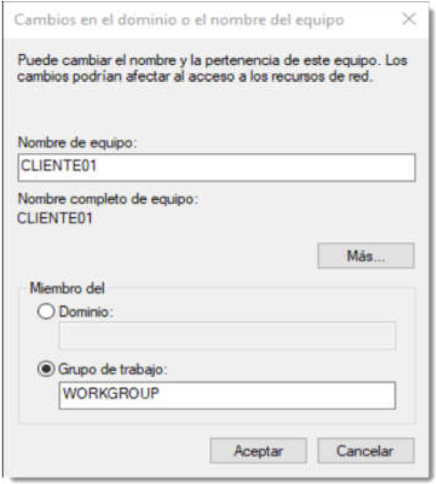
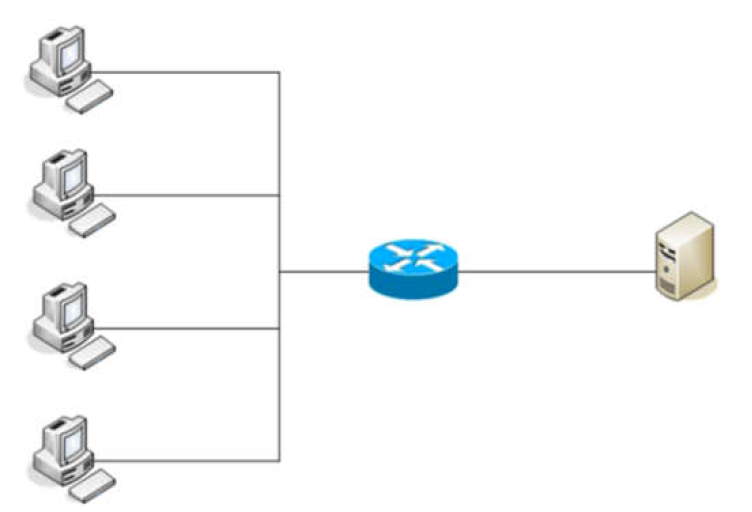

--- 
title: Introducción SOR
description: Introducción de Sistemas Operativos en red de Francisco Javier Hernández Illán. Explicación inicial de los Sistemas Operativos en Red. Descripción escenario Cliente/Servidor 
---

# Introducción SOR

Un **sistema operativo en red** posibilita la conexión y comunicación de varios ordenadores autónomos dentro de una red. Sus principales funciones son:

- Proporcionar servicios a los clientes como **DHCP, DNS, correo** (estos servicios son competencias del módulo de **SER**)
- **Compartir y gestionar** los dispositivos, archivos y **recursos** de forma centralizada.
- **Permitir el acceso remoto** al sistema, a otro ordenador o a dispositivos periféricos.
- **Planificar tareas y funciones** entre varios ordenadores para que se finalicen antes.
- **Creación** diferentes tipos de **usuarios y grupos.**
- Crear **reglas de seguridad de acceso** a los recursos compartidos  a los usuarios creados.
- **Monitorización** de los dispositivos de la red.

## Arquitectura de los Sistemas Operativos en Red

Los **sistemas operativos en red** pueden catalogarse según su arquitectura de red en **distribuidos y centralizados**. 

- Los primeros se componen de un software que controla todos los equipos informáticos de forma distribuida en modo *"cluster"*. Un ejemplo es el SO llamado **Amoeba** de **A.S.Tanenbaum**. Se utilizan en despliegues específicos que no competen en este módulo.
- Los centralizados se realizan mediante la estructura de "**Cliente/Servidor**", la cual es la más utilizada a nivel empresarial y sirve de base para la creación de los escenarios de red en este módulo.

!!! tip "Consejo"
    Es importante conocer la evolución desarrollada en las redes empresariales anteriormente a la utilización de la arquitectura **cliente/servidor**. En el siguiente apartado se desarrolla en detalle.

### Estructura Red plana

Antes del desarrollo de las herramientas de los servicios de red en las empresas, se comenzó a desarrollar la **Estructura de trabajo en grupo**, la cual trataba la red en **modo plano**.

* **Una red plana entre iguales o punto a punto**, es aquella en la ninguno de los equipos realiza tareas de administración de la red, sino tan sólo de sí mismo. No existe un equipo que haga las veces de administrador, por lo que en realidad, todos los clientes se convierten en administradores de los recursos que ofrecen a la red.

!!! Example "Ejemplo"
    Si un cliente decide compartir un recuso, éste estará disponible para todos los miembros de la red sin distinción. Si es necesario limitar el acceso a un subconjunto de usuarios, habrá que establecer una contraseña y hacérsela llegar a través de un medio seguro.

!!! Warning "Advertencia"
    Si cada uno de los usuarios empieza a compartir recursos sin control, su localización puede ser una tarea complicada, ya que los usuarios de la red deben conocer en todo momento su distribución y configuración. La localización puede suponer un grave problema.

* **Microsoft** introdujo en sus sistemas operativos la posibilidad de crear **grupos** de trabajo que dividían la red en subconjuntos. De este modo, si se sabe a qué grupo pertenece el equipo que comparte un recurso será más sencillo su localización. Estas divisiones se realizaban por funciones, por ubicación física o por cualquier otro criterio de la empresa.

<figure>
  
  <figcaption>Introducción de un equipo a un grupo de trabajo</figcaption>
</figure>

!!! Warning "Advertencia"
    Resultaba más sencillo localizar recursos, pero **no solucionaban el problema de acceso**. Este sistema de organización de red presenta numerosos problemas de seguridad.

Para controlar los accesos de los diferentes usuarios de las empresas y de este modo solucionar dicho problema se desarrollo la estructura **cliente/servidor**.

### Estructura cliente-servidor

Se trata de un modelo de aplicación centralizada en el que las tareas se dividen entre los proveedores de recursos o servicios. A estas máquinas se las conoce como **servidores** y a los equipos que demandan estos servicios se les conoce como **clientes**.

<figure>
  
  <figcaption>Esquema de red cliente servidor</figcaption>
</figure>

En este tipo de redes:

* Los clientes están conectados a un servidor en el que se centralizan los recursos y servicios.
* El servidor es el encargado de ponerlos a disposición de los clientes cada vez que estos son solicitados.
* Por lo tanto, todas las gestiones que se realizan se concentran en el servidor, lo que **facilita la localización de los recursos de una forma sencilla.**

!!! tip "A tener en cuenta"
    * Sin embargo, agregar un **segundo servidor** puede complicar las cosas de manera significativa. El problema surge porque cada servidor individual mantiene su propia lista de usuarios y recursos. El servidor **A** ofrece alojamiento a aplicaciones, el servidor **B** al correo electrónico y las aplicaciones de contabilidad y la base de datos se encuentran en el servidor **C**.

<figure>
  
  <figcaption>Red cliente-servidor con varios servidores.</figcaption>
</figure>

* Los usuarios que requieren acceso a la base de datos y utilizar las aplicaciones, necesitan una cuenta en dos de los tres servidores. 

!!! Warning "Advertencia"
    Cada una de esas cuentas de usuarios debe ser creada y mantenida de manera separada. **Es fácil para los servidores perder sincronía cuando deben ser actualizados manualmente.**

!!! note
    Estas y otras cuestiones serán resueltas con el siguiente modo de organización de red.

## Servicios de directorio

**los servicios de directorios**, son un conjunto de aplicaciones que guardan y administran toda la información sobre los elementos de una red.

 * Cada **recurso** de la red se considera como un **objeto**, donde su **información se almacena como atributos**.
 * Para la gestión de esta información, el **servicio de directorio** establece una serie de **permisos de acceso y condiciones de seguridad** que la salvaguardan esta información.
 * Ofrecen una **infraestructura** para localizar, manejar, administrar, y organizar los componentes y recursos comunes de una red.

!!! note "Nota"
    Los recursos pueden ser: volúmenes, carpetas, archivos, impresoras, usuarios, grupos, dispositivos, números de teléfono y un largo etcétera.

Los servicios de directorios contienen diferentes objetos relacionados entre sí, que se desarrollarán en detalle a lo largo del curso, de momento es suficiente con esta breve introducción.