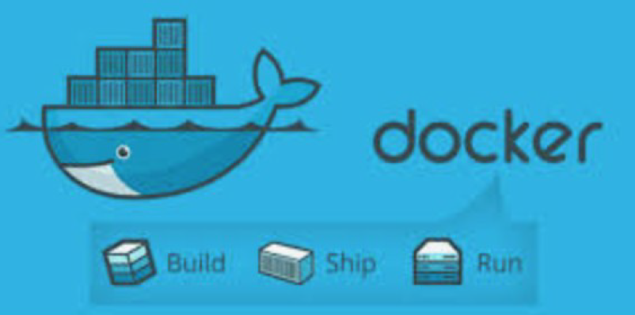
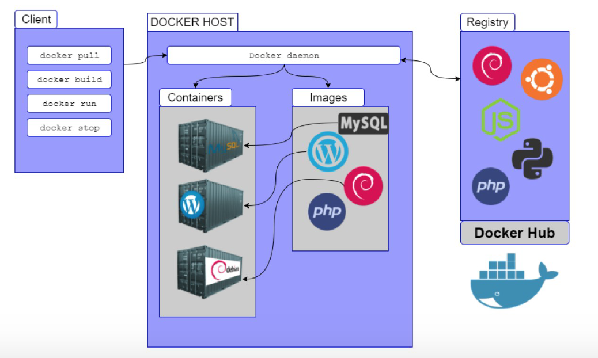

--- 
title: Introducción Docker
description: Introducción a Docker por Francisco Javier Hernández Illán. Explicación de las principales características de Docker, su instalación y principales comandos de uso. 
---

# DOCKER

<figure style="float: right;">
    
    <figcaption><b>Figura 1:</b> Logo Docker.</figcaption>
</figure>

**Docker** (estibador en inglés) es un **Sistema de Virtualización de Aplicaciones mediante contenedores**, creado por *Solomon Hykes* y su equipo de ingenieros.

* En **2013** se convirtió en un proyecto de **software libre (licencia Apache)** en el que participan cada vez más empresas. 
* La **versión 1.0** se publicó en **junio de 2014** y ha tenido un desarrollo muy rápido.
* En marzo de **2017**, Docker anunció un desarrollo todavía más rápido, **pasando a publicar una nueva versión cada mes**. La numeración de las versiones adoptó al formato AA.MM (la primera fue **Docker 17.03**).
* En **julio de 2018**, Docker anunció que volvían a un desarrollo más pausado. A partir de **Docker 18.09** habría una versión "estable" cada seis meses.

## Características principales de Docker

!!! abstract "Por lo tanto se define Docker como..."
    Un proyecto de código abierto que automatiza el despliegue de aplicaciones dentro de contenedores de software, proporcionando una capa adicional de abstracción y automatización de virtualización de aplicaciones en múltiples sistemas operativos.​

Sus principales características son:

* Docker es una API amigable del tipo **Open Source**.
* Genera un **proceso aislado** del resto de los procesos de la máquina gracias a: Ejecutar sobre su propio sistema de ficheros, con su propio espacio de usuarios y procesos, y sus propias interfaces de red... 
* Es **Modular** ya que esta dividido en varios componentes.
* Es **portable e inmutable** utilizando la plataforma **DockerHub**.
* Su es lema ***“Build, Ship and Run, any app,”***.

<figure>
    
    <figcaption>Lema Docker.</figcaption>
</figure>


!!! Note "Nota"
    Aunque un contenedor puede incluir cualquier número de aplicaciones, lo habitual es que un contenedor **contenga una sola aplicación** (y los programas necesarios para ponerse en marcha). 

## Arquitectura Docker

1. **Docker Engine ("Motor" del Gestor Docker)**: el cual basado en la arquitectura de **Cliente-Servidor** (que pueden estar en la misma máquina, o en distintas), y realizada por mediante una **API de REST** que utiliza **HTTP**.
    * **API REST**: interfaz de programación con un estilo de arquitectura software para sistemas hipermedia distribuidos como la *World Wide Web*.
2. **"Daemon Docker" (Servicio)**: lleva a cabo Gestión y enlace de los componentes del gestor.
3. **Imágenes**: Las imágenes son una especie de plantillas que contienen como mínimo todo el software que necesita la aplicación para ponerse en marcha. están formadas por una colección ordenada de: *Sistemas Archivos*, *Repositorios*, *Comandos*, *Parámetros*, *Aplicaciones*.
4. **Contenedores**: son el conjunto de procesos que encapsulan e identifican a una Imagen. Pueden ser:
    * Creado, inicializado, parado, vuelto a ejecutar y destruido.
5. **Registros** son imágenes guardadas en repositorios para: Almacenar o Distribuir.
    * Se almacenan en **Docker Hub** y pueden ser  Públicos o Privados.

<figure>
    
    <figcaption>Componentes de Docker.</figcaption>
</figure>

!!! Note "Nota"
    * El componente básico de Docker es el **Docker Engine**, pero Docker ofrece también una serie de herramientas para administrar, distribuir e instalar contenedores: **Docker Compose**, **Docker Swarm**.
    * Las **imágenes** se pueden crear a partir de otras imágenes más básicas incluyendo software adicional en forma de capas. Todos los contenedores creados a partir de una imagen contienen el mismo software, aunque en el momento de su creación se pueden personalizar algunos detalles

## Instalación

Para la Instalación de **Docker** es recomendable seguir la documentación oficial. Además se recomienda Instalar máquina Ubuntu Server última versión e instalar Docker en ella.

* Docker for Mac:
    * **[Instalación Mac](https://docs.docker.com/docker-for-mac/install/)**
* Docker for Windows:
    * **[Instalación Windows](https://docs.docker.com/docker-for-windows/install/)**
* Docker for ubuntu:
    * **[Instalación Ubuntu](https://docs.docker.com/engine/installation/linux/docker-ce/ubuntu/)**

!!! Warning "Advertencia"
    * **Docker** empezó estando disponible solamente para distribuciones GNU/Linux, pero desde **junio de 2016** también está disponible como aplicación nativa en Windows Server 2016 y Windows 10.
    * **Docker** utiliza la virtualización ofrecida por el sistema operativo. En el caso de Windows 10, eso significa que para usar Docker de forma nativa hay que activar **Hyper-V** que, por desgracia, es incompatible con VirtualBox. Para poder utilizar Docker en Windows 7 o en Windows 10 sin **Hyper-V**, Docker ofrece desde agosto de 2015 **[Docker Toolbox](https://github.com/docker-archive/toolbox)**, que realmente es una máquina virtual (que se ejecuta en VirtualBox) que contiene Docker.
    * Otra opción sería utilizar [Podman](https://podman.io)

### Ejemplo Instalación en Ubuntu server

- A continuación se muestra la instalación aconsejada para Ubuntu Server utilizando el método de repositorios:

1. En primer lugar se actualizan los paquetes y se instalan los paquetes para utilizar el repositorio sobre HTTPS:

``` bash
sudo apt-get update
apt-get install ca-certificates curl gnupg lsb-release
```

2. Se añade la clave GPG oficial de Docker:

``` bash
mkdir -p /etc/apt/keyrings
curl -fsSL https://download.docker.com/linux/ubuntu/gpg | sudo gpg --dearmor -o /etc/apt/keyrings/docker.gpg
```

3. Se configura el repositorio:

``` bash
echo "deb [arch=$(dpkg --print-architecture) signed-by=/etc/apt/keyrings/docker.gpg] https://download.docker.com/linux/ubuntu $(lsb_release -cs) stable" | sudo tee /etc/apt/sources.list.d/docker.list > /dev/null
```

- Se realiza de nuevo una actualización.

``` bash
sudo apt-get update
```

4. Instalación propia del Engine de Docker y Docker Compose:

``` bash
apt-get install docker-ce docker-ce-cli containerd.io docker-compose-plugin
```

5. Comprobamos que está correctamente bien instalado ejecutando el contenedor "Hello World"

``` bash
docker run hello-world
```


## Principales Comandos

A continuación se muestran los comandos más utilizados:

| Comando      | Acción                               | Comando      | Acción                                  |
| ------------ | ------------------------------------ | ------------ | --------------------------------------- |
|`docker info`| obtener información relativa a docker | `docker start`| (docker container start) inicia la ejecución|
|`docker run`| (docker container run) crea y ejecuta el contenedor|`docker rm` |(docker container eliminar) elimina el contenedor|
|`docker build`| crea una imagen|`docker cp` |(docker container copiar)|
|`docker ps` |muestra la lista de contenedores creados|`docker logs` |(docker container logs) muestra los errores|
|`docker inspect` |(docker container inspect) información detallada de los contenedores|`docker stats` |(docker container stats) muestra el estado|
|`docker stop`| (docker container stop) detiene la ejecución del contenedor|`docker system prune`|limpiar todo el sistena de contenedores imágenes y volumenes|

* **[Chuleta de Comandos](https://github.com/sergarb1/CursoIntroduccionADocker/raw/main/FuentesCurso/Docker%20CheatSheet%20COMPLETA.pdf)**

<figure>
    
    <figcaption>Chuleta Docker.</figcaption>
</figure>

## Primer Contenedor

A continuación se muestra un ejemplo guiado de la creación del contenedor **"Hello World"**

1. Comprobación que inicialmente no hay ningún contenedor creado (la opción `-a` hace que se muestren también los contenedores detenidos, sin ella se muestran sólo los contenedor que estén en marcha):

``` bash
sudo docker ps -a
```
o también

``` bash
sudo docker container ls -a
```

2. Compruebe que inicialmente tampoco disponemos de ninguna imagen:

``` bash
sudo docker image ls
```

!!! Note "Nota"
    **Docker** crea los contenedores a partir de imágenes locales (ya descargadas), pero si al crear el contenedor no se dispone de la imagen local, Docker descarga la imagen de su repositorio.

3. La orden más simple para crear un contenedor sigue esta estructura:

``` bash
sudo docker run IMAGEN
```

!!! Example "Ejemplo"
    ``` bash
    sudo docker run hello-world
    ```

!!! Note "Nota"
    Como no tenemos todavía la imagen en nuestro ordenador, **Docker** descarga la imagen, crea el contenedor y lo pone en marcha. En este caso, la aplicación que contiene el contenedor **hello-world** simplemente escribe un mensaje de salida al arrancar e inmediatamente se detiene el contenedor.

Si listamos de nuevo imagenes y contenedores, las veremos creadas.

* Cada contenedor tiene un **identificador (ID)** y un nombre distinto. Docker "bautiza" los contenedores con un "**nombre peculiar**", compuesto de un adjetivo y un apellido.
* Podemos crear **tantos contenedores como queramos** a partir de una imagen. Una vez la imagen está disponible localmente, Docker no necesita descargarla y el proceso de creación del contenedor es inmediato (aunque en el caso de **hello-world** la descarga es rápida, con imágenes más grandes la descarga inicial puede tardar un rato).

!!! Tip
    * Normalmente se aconseja usar siempre la opción `-d`, que arranca el contenedor en segundo plano (**detached**) y permite seguir teniendo acceso a la shell (aunque con hello-world no es estrictamente necesario porque el contenedor hello-world se detiene automáticamente tras mostrar el mensaje).
    * Al crear el contenedor hello-world con la opción `-d` no se muestra el mensaje, simplemente muestra el identificador completo del contenedor.

* Los contenedores se pueden destruir mediante el comando rm, haciendo referencia a ellos mediante su nombre o su id. **No es necesario indicar el id completo**, basta con escribir los primeros caracteres (de manera que no haya ambigüedades).

* Además podemos dar nombre a los contenedores al crearlos:

``` bash
sudo docker run -d --name=hola-1 hello-world
```

## Volúmenes

Docker simplifica enormemente la creación de contenedores, y eso lleva a tratar los contenedores como un **elemento efímero**, que se crea cuando se necesita y que no importa que se destruya puesto que puede ser reconstruido una y otra vez a partir de su imagen.

!!! warning "Advertencia"
    Pero si la aplicación o aplicaciones incluidas en el contenedor generan datos y esos datos se guardan en el propio contenedor, en el **momento en que se destruyera el contenedor perderíamos esos datos**.

* **El objetivo principal** de los volumenes es **no perder datos si borro el contenedor y mejorar rendimiento del Docker**.  Para conseguir la persistencia de los datos, se pueden emplear dos técnicas:

    1. **Los directorios enlazados (bind)**, en la que la información se guarda fuera de Docker, en la máquina host (por ejemplo si lo ejecutamos en la máquina virtual de Ubuntu o la máquina física de Lliurex en clase).

    2. **Los volúmenes**, en la que la información se guarda mediante Docker, pero en unos elementos llamados ***volúmenes***, independientes de las imágenes y los contenedores. Además los volúmenes se pueden catalogar en dos tipos.

        1. **Volúmenes de Datos**: es como si montará un disco en el contenedor y por defecto se realizan en un path temporal.
        2. **Volúmenes de Host**: Mismo concepto pero indicándole el path.

!!! Tip
    Aconsejable utilizar la técnica de ***volumenes***, ya que, La ventaja frente a los directorios enlazados es que pueden ser gestionados por Docker. Otro detalle importante es que el acceso al contenido de los volúmenes sólo se puede hacer a través de algún contenedor que utilice el volumen.

### Ventajas Volúmenes

Los volúmenes tienen varias ventajas sobre los directorios enlazados:

* Los volúmenes son más fáciles de respaldar o migrar que enlazar montajes.
* Puede administrar volúmenes mediante los comandos de la CLI de Docker o la API de Docker.
* Los volúmenes funcionan tanto en contenedores de Linux como de Windows.
* Los volúmenes se pueden compartir de forma más segura entre varios contenedores.
* Los controladores de volumen le permiten almacenar volúmenes en hosts remotos o proveedores en la nube, para cifrar el contenido de los volúmenes o para agregar otras funciones.
* Los nuevos volúmenes pueden tener su contenido precargado por un contenedor.
* Los volúmenes en Docker Desktop tienen un rendimiento mucho mayor que los directorios enlazados de hosts de Mac y Windows.

!!! Note "Nota"
    Además, los volúmenes suelen ser una mejor opción que los datos persistentes en la capa de escritura de un contenedor, porque un volumen no aumenta el tamaño de los contenedores que lo usan y el contenido del volumen existe fuera del ciclo de vida de un contenedor determinado.

<figure>
    
    <figcaption>Gráfico técnicas de persistencia de datos.</figcaption>
</figure>

!!! Note "Nota"
    Los volúmenes son independientes de los contenedores, por lo que también podemos conservar los datos aunque se destruya el contenedor, reutilizarlos con otro contenedor, etc.

### Opciones

* Opciones:

``` bash
`Docker volume (create|Is|inspect|rm)`
```

* para crear el volumen a la vez que creamos y ejecutamos un contenedor se utilzan las opciones `v` o `--mount`

En general, `--mount` más explícito y detallado. La mayor diferencia es que la sintaxis de `-v` combina todas las opciones juntas en un campo, mientras que la sintaxis `--mount`  las separa. A continuación se muestra una comparación de la sintaxis de cada "flag".

* `-v` o `--volume` : consta de tres campos, separados por dos puntos ( :). Los campos deben estar en el orden correcto y el significado de cada campo no es inmediatamente obvio.
    * En el caso de volúmenes con nombre, el primer campo es el nombre del volumen y es único en una máquina host determinada. Para volúmenes anónimos, se omite el primer campo.
    * El segundo campo es la ruta donde se monta el archivo o directorio en el contenedor.
    * El tercer campo es opcional y es una lista de opciones separadas por comas, como `ro` (readonly). 

* `--mount`: Consta de varios pares clave-valor, separados por comas (cada uno formado por una <key>=<value> dupla). La sintaxis de `--mount` es más detallada que `-v` o `--volume`; además el orden de las claves no es significativo, por lo tanto el valor de las "flags" son más fáciles de entender. 
* Valores de las duplas:
    * **type**: puede ser `bind`, `volume` o `tmpfs`.
    * **source**: Para volúmenes con nombre, este es el nombre del volumen. Para volúmenes anónimos, este campo se omite. Puede especificarse como source o src.
    * **destination**: toma como valor de la ruta en el archivo o directorio está montado en el contenedor. Puede ser especificado como destination, `dst` o `target`.
    * **readonly**: si está presente, hace que el montaje de enlace se monte en el contenedor como de solo lectura. Puede especificarse como `readonly` o `ro`.
    * **volume-opt** se puede especificar más de una vez, toma un par clave-valor que consta del nombre de la opción y su valor. Ejemplo: `volume-opt=type=nfs`

!!! Note "Nota"
    Todas las opciones de volúmenes están disponibles para los indicadores `--mount` y `-v`, por que a la hora de elegir uno u otro depende del técnico para su facilidad de configuración donde por su sintaxis a priori sería mejor `--mount`.

### Ejemplo

A continuación se muestra un ejemplo de creación del servidor web NGINX.

!!! Example "Ejemplo"
    ```bash
    docker run -d \
    --name nginx1 -p 8080:80 \
    --mount type=volume,source=myvol1,target=/usr/share/nginx/html \
    nginx:latest
    ```

!!! Note "Nota"
    * Si en lugar de la opción `-p 8080:80` se utiliza la opción `-P` hace que Docker asigne de forma aleatoria un puerto de la máquina virtual al puerto asignado a Nginx en el contenedor.

* Si se creara una página de incio del apache diferente a la de defecto podríamos copiarla en el volumen y esta cambiaría:

```bash
nano index.html
```

* Nueva página de inicio:

``` bash
<!DOCTYPE html>
<html lang="es">
<head>
  <meta charset="utf-8">
  <title>Apache en Docker</title>
  <meta name="viewport" content="width=device-width, initial-scale=1.0">
</head>

<body>
  <h1>¡Hola Mundo!</h1>
</body>
</html>
```

* Para cambiar la página de inicio del apache se debe copiar dentro del volumen creado.
```bash
docker cp index.html nginx1:/usr/share/nginx/html
```

* Si accedemos al servidor apache aparecerá la nueva página. 

!!! warning "Advertencia"
    Si aparece el error forbiden 403, es debido a permisos del index.html, debemos entrar en container y cambiar los permisos.

``` bash
docker exec -it nginx1 /bin/bash
```

``` bash
cd /usr/share/nginx/html
chown -R root:root index.html
```

* Además podemos crear un nuevo contenedor con este volumen:
``` bash
docker run -d \
    --name nginx2 -p 8080:80 \
    --mount type=volume,source=myvol1,target=/usr/share/nginx/html \
    nginx:latest
```

* Se comprueba que el nuevo contenedor muestra la nueva página index.html

!!! Warning "Advertencia" 
    Si se intenta borrar el volumen del ejemplo anterior mientras los contenedores están en marcha, Docker muestra un **mensaje de error que indica los contenedores afectados**.