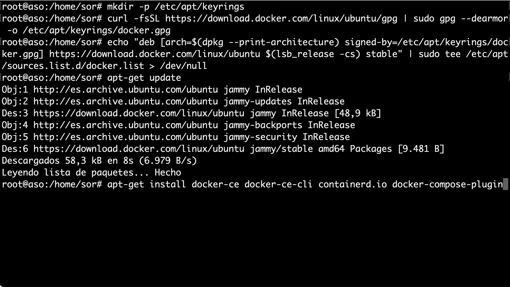
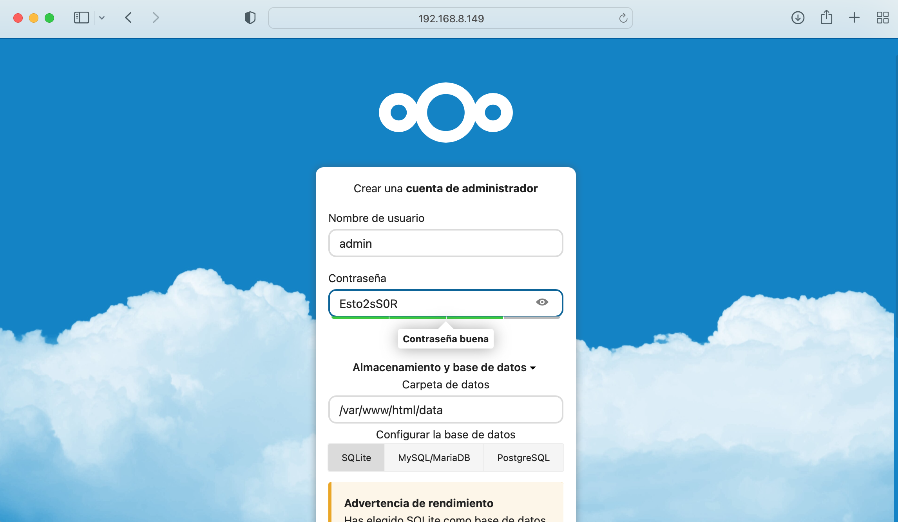
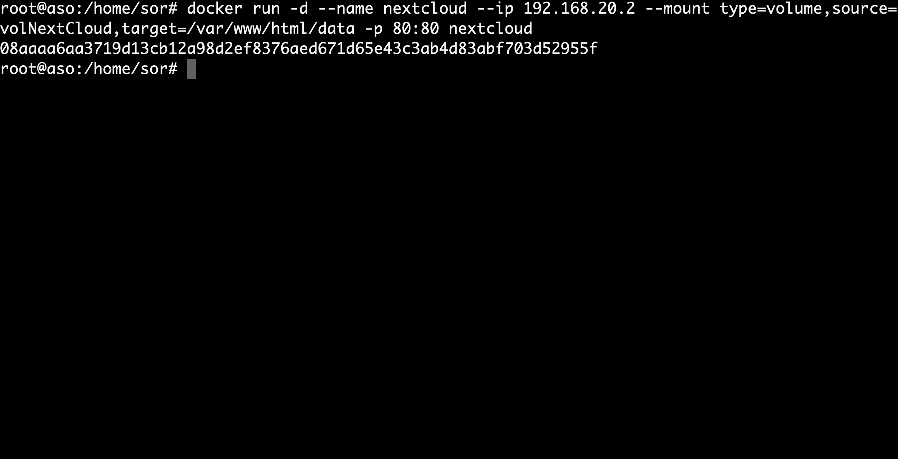

--- 
title: Guía Instalación NextCloud con Docker
description: Práctica guiada de instalación de NextCloud mediante Docker Docker por Francisco Javier Hernández Illán. Gestión de recursos compartidos en NextCloud utilizando Volúmenes persistentes. 
---

# GUÍA INSTALACIÓN NEXTCLOUD-DOCKER

## PT11_1 Instalación Docker

Se realiza la instalación de Docker en una máquina virtual de Ubuntu 22.04 siguiendo el método [Install using the repository](https://docs.docker.com/engine/install/ubuntu/#install-using-the-repository)

1. Se realiza un actualización y se instalan los paquetes necesarios para usar el repositorio sobre HTTPS:

- Código para la actualización de paquetes:

``` bash
sudo apt-get update
```
- Resultado:

<figure>
  
  <figcaption>Actualización repositorios</figcaption>
</figure>

<div style="page-break-before:always;"></div>

- Código para instalar los paquetes necesarios para usar el repositorio sobre HTTPS:

``` bash
sudo apt-get install ca-certificates curl gnupg lsb-release
```
- Resultado:

<figure>
  
  <figcaption>Instalación repositorios necesarios</figcaption>
</figure>

<div style="page-break-before:always;"></div>

2. Se añade la clave GPG oficial de Docker y el comando para configurar el repositorio:

- Código para los objetivos comentados en este punto:

``` bash
sudo mkdir -p /etc/apt/keyrings
curl -fsSL https://download.docker.com/linux/ubuntu/gpg | sudo gpg --dearmor -o /etc/apt/keyrings/docker.gpg
echo "deb [arch=$(dpkg --print-architecture) signed-by=/etc/apt/keyrings/docker.gpg] https://download.docker.com/linux/ubuntu $(lsb_release -cs) stable" | sudo tee /etc/apt/sources.list.d/docker.list > /dev/null
```
- Resultado:

<figure>
  
  <figcaption>Clave GPG y configuración repositorio</figcaption>
</figure>

<div style="page-break-before:always;"></div>

3. se realiza otra actualización:

- Código para la nueva actualización de paquetes, debido a la configuración realizada:

``` bash
sudo apt-get update
```

- Resultado:

<figure>
  
  <figcaption>Nueva actualización</figcaption>
</figure>

<div style="page-break-before:always;"></div>

4. Se Instala Docker Engine, containerd y Docker Compose:

- Código para la instalación de paquetes Docker:

``` bash
sudo apt-get install docker-ce docker-ce-cli containerd.io docker-compose-plugin
```

- Resultado:

<figure>
  
  <figcaption>Instalación Docker</figcaption>
</figure>

<div style="page-break-before:always;"></div>

5. Comprobación que la instalación del motor Docker sea correcta ejecutando la imagen **hello-world**:

- Código para la comprobación de Docker, mediante la ejecución de un contenedor:

``` bash
sudo docker run hello-world
```
- Resultado:

<figure>
  
  <figcaption>Comprobación</figcaption>
</figure>

<div style="page-break-before:always;"></div>


## PT11_2 Instalación contenedor NextCloud sin volumen persistente.

La instalación del contenedor se puede consultar en [Imagen oficial NextCloud Docker Hub](https://hub.docker.com/_/nextcloud)

1. Se instala y ejecuta el contenedor:

- Código para la instalación NextCloud:

``` bash
docker run -d -p 8080:80 nextcloud
```

- Resultado:

<figure>
  
  <figcaption>Instalación y ejecución del contenedor de NextCloud</figcaption>
</figure>

<div style="page-break-before:always;"></div>

2. Comprobación de instalación correcta del contenedor NextCloud:

- Se introduce en un navegador **http://"IPmáquinaVirtual":8080** debe aparecer el inicio de NextCloud para crear una cuenta de administrador, como se muestra en la siguiente figura:

<figure>
  
  <figcaption>Instalación de NextCloud</figcaption>
</figure>

- Probamos a subir un archivo para ver donde se guardan:

<figure>
  
  <figcaption>Subir archivo NextCloud</figcaption>
</figure>

<div style="page-break-before:always;"></div>

- Se comprueba en el GUI de NextCloud que esta subido:

<figure>
  
  <figcaption>Comprobación subido el archivo en el GUI de NextCloud</figcaption>
</figure>

- Se comprueba en el bash del contenedor de NextCloud que esta subido:

<figure>
  
  <figcaption>Comprobación subido el archivo en el contenedor de NextCloud</figcaption>
</figure>

<div style="page-break-before:always;"></div>

- Si borramos el contenedor y lo volvemos a crear se comprueba que se ha perdido el fichero:

<figure>
  
  <figcaption>Borrado del contenedor</figcaption>
</figure>

<figure>
  
  <figcaption>Comprobación del fichero borrado</figcaption>
</figure>

<div style="page-break-before:always;"></div>

## PT11_3 Instalación contenedor NextCloud con volumen persistente y red interna

- Siguiendo los apuntes en el punto 3 se describen los volúmenes y la importancia de los mismos para salvaguardar los datos si el contenedor se corrompe, o incluso utilizarlo para un segundo contenedor de docker. El ejemplo 3.3 es una buena guía para realizar este punto.

- Por lo tanto el código a ejecutar para que el volumen se llame **"volNextCloud"** podría ser:

``` bash
sudo docker run -d --name nextcloud --ip 192.168.20.2 --mount type=volume,source=volNextCloud,target=/var/www/html/data -p 80:80 nextcloud
```

<figure>
  
  <figcaption>Creación NextCloud con Persistent Data y red interna</figcaption>
</figure>

<div style="page-break-before:always;"></div>

### Comprobación NextCloud con volumen persistente

1. Se sube un fichero como el caso anterior.

<figure>
  
  <figcaption>Subimos fichero</figcaption>
</figure>

2. Se comprueba que esta en el contenedor.

<figure>
  
  <figcaption>El archivo existe en el path del volumen</figcaption>
</figure>

<div style="page-break-before:always;"></div>

3. Se borra el contenedor, se crea uno nuevo apuntando al volumen y se comprueba que el fichero perdura.

<figure>
  
  <figcaption>Comprobación fichero existe, después de borrar contenedor y volver a crear uno nuevo</figcaption>
</figure>

## Network

- Se observa en el código del apartado anterior en el mismo comando se ha estado introduciendo la IP del enunciado. Para que dicha IP se refleje en el contenedor además debe existir una red creada previamente y apuntar a ella. en los siguientes pasos se muestra.

1. Crear red:

``` bash
sudo docker network create --driver=bridge --subnet=192.168.20.0/24 nextCloudNet
```

2. Referenciamos contenedor a la red creada.

``` bash
sudo docker run -d --name nextcloud --network nextCloudNet --ip 192.168.20.2 --mount type=volume,source=volNextCloud,target=/var/www/html/data -p 80:80 nextcloud
```

<div style="page-break-before:always;"></div>

3. Confirmamos la IP.

``` bash
docker inspect -f '{{range.NetworkSettings.Networks}} {{.IPAddress}}{{end}}' CONTAINER_ID
```

### Comprobación IP

- En la siguiente figura se muestra la comprobación de la red y la IP del contenedor:

<figure>
  
  <figcaption>Contenedor en la IP del enunciado</figcaption>
</figure>