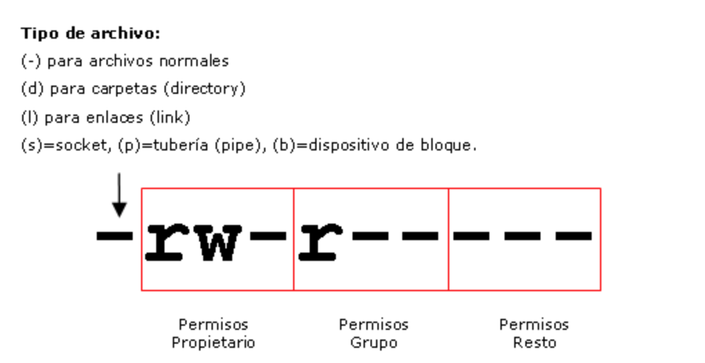

--- 
title: Introducción Samba
description: Introducción del servicio Samba por Francisco Javier Hernández Illán. Explicación inicial de Samba. Descripción de la configuración de partida en ubuntu server. 
---

<figure>
    
</figure>
<figure>
    
</figure>

# Introducción

!!! tip "**Conocimiento previo**"
    - **SMB (Server Message Block)** protocolo de red que **permite compartir archivos, impresoras, etcétera,** entre nodos de una red de computadoras que usan el **sistema operativo Microsoft Windows**. 
    - Este protocolo pertenece a la **capa de aplicación** en el modelo TCP/IP y fue renombrado posteriormente a **CIFS (Common Internet File System)**.

**Samba** es una implementación libre del protocolo **SMB** para sistemas de tipo UNIX, para el cual se destaca:

- Se basa en un conjunto de aplicaciones de **GNU/Linux** cuyo principal objetivo es conectar computadoras con diferentes sistemas operativos como pueden ser **GNU/Linux, Mac OS X o Unix** para actuar como **servidores o clientes** de los diferentes servicios de compartición de recursos.
- También permite validar usuarios haciendo de **Controlador Principal de Dominio (PDC)**, como miembro de dominio e incluso como un dominio **Active Directory** para redes basadas en Windows; aparte de ser capaz de servir colas de impresión, directorios compartidos y autentificar con su propio archivo de usuarios.

## Características

Entre los sistemas tipo **Unix** en los que se puede ejecutar **Samba**, están las distribuciones:

- **GNU/Linux**. 
- **Solaris**.
- Las diferentes variantes **BSD** entre las que podemos encontrar el **Mac OS X Server** de Apple.

Como se ha comentado **Samba** es una implementación de **servicios y protocolos**, entre los que destacan: 

- [NetBIOS](https://es.wikipedia.org/wiki/NetBIOS) sobre TCP/IP (NetBT). 
- [SMB (Server Message Block)](https://es.wikipedia.org/wiki/Server_Message_Block).
- [DCE/RPC](https://en.wikipedia.org/wiki/Microsoft_RPC) o más concretamente, **MSRPC**. 
- El servidor [WINS](https://es.wikipedia.org/wiki/Windows_Internet_Naming_Service) también conocido como el servidor de nombres de **NetBIOS**. 
- La suite de **protocolos del dominio NT** o [NTLM](https://es.wikipedia.org/wiki/NTLM), para autentificación. 
- La base de datos del gestor de cuentas seguras [SAM](https://learn.microsoft.com/es-es/windows/security/threat-protection/auditing/audit-sam). 
- El servicio [Local Security Authority LSA](https://es.wikipedia.org/wiki/Servicio_de_Subsistema_de_Autoridad_de_Seguridad_Local) o autoridad de seguridad local.
- Recientemente el Logon de entrada de Active Directory, que incluye una versión modificada de [Kerberos](https://es.wikipedia.org/wiki/Kerberos#:~:text=Kerberos%20pronunciación%20en%20inglés%3A%20%2F,identidad%20mutuamente%20de%20manera%20segura.) 
- Y una versión modificada de [LDAP](https://es.wikipedia.org/wiki/Protocolo_ligero_de_acceso_a_directorios#:~:text=El%20protocolo%20ligero%20de%20acceso,en%20un%20entorno%20de%20red.). 

!!! warning "Advertencia"
    Todos estos servicios y protocolos son frecuentemente referidos de un modo incorrecto como **NetBIOS** o **SMB**.

!!! tip "Propina"
    A partir de la **versión 4.10.0 de samba** se ofrece soporte completo para **Python 3** y aunque mantiene compatibilidad con **Python 2**, esta debe ser configurada de manera explícita,​ sin embargo, a futuro, dicho soporte a **Python 2** será retirado.

## Introducción a la configuración del servicio SAMBA en Ubuntu

Toda la configuración de *Samba* se encuentra en el fichero `/etc/samba/smb.conf` &#8594 [DOCUMENTACIÓN OFICIAL](http://manpages.ubuntu.com/manpages/bionic/man5/smb.conf.5.html) .

!!! note "**NOTA**"
    Existen multitud de opciones pero tan solo se analizarán las imprescindibles para la compartición de recursos. Las líneas que comiencen con `#` o `;` están comentadas y el servicio no las tendrá en cuenta. 

**Este fichero tiene varios apartados, con opciones que se comentarán a continuación:**

- `[global]` cuyas opciones generales son:

|Variable|Descripción|
| - | - |
|**workgroup**|Esta variable ha de almacenar el nombre del grupo de trabajo o dominio que usamos en nuestra red.|
|**server string**|Permite reconocer el equipo dentro del dominio. Por defecto tiene como valor el nombre del servidor.|
|**hosts allow**|Especifica desde qué direcciones IP se podrá acceder al servicio. Si se especifica  192.168. todas las direcciones que empiecen de ese modo tendrán acceso al recurso. Se puede establecer direcciones IP completas.|
|**hosts deny**|Especifica los rangos no permitidos, del mismo modo que **host allow**.|
|**security,**|Especifica el nivel de seguridad con el que se puede acceder.|

- `[autentication]`, donde se destaca **server role**, el cual indica la forma en la que va a trabajar el servidor **Samba**:

|Variable|Descripción|
| - | - |
|**standalone server**|Modo por defecto, actúa como un servidor de ficheros y directorios compartidos pero no como servidor de dominio.|
|**member server**|similar al anterior con la diferencia que añadimos al equipo a un dominio ya existente y por tanto su funcionamiento se verá afectado por las reglas de éste. Esta opción requiere añadir las líneas **security=ADM**, para indicar que el control de acceso lo gestionará el  controlador de dominio, y **realm =NOMBREDOMINIO.COM** para indicar el nombre de dominio al que pertenece el servidor. Además, hay que comentar la línea **workgroup** ya que no pertenecemos a un grupo de trabajo.|
|**AD domain controler**|actúa como un controlador de dominio.|

### Creación Directorio Compartido

- Para crear un directorio compartido es necesario añadir una nueva sección del siguiente modo:

``` yaml
[compartidoUser1]
comment = Carpeta compartida 
path = /media/compartido/user1
guest ok = Yes
read only = Yes
write list = @Ceos, administrador, user1 
directory mask = 0755
```

!!! note "**NOTA**"
    - Estas  líneas  crean  un  recurso  compartido  con  el  nombre **compartidoUser1**  en  el  directorio **/media/compartido/user1** de solo lectura, con acceso de invitado, los usuarios **administrador** y **user1** pueden escribir  y el grupo **@Ceos** también. 
    - Además, se aplicará una máscara de permisos automática de **0755** a los ficheros y carpetas que se creen en este recurso.

- Las opciones más relevantes son:

|Variable|Descripción|
| - | - |
|**[X]:**| Nombre del recurso a compartir, normalmente un directorio.|
|**Comment:**| Comentario que describe el directorio que se está compartiendo.|
|**Path:**| Es la carpeta que se quiere compartir. Puede ser cualquier carpeta del servidor, no obstante, por estándar las carpetas compartidas de un servidor suelen encontrarse dentro del directorio /srv.|
|**guest ok**|Permite el acceso como usuario invitado. Su valor puede ser **Yes** o **No**.|
|**public**|Equivalente del parámetro **guest ok**.|
|**browseable**|Permitirá mostrar este recurso en las listas de recursos compartidos. Su valor puede ser **Yes** o **No**.|
|**writable**|Permitirá la escritura. Su valor puede ser **Yes** o **No**.|
|**valid users**|Especifica qué usuarios o grupos pueden acceder al recurso compartido. Mirar valores en la Nota a continuación de esta tabla.|
|**write list**|Usuarios o grupos pueden acceder con permiso de escritura.|
|**admin users**|Usuarios o grupos pueden acceder con permisos administrativos.|
|**Create Mask:**| Indica los permisos de los **ficheros creados por los clientes**. Por defecto 0744 (todos los permisos para usuario propietario y solo permiso de lectura para grupo y otros usuarios).|
|**directory mask**|Define que permisos en el sistema tendrán los subdirectorios creados dentro del recurso.|

!!! tip "**Especificación de los valores de `valid users`**"
    - **nombres de usuarios** separados por comas
    - **nombres de grupo** precedidos por una *@*
    - **%S** indica que solo el usuario cuyo nombre sea igual al de ese directorio, tiene acceso (útil para las carpetas personales de usuario)

!!! warning "**Advertencia**"
    Una vez añadido el recurso, es necesario reiniciar el servicio para que se apliquen los cambios

``` bash
systemctl restart smbd
```

- Por último, **para acceder al recurso desde el cliente se realizará** a través de cualquier navegador o explorador de archivos de archivos usando el protocolo **smb** especificando el usuario, la dirección del recurso y su nombre del siguiente modo:

``` bash
smb://usuario1@servidorubuntu/compartido1
```

## Integración de permisos

La gestión de permisos de usuarios y grupos es sustancialmente diferente en Sistemas Unix y en Sistemas Microsoft Windows. A continuación se describen las diferencias.

### Permisos Unix

- En los ***Sistemas Unix***, la gestión de los permisos que los usuarios y los grupos de usuarios tienen sobre los archivos se realiza mediante un sencillo esquema de **tres tipos de permisos (lectura, escritura y ejecución)** aplicables a tres tipos de usuarios **(propietario, grupo propietario y resto)**, los cuales se denominan trios de permisos. 

En la siguiente figura se puede observar su funcionamiento:

<figure>
  
</figure>

!!! tip "Ventajas"
    - Este sencillo esquema se desarrolló en los **años 70** y **aún hoy resulta adecuado** para la gran mayoría de los sistemas en red que podamos encontrar en cualquier tipo de organización, desde pequeñas redes a las más grandes.
    - Es cierto que tiene algunas limitaciones pero la ventaja de ser sencillo hace que su **administración sea fácil y su rendimiento muy elevado.**

### Permisos Windows

- En los ***Sistemas Microsoft Windows***, la gestión de los permisos que los usuarios y los grupos de usuarios tienen sobre los archivos, se realiza mediante un complejo esquema de listas de control de acceso **ACLs (Access Control Lists)** para cada carpeta y cada archivo. 

!!! tip "Ventajas"
    - El sistema de ACLs tiene la **ventaja de ser mucho más flexible que el sistema Unix ya que se pueden establecer más tipos de permisos**, establecer permisos solo a algunos usuarios y algunos grupos, denegar permisos, etc..., pero como hemos comentado anteriormente, **en la mayoría de los casos, con las prestaciones del Sistema Unix es suficiente**.
    
!!! warning "Desventajas"
    En el lado contrario, el sistema de **ACLs es más complejo de administrar** y más lento ya que antes de acceder a las carpetas o archivos, el sistema debe comprobar listas mientras que en **Unix** hace una operación lógica de los bits que especifican los permisos lo cual **es muchísimo más rápido**.

- En particular el acceso a una carpeta se determina por dos tipos de permisos:

!!! info "**Tipos de permisos para Samba**"
    - De **recurso compartido** definidos tan solo a **carpetas**.
    - De red o **NTFS (New Technology File System)** definidos tanto en **carpetas** como en **archivos**.

!!! warning "Advertencia"
    Los permisos de **recurso compartido** suelen utilizarse para administrar equipos con sistemas de archivos **FAT32** (*File Allocation Table*) o posterior, **por lo que quedan desterrados en sistemas operativos de red** y por tanto se usan los permisos de red **NTFS**. 

### Permisos Samba

**Samba** tiene también implementado el sistema de **ACLs** y se gestiona utilizando el comando `smbcacls`, no obstante, **la recomendación es utilizar el sistema de gestión de permisos de Unix**.

!!! tip "consejo"
    Para realizar una gestión eficaz de usuarios, grupos y permisos, **se recomienda utilizar los permisos de Unix que permiten asignar permisos de lectura, escritura y ejecución** al usuario propietario del archivo, al grupo propietario del archivo y al resto de usuarios del sistema.

!!! warning "advertencia"
    - Puede ocurrir que exista contradicción entre los permisos del sistema Unix y los permisos del recurso compartido en samba, por ejemplo, podemos tener una carpeta compartida llamada almacen-software con permisos Unix de lectura, escritura y ejecución para todos, en cambio si en el archivo de configuración de samba, **dicho recurso tiene el parámetro read only = yes, no será posible realizar cambios ya que está compartido con permiso de 'solo lectura'**. 
    - Cuando los permisos Unix se contradicen con los permisos samba, **el permiso efectivo es el más restrictivo de los dos**.

## Referencia

!!! info "Wikipedia Oficial de Samba"
    Se recomienda leer la documentación oficial del servicio en [ENLACE WIKI SAMBA](https://wiki.samba.org/index.php/Main_Page)
