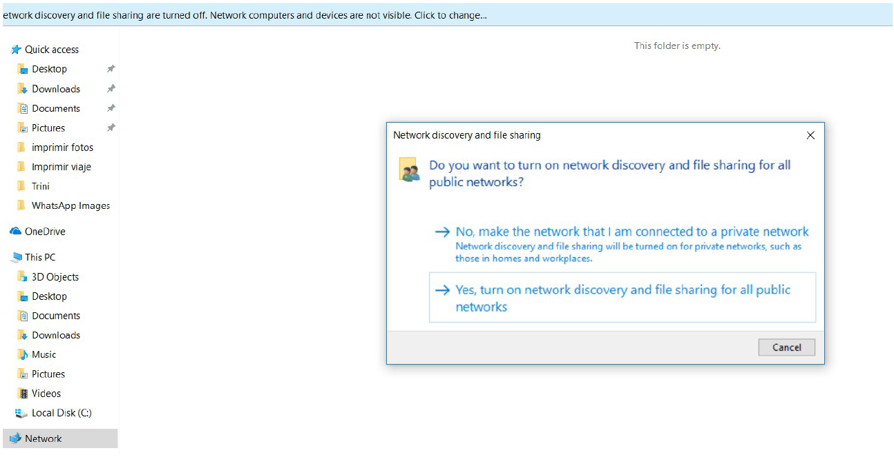
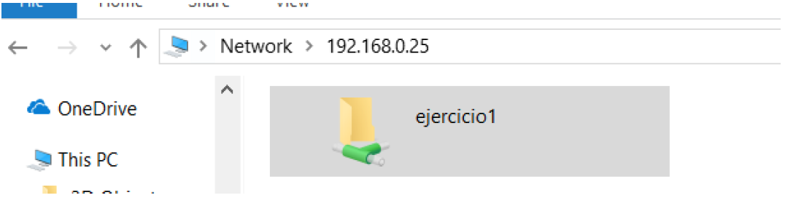

--- 
title: Instalación y configuración inicial Samba
description: Instalación y configuración inicial Samba de Francisco Javier Hernández Illán. 
---

# Instalación y configuración inicial de Samba

Partiendo de la **situación de aprendizaje**, desde el departamento TIC de **NetOS** nos encargan una instalación y configuración de una carpeta compartida en las aulas del **IES Severo Ochoa d'Elx**, la carpeta debe estar compartida en el ordenador del profesor compartiendo acceso los ordenadores de los alumnos, los cuales tienen una distribución dual de Windows y linux.

- Es la primera vez que utilizas **Samba** y decides realizar unos pasos previos siguiendo la guía adjunta a continuación:

!!! warning "Requisitos"
    Se necesitan tres máquinas virtuales: 

!!! info "Información de las Máquinas Virtuales"
    - El **Ubuntu Server** del enlace de one drive de Aules, se descarga y se importa a Virtualbox. Si ya lo tienes de la UT anterior se debe utilizar la instantánea limpia de la MV
    - **Microsoft Windows 11 Professional** con el mismo procedimiento, que actuará como cliente. Es buena idea que realices instantáneas de las máquinas para tener copias de seguridad en caso de emergencia.
    - **Linux Lite** también como cliente y se obtiene con el mismo procedimiento.

!!! warning "Configuración de red"
    - Crea una [Red NAT](https://www.fpgenred.es/VirtualBox/modo_red_nat.html) en VirtualBox e introduce en ella las tres máquinas que has creado. Como nombre ponle tu segundo apellido.
    - Para acceder a las MVs por ssh se debe hacer un túnel con [redirección puertos](https://nsrc.org/activities/agendas/en/cloud-virtualization/cloud-virt/en/intro-virtualization/ex-virtualbox-portforward-ssh/ex-virtualbox-portforward-ssh.html#:~:text=To%20enable%20port%20forwarding%2C%20open%20the%20settings%20for%20your%20virtual%20machine.&text=Verify%20that%20NAT%20is%20selected,you%20can%20add%20new%20forwardings.).


## Instalación Ubuntu Server

``` yaml
sudo apt install samba
```

## Configuración de carpetas compartidas

1. Editamos el fichero de configuración: `/etc/samba/smb.conf`

2. Al final del archivo de configuración añadiremos una nueva entrada con el **directorio a compartir**:

``` yaml
[ejercicio1]
    comment = Prueba Ejercicio 1
    path = /srv/samba/ejercicio1
    browsable = yes
    guest ok = yes
    read only = yes
    create mask = 0764
    directory mask = 0764
```

3. Creamos el directorio que íbamos a compartir y cambiamos los permisos para que no de conflicto.

``` yaml
sudo mkdir -p /srv/samba/ejercicio1
sudo chmod 764 /srv/samba/ejercicio1/
```

4. Siempre que modifiquemos el fichero de configuración debemos reiniciar el servicio:

``` yaml
sudo systemctl restart smbd
```

## Acceso desde Linux

a través de cualquier navegador de archivos usando el protocolo **smb** especificando el usuario, la dirección del recurso y su nombre del siguiente modo:

``` bash
smb://usuario1@servidorubuntu/compartido1
```

## Acceso desde Cliente Windows

1. Abrimos un explorador de directorios.
2. Seleccionamos Red (Network)
3. Puede que tengamos que habilitar el descubrimiento de redes:

<figure>
  
</figure>

Como alternativa, en caso de no descubrir el equipo podemos abrir un explorador de directorio y colocar en la barra de direcciones `\\IP_Servidor`

<figure>
  
</figure>

## PT21 Práctica Instalación y configuración inicial de Samba 

!!! info "Contribución a los CEs (Criterios de Evaluación)"
    Estas actividades contribuyen a los criterios de evaluación CE5, CE7 y CE9 del RA1 de SOR.

!!! warning "Advertencia"
    Razona todas las respuestas, en caso de que la respuesta sea debido a unos permisos indica que permisos tiene y donde han sido determinados.

!!! question "Tareas"
    A partir de la guía adjunta realiza un video con los pasos realizados y un informe con los siguientes apartados:

1. Sigue todos los pasos del manual (apartado anterior) para conseguir compartir ficheros. Adjunta una captura de la sección del fichero de configuración de samba donde se muestre la configuración del recurso compartido.
2. **Desde el servidor**, crea un fichero hola.txt en la carpeta `/srv/samba/ejercicio1`.
3. **Desde el cliente windows** accede al servidor mediante un explorador de directorios e intenta abrir el documento ¿Existe algún problema para ello? Razona tu respuesta.
4. Seguidamente modifica el fichero e intenta guardarlo. ¿Qué ocurre? ¿Por qué?
5. Ahora, desde el cliente Windows, intenta crear un fichero. ¿Te deja? ¿Puedes leer y escribir en él? ¿Por qué?
6. **Desde el servidor,** modifica los permisos de `/srv/samba/ejercicio1/hola.txt` para que tenga los siguientes permisos rwxr—rwx, ahora desde el cliente Windows prueba a modificar el contenido de dicho fichero. ¿Qué ocurre y por qué? Si no te deja escribir y guardar los cambios, indica que deberías cambiar para que puedas hacerlo.
7. Crea una carpeta en el servidor `/srv/samba/ejercicio2`. Comparte dicha carpeta, añadiendo una nueva entrada en el fichero de configuración de samba. La carpeta debe ser navegable, se debe poder acceder sin credenciales, debe tener permisos  de lectura/escritura y además los ficheros creados por los clientes podrán ser modificados, leídos y ejecutados por cualquiera. Por otro lado, los directorios creados por los clientes solo podrán ser modificados por el usuario propietario, mientras que el resto de usuarios/grupos no tendrán ningún permiso. Muestra la configuración realizada.
8. Desde un cliente Windows (como usuario propietario) intenta acceder a la carpeta ejercicio2 y crear un documento llamado “miSamba.txt”. Acto seguido, vuelve al servidor e intenta modificar el fichero (**SIN SER SUDO**) ¿Existe algún problema? ¿Por qué?
9. Ahora desde el cliente (Windows) crea un directorio llamado “SOR”. Vuelve al servidor e intenta crear un fichero “sor.txt” dentro de SOR (**SIN SER SUDO**). ¿Qué ocurre? ¿Qué permisos tiene la carpeta “SOR”?.
10. Realiza los mismos acceso desde la máquina **Lubuntu Client**. Demuestra que has realizado dichos accesos.