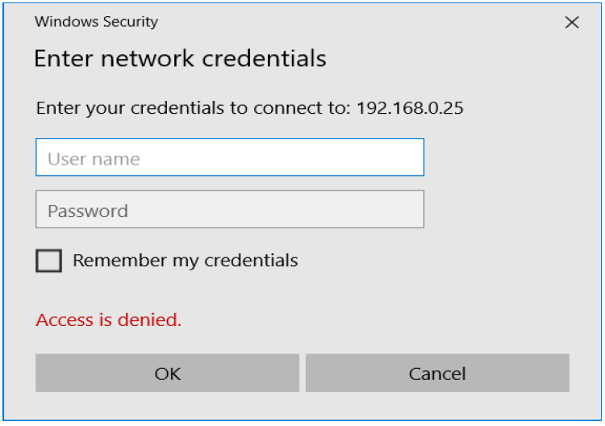

--- 
title: Secciones y Usuarios en Samba
description: Configuración Secciones y Usuarios en Samba de Francisco Javier Hernández Illán. 
---

# Secciones y Usuarios en SAMBA

## Secciones

Aunque en la UT anterior ya se comentaron parámetros de algunas de las secciones del archivo de configuración de **Samba**, es importante desarrollar más en profundidad las diferentes opciones que nos brinda **Samba** a través de dichas secciones.

Dentro del fichero de configuración `/etc/samba/smb.conf` encontramos diversas secciones, entre las que se destacan tres:

- `[global]`: Es la sección principal que nos permite configurar los parámetros generales del servicio. Las opciones especificadas aquí afectan a cualquier recurso compartido. 

!!! warning "Advertencia"
    A tener en cuenta, si una misma opción se declara en la sección global y en otra sección, por ejemplo una carpeta compartida con el nombre `ejercicio1`, tendrá mayor peso la de la sección más específica, es decir, la especificada en la sección llamada `ejercicio1`.

- `[homes]`: Esta sección permite compartir las carpetas home de cada usuario, para que cada usuario pueda acceder a su carpeta home por la red. 

!!! tip "consejo"
    Se puede indicar las opciones para el `/home` de los usuarios existentes en el servidor. De tal forma que podríamos acceder a nuestro `/home` desde cualquier máquina del grupo de trabajo de la siguiente forma: `\\IP_SERVIDOR\usuario` &#8594 (file://IP_SERVIDOR/usuario)

- `[printers]`: Permite compartir impresoras en red.

### Parámetros

Puesto que editando el archivo `smb.conf` se pueden configurar más de 300 parámetros, dando lugar a miles de configuraciones, esta guía se limitará a analizar los parámetros más relevantes

1. En la sección `[global]` se especifican las siguientes opciones generales:

|Variable|Descripción|
| - | - |
|**workgroup**|Esta variable ha de almacenar el nombre del grupo de trabajo o dominio que usamos en nuestra red.|
|**server string**|Permite reconocer el equipo dentro del dominio. Por defecto tiene como valor el nombre del servidor.|
|**hosts allow**|Especifica desde qué direcciones IP se podrá acceder al servicio. Si se especifica  192.168. todas las direcciones que empiecen de ese modo tendrán acceso al recurso. Se puede establecer direcciones IP completas.|
|**hosts deny**|Especifica los rangos no permitidos, del mismo modo que **host allow**.|
|**security,**|Especifica el nivel de seguridad con el que se puede acceder.|

!!! example "Ejemplo [global]"

``` bash
    [global]
    # Seguridad por usuarios
    security = user
    # Grupo de trabajo 'Aula5'
    workgroup = Aula5 
    # Las contraseñas se deberán enviar encriptadas 
    encrypt passwords = yes
    # Samba será servidor wins
    wins support = yes
    # Nivel y longitud máxima del archivo de registro
    log level = 1 
    max log size = 1000
    # Por defecto, lectura y escritura
    read only = no
    # Se comparten también las impresoras
    load printers = yes
```

- Más ejemplos:

`hosts allow/deny`: Permite restringir el acceso por IP:

!!! example "Ejemplo1"
    **Permitir Redes**  
    ``` yaml
    hosts allow = 192.168.2.0/24 192.168.3.0/24
    ```

!!! example "Ejemplo2"
    **Permitir IP específica**  
    ``` yaml
    hosts allow = 192.168.2.5 192.168.3.100 192.168.3.200
    ```

!!! example "Ejemplo1"
    **Permitir acceso a todos los hosts que comiencen por 192.168.**  
    ``` yaml
    hosts allow = 192.168.
    ```

!!! example "Ejemplo1"
    **Deniega acceso a todos los hosts que comiencen por 10.**  
    ``` yaml
    hosts deny = 10.
    ```

- Su funcionamiento es de arriba abajo, como las listas de acceso. Es decir, si tenemos:

``` yaml
hosts allow = 127.0.0.1 192.168.2.0/24 192.168.3.0/24
hosts deny = 127.0.0.1 192.168.2.0/24 192.168.3.0/24
```

**El que cuenta es el primero que coincida, por tanto sí permitiría el acceso.**

2. En la sección `[homes]` se muestra el siguiente ejemplo:

!!! example "Ejemplo"

``` bash
    [homes] 
    # Comentario
    comment = Carpetas home 
    # No explorables
    browsable = no 
    # Máscara de creación de archivos (rxw------)
    create mask = 0700 
    # Máscara de creación de carpetas
    directory mask = 0700
``` 

3. En la sección `[printers]` se muestra el siguiente ejemplo:

!!! example "Ejemplo"

``` bash
    [printers] 
    path = /var/tmp 
    printable = yes
    min print space = 2000
``` 

## Usuarios

- Para que esa administración sea posible, **Samba** dispone de su propia base de datos de `usuarios samba` pero como los usuarios utilizan otros recursos del servidor como carpetas e impresoras, es necesario que estén creados en el sistema Unix.

- Resumiendo, podemos decir que **para poder ser usuario de samba, es necesario disponer de una cuenta de usuario en Unix y de una cuenta de usuario en samba**.

!!! tip "Gestión usuarios"
    - La gestión de usuarios de samba se puede realizar de dos formas: 
    - con el comando `smbpasswd`. Con dicho comando, entre otras cosas podremos crear y eliminar usuarios, cambiar su contraseña, etc.
    - A través de los comandos **samba-tool user** y **samba-tool group**.

- Inicialmente se van a realizar con la primera opción.

### Creación de un usuario de samba con smbpasswd 

Para crear un usuario de samba se puede utilizar el comando `smbpasswd`, pero antes debemos haber creado el usuario en Unix.

!!! example "Ejemplo"

``` bash
# Creación del usuario pepe
sudo useradd pepe
# Si se desea que pepe pueda disfrutar de los servicios samba, debemos crear a pepe como usuario de samba ejecutando el siguiente comando:
sudo smbpasswd -a pepe
# Con la opción -a indicamos que añada al usuario. 
# Acto seguido nos preguntará dos veces la contraseña que deseamos poner al usuario. Lo razonable es que sea la misma contraseña que tiene el usuario en Unix. 
```

### Eliminar un usuario de samba

Para eliminar un usuario de samba debemos ejecutar `smbpasswd` con la opción `-x`, 

!!! example "Ejemplo"

``` bash
# Eliminar un usuario de samba
sudo smbpasswd -x pepe
# Inmediatamente el usuario habrá desaparecido de la base de datos de 'usuarios samba' aunque seguirá siendo un usuario de Unix.
```

3. Otras opciones de `smbpasswd`

- `-d`: Deshabilitar un usuario
- `-e`: Habilitar un usuario.
- `-m`: Indica que es una cuenta de máquina (equipo)
- `-n`: Usuario sin password.

!!! note
    La última opción Necesita parámetro null passwords = yes en sección 'global' del archivo de configuración de samba

### El usuario Invitado

Cuando accedemos como “**invitado**” (guest ok) por defecto accedemos como el usuario `nobody:nogroup`. Esto se puede modificar usando el siguiente parámetro:

``` bash
force user = javi
force group = alumnos
```

!!! tip "Opción"
    De esta forma cuando accedamos al sistema como invitado accederemos como el usuario `javi` que tiene el grupo principal alumnos.

### Restricción por usuarios

En caso de que no permitamos el acceso de invitados (guest ok = no) el servidor nos solicitará nuestras credenciales:

<figure>
  
</figure>

- Por otra parte se puede restringir los usuarios que pueden tener acceso a un recurso:

``` bash
valid users = javi pepe jorge
invalid users = root @profesores @root
```

!!! note "Nota"
    El `“@”` indica que se hace referencia a un grupo. Por tanto ningún usuario perteneciente al grupo root o de profesores puede acceder.

- Además se pueden crear usuarios administradores.

``` bash
admin users = javi
```

!!! note "**NOTA:**"
    Los usuarios dentro de esta lista actuarán como `root`.

!!! note "**NOTA:**"
    Si un usuario está en el listado de “valid users” y en el de “invalid users” se le deniega el acceso.

### Autentificación en Samba a través de usuarios

Para autentificarse en `Samba` a través de usuarios se deben cumplir 2 requisitos:

1. El usuario debe existir en el sistema `/etc/passwd`

``` bash
sudo useradd -s /bin/true “usuario”
```

!!! note "**Nota**"
    De esta forma no se crea el `/home` del usuario y no se permite el acceso al sistema si no es a través de **Samba**. Es decir, el usuario no se podría conectar a través de `ssh` o localmente.

2. El usuario debe existir en el servicio de samba. Para listar los usuarios se utiliza el comando `pbedit -L`.

``` bash
sudo smbpasswd –a “usuario”
```

!!! note "**NOTA:**"
    La contraseña es recomendable que sea diferente a la usada en el sistema.

- **Listar usuarios dados de alta en SAMBA:**

``` bash
pdbedit -L
```


<!-- smb encrypt = required
client min protocol = SMB2
client max protocol = SMB3 -->