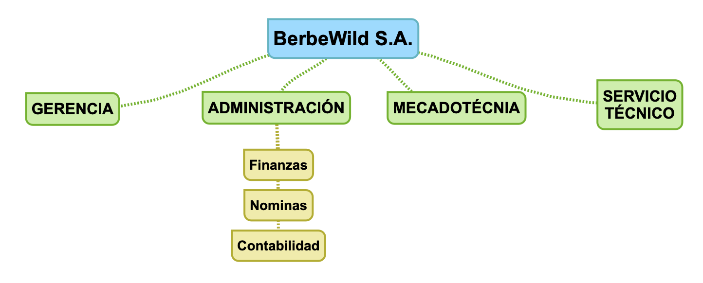

--- 
title: Creación de Usuarios y grupos en Samba
description: Creación de Usuarios y grupos en Samba de Francisco Javier Hernández Illán. 
---

# Creación de usuarios y grupos

## PT31 Creación de usuarios y grupos

!!! info "Contribución a los CEs (Criterios de Evaluación)"
    Estas actividades contribuyen a los criterios de evaluación CE1, CE2, CE3, CE4, CE5, CE6, CE7, y CE8 del RA2 de SOR.

!!! warning "Advertencia"
    Razona todas las respuestas, en caso de que la respuesta sea debido a unos permisos indica que permisos tiene y donde han sido determinados.

### Enunciado

Partiendo de la **situación de aprendizaje**, desde el departamento TIC de **NetOS** nos encargan crear la infraestructura de directorios y usuarios para los diferentes departamentos de una empresa de cría de berberechos salvajes denominada **BerbeWild S.A.** desde un sevidor linux **Ubuntu Server**. 

!!! note "**Nota**"
    Cabe destacar que el escenarios de la empresa es heterogéneo ya que existen diferentes tipos de sistemas operativos de propietarios (**Windows**) y libre licencia (**Lubuntu**).

- Por estas razones se decide utilizar el servicio **Samba** y realizar unos pasos previos siguiendo la guía adjunta a continuación:

!!! warning "Requisitos"
    Se necesitan las tres máquinas virtuales utilizadas en el apartado [2.2 Instalación y configuración inicial de Samba](https://fjavier-hernandez.github.io/sor/02_INTRO_SAMBA/022_InstalacionSamba.html) en configuración **Red NAT**.

!!! question "Tareas"
    - Esta práctica tiene como objetivo la creación de usuarios y grupos por un lado en el sistema y por otro en el servicio de directorio Samba, aunque inicialmente se debe crear la estructura de directorios de la organización.
    - A partir de las premisas adjunta realiza un video con los pasos realizados y un informe con los siguientes apartados.
    - Haz pruebas de inicio de sesión en al menos un cliente por departamento para comprobar que las cuentas funcionan.


### Premisas

1. **BerbeWild S.A.** esa posee una estructura en departamentos de esta forma:

* Un departamento encargado de la **gerencia** de la empresa. El sistema utilizado por este departamento es **Lubuntu 22_04**.
* Otro se encargará de la **administración** de la empresa. Es normal que ante la amplitud de tareas que este departamento posee se divida en varios sub-departamentos: **finanzas**, **nóminas** y **contabilidad.** Este departamento destaca por utilizar el sistema operativo **Windows 11**.
* Otra de las actividades que seguro necesitarás en tu empresa será la gestión de **mercadotécnia** con sistema operativo **Windows 11**.
* Además, debes contar con un buen **servicio técnico** que realice las tareas de diseño, implementación y mantenimiento de la infraestructura informática. El sistema utilizado por este departamento es **Lubuntu 22_04**.

!!! info "**Número de usuarios por departamento y rol**"
    Cada uno de estos departamentos posee dos empleados, uno de ellos será el responsable.

!!! note "**Nota**"
    Utiliza datos inventados para la información personal. Puedes usar esta web para obtener datos personales ficticios: [GeneraData](https://www.generatedata.com).

2. Crea un grupo por cada departamento y sub-departamento e introduce en ellos a cada uno de los usuarios que corresponda.

!!! example "**Ejemplo**"
    Los usuarios de **gerencia** en el grupo **gerencia**.

3. Los usuarios deben tener estas limitaciones:

* El usuario debe cambiar su contraseña en el siguiente inicio de sesión.
* El usuario no podrá cambiar la contraseña hasta que no transcurran 7 días desde la última vez que la modificó.
* Cualquier usuario debe cambiar su contraseña transcurridos treinta días.
* El sistema avisará con una semana de antelación del cambio de contraseña.

## Guía

El esquema de la organización es:

<figure>
  
</figure>

!!! tip "Consejo"
    Genera los directorios para la empresa, podrías utilizar el comando `mkdir -p /PATH`.

1. En un primer paso se crean los grupos y usuarios en el sistema para luego tenerlos "agregados también en el servicio de Samba". Se muestra la creación de dos usuarios en el sistema del departamento de servicio técnico a modo de ejemplo:

- Generación de grupo de servicio técnico "TIC":

``` bash
sudo groupadd TIC
```

- Usuario administrador "responsable" debe tener permisos de superusuario:

``` bash
sudo useradd admin -m -G sudo -s /bin/bash
```

- Usuario "nivel bajo":

``` bash
sudo useradd usuario -m -g TIC -s /bin/bash
```

Por otro lado, se generan los usuarios en Samba, los cuales se pueden realizar de dos formas:

- Mediante **smbpasswd**:

``` bash
sudo smbpasswd -a admin
```

- A través de comandos de **samba-tool**.

``` bash
sudo samba-tool user create admin
```

**Nota**: Este ejemplo se realiza para todos los usuarios planteados en la organización.

2. La creación de grupos también se realiza en el servicio samba mediante **samba-tool**.

- En el sistema.

``` bash
sudo samba-tool group add admin
```

- Se añaden los usuarios al grupo.

``` bash
sudo samba-tool group addmembers TIC usuario
```

3. Para las restricciones de contraseña se puede realizar en un solo comando o en el sistema o por samba, se muestra por sistema:

``` bash
sudo chage -d 0 -m 7 -M 30 -W 7 usuario
```

- Para comprobarlo se puede ejecutar:

``` bash
sudo chage -l usuario
```

!!! note "**Nota**"
    Investiga los argumentos del comando `chage` para relacionarlos con las premisas del punto 3.

