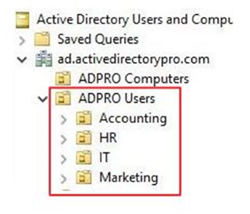
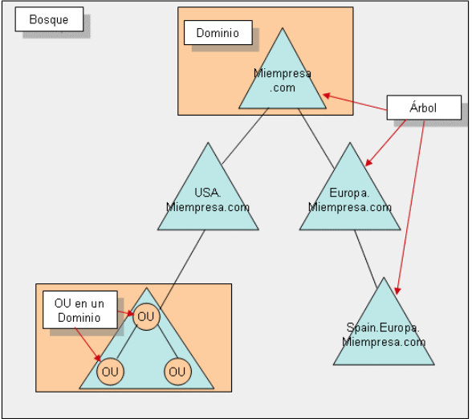
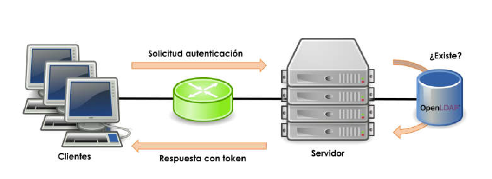

--- 
title: Introducción de Samba DC
description: Introducción Gestión de de recursos compartidos en Samba de Francisco Javier Hernández Illán. 
---

# Introducción Samba Domain Controller

La organización de una red de trabajo empresarial supone un reto organizativo que el administrador del sistema debe afrontar con garantías de éxito. 

!!! abstract "**Principio**"
    Si no se concibe un ordenador sin sistema operativo que lo administre, tampoco debe existir una red de cierta entidad sin sistema operativo en red que la gestione.

* Para ello se dispone de herramientas organizativas como los **Servicios de Directorio**.
* Entre los principales servicios de directorio destacan **SAMBA Domain Controller** y **Active Directory**, ambos basados en el protocolo **LDAP**, y los cuales ofrecen una amplia gama de herramientas que facilitan la organización de recursos de una red.
* En concreto en esta **Unidad de Trabajo (UT)** se desarrolla **Samba Domain Controller**, el cual emula al controlador de dominio de un dominio Windows, conocido como **Active Directory Domain Services (AD DS)**.

## Servicios de directorio

!!! tip "**En primer lugar...**"
    Antes de profundizar en **Samba DC** es importante desarrollar los principales conceptos de los **servicios de directorio**.

**Los servicios de directorios**, son un conjunto de aplicaciones que guardan y administran toda la información sobre los elementos de una red.

 * Cada **recurso** de la red se considera como un **objeto**, donde su **información se almacena como atributos**.
 * Para la gestión de esta información, el **servicio de directorio** establece una serie de **permisos de acceso y condiciones de seguridad** que la salvaguardan esta información.
 * Ofrecen una **infraestructura** para localizar, manejar, administrar, y organizar los componentes y recursos comunes de una red.

!!! note "**Nota**"
    Los recursos pueden ser: volúmenes, carpetas, archivos, impresoras, usuarios, grupos, dispositivos, números de teléfono y un largo etcétera.

!!! absract "**Resumen**"
    Un servicio de directorio ofrece toda la información de los recursos de la red a través de una única ubicación. Para ello convierte cada recurso en un objeto y almacena su información en una base de datos jerárquica y, opcionalmente, distribuida. La gestión de estos datos se realiza a través de un protocolo determinado por la versión del servicio de directorio escogido.

### Principales

1. **Active Directory**, ideado por Microsoft e implementado desde su versión *Microsoft Windows 2000* que usaba tecnología propietaria, para más tarde adaptar el protocolo LDAP a su servicio.
2. **OpenLDAP**, recibe el nombre del protocolo homónimo que gestiona el intercambio de información. Es uno de los más usados en sistemas basados en *GNU/Linux*.
3. **SambaDC**, un servicio compuesto por un conjunto de protocolos (*OpenLDAP*, *Kerberos* y *Samba*) que permite la fácil coexistencia de entre sistemas operativos diferentes.
4. Otros: **Novell Directory Services**, **Red Hat Directory Server** o **Apache Directory Server**.

### Componentes

Los servicios de directorios contienen diferentes objetos relacionados entre sí, y que será conveniente familiarizarse con ellos:

1. **Directorio**, es un repositorio único para la información relativa a los objetos de una organización.
2. **Dominio**, es una colección de objetos dentro de un directorio.
3. **Objeto**, cualquiera de los elementos que forman parte del directorio. Pueden ser recursos, usuarios, equipos, relaciones de confianza, servidores, unidades organizativas entre otros. En general todos estos objetos se clasifican en tres categorías:
    1. **usuarios**, identificados a través del binomio *nombre/contraseña* y que pueden organizarse en grupos.
    2. **recursos**, elementos que los usuarios pueden usar para el correcto desarrollo de su actividad.
    3. **servicios**, que son funciones a los que el usuario tienen acceso como el *correo electrónico*, *copias de seguridad en la nube*, *conexión Internet entre otros*.
4. **Unidad organizativa**, es un contendedor de objetos que permite organizarlos en subconjuntos de forma jerárquica. Facilita la organización de los dominios.

<figure>
  
  <figcaption>Unidades Organizativas en Active Directory</figcaption>
</figure>

5. **Grupo**, conjunto de objetos usuario. Al igual que las unidades organizativas, facilitan la organización y administración de los objetos, los grupos lo hacen con objetos tipo usuario.
6. **Controlador de dominio**, equipo que contiene la base de datos de objetos para un determinado dominio, incluida la información de seguridad y la responsabilidad de la autenticación de objetos de su ámbito de gobierno.
7. **Catálogo global**, base de datos con la información de todos los objetos que contiene el directorio. Esta información habitualmente se divide
entre los controladores de dominio siendo éstos responsables del mantenimiento de su parte de esta información.
8. **Maestro de operaciones**, existen un conjunto de operaciones que deben estar centralizadas para mantener la consistencia del sistema. El equipo encargado de esas operaciones obtiene este rol específico. Según el caso puede ser un equipo independiente que controle estas operaciones o asignar estas tareas a un equipo existente.
9. **Árbol**, un conjunto de dominios dependientes de una raíz común y que tienen una estructura jerárquica. Se caracterizan por tener un espacio de nombres común (un servidor DNS propio). El objetivo de esta fragmentación de la estructura es replicar sólo la información necesaria y disminuir el tráfico de red.

<figure>
  
  <figcaption>Objetos en Active Directory.</figcaption>
</figure>

10. **Bosque**, se trata del mayor contenedor lógico dentro del directorio, conteniendo a todos los árboles dentro de su ámbito. Cada uno de
estos contenedores posee su propio espacio de nombres y una forma de relacionarse con el resto de bosques.

<figure>
  
  <figcaption>Ejemplo de Objetos en Active Directory.</figcaption>
</figure>

11. **Esquema**, se refiere a la estructura de los objetos que forman la base de datos. Usa la técnica clase/objeto para definir la estructura de un
objeto. Si se crean dos objetos usuarios, ambos tendrán los mismos atributos (estructura), pero diferentes valores de atributos.
12. **Sitio**, conjunto de *objetos equipo* que se encuentran relacionados de una forma lógica, geográfica o técnica particular y que necesitan un subconjunto de normas diferentes al resto.
13. **Relaciones de confianza**, son un método de comunicación segura entre dominios, árboles y bosques, que permiten a los usuarios autentificarse en
otra parte del directorio a la que no pertenece.

!!! note "**Nota**"
    Para nombrar a todos estos objetos que componen la red, los servicios de directorio definen un espacio de nombres unívoco, e identifican a cada uno de estos objetos con un nombre único en todo el directorio.

* La tecnología utilizada para crear este espacio de nombres es la **DNS (Domain Name Server)**, y su funcionamiento es similar al de Internet. 
* Cada uno de los objetos del directorio posee un **DN (Distinguished Name)** que lo identifica de forma unívoca del resto de elementos del directorio.

### Ventajas

* los servicios de directorio, ofrecen una capa de **abstracción** para facilitar el acceso a los objetos. Se debe indicar una única ubicación en donde se dirigirán las peticiones de información. No importa si la información solicitada se encuentra o no en ese emplazamiento.
* **Autonomía**, Es posible que toda la información no esté contenida en un único equipo por cuestiones de rendimiento, escalabilidad o idiosincrasia del sistemas informático. En estos casos crear un subconjunto de la información contenida en los servicios de directorio parece una buena opción y dotarlos de las herramientas necesarias para su gestión autónoma.
<!-- * Si se permite el símil, **es el Google de los sistemas informáticos** que se gestiona. -->

## Samba DC

!!! quote "**Referencia**"
    Según [Samba Wiki](https://wiki.samba.org/index.php/Setting_up_Samba_as_an_Active_Directory_Domain_Controller#Introduction) las principales características de **Samba DC** son:

- **Samba** puede servir como **controlador de dominio (DC)** de **Active Directory (AD)** a partir de la versión 4.0 (lanzada en 2012).
- Samba opera en el nivel funcional forestal de **Windows Server 2008 R2**, que es más que suficiente para gestionar empresas sofisticadas que utilizan **Windows 10/11** con estrictos requisitos de cumplimiento (incluido el [NIST 800-171](https://csrc.nist.gov/pubs/sp/800/171/r2/upd1/final)).
- Integra el servidor **LDAP** como back-end de **Active Directory (AD)**.
- Proporciona soporte experimental para el MIT **Kerberos**.

Dentro del compendio de aplicaciones que en el que se basa **Samba** se destacan **LDAP y Kerberos**, las cuales se definen a continuación.

## LDAP

El **LDAP (Lightweight Directory Access Protocol)** es un protocolo a nivel de aplicación que da acceso a un servicio de directorio ordenado y distribuido para la búsqueda de la información de un entrono de red.

* En la década de los 80, la especificación de directorio **X.500** vió la luz. El protocolo que daba acceso a la información contenida en él, fue DAP
(Directory Access Protocol) y estaba basado en la **pila de protocolos OSI (Open Systems Interconexion)**. Gracias al auge de Internet, la pila de protocolos TCP/IP cobraron especial protagonismo y su uso fue generalizado en cualquier infraestructura de red, incluidas las LAN.

* Ante esta situación, en **1993** se implementó el protocolo **LDAP** que utilizaba la pila de protocolos TCP/IP para el acceso a la información contenido en un servicio de directorio. El funcionamiento de LDAP es **relativamente simple**: un cliente se inicia una sesión en un servidor LDAP solicitando alguna información.

<figure>
  
  <figcaption>Esquema de funcionamiento del protocolo LDAP</figcaption>
</figure>

!!! Conclusión
    * **LDAP, es un protocolo que ofrece el acceso a un servicio de directorio** implementado sobre un entorno de red, con el objeto de acceder a una determinada información. Puede ejecutarse sobre TCP/IP o sobre cualquier otro servicio de transferencia orientado a la conexión.
    * Podemos considerarlo como un **sistema de almacenamiento de red al que se pueden realizar consultas.**

## Kerberos

**Kerberos es un protocolo de autenticación** de redes de ordenador creado por el MIT que permite a dos ordenadores en una red insegura demostrar su identidad mutuamente de manera segura.

<figure>
  
  <figcaption>Logo Kerberos</figcaption>
</figure>

Se caracteriza por:

- Se basa en el modelo de **cliente-servidor**.
- Brinda **autenticación mutua:** tanto cliente como servidor verifican la identidad uno del otro. 
- Los mensajes de autenticación están protegidos mediante criptografía de **clave simétrica**.
