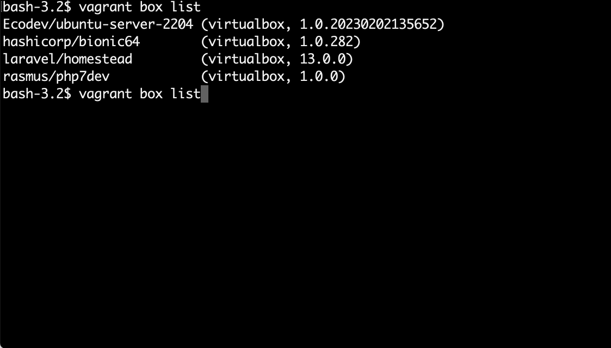
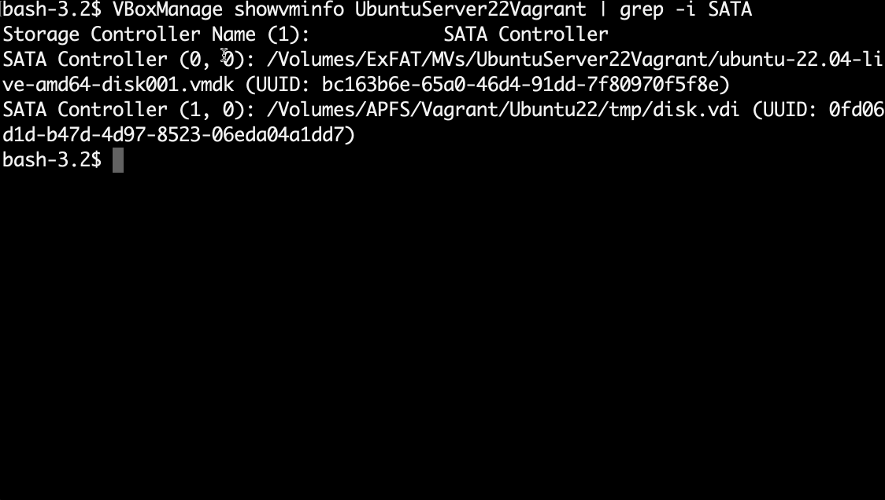

--- 
title: Introducción a Entornos de desarrollo virtualizados - Vagrant
description: Apuntes de introduccióna entornos de desarrollo virtualizados del módulo Sistemas Operativos en red (SOR) del docente Francisco Javier Hernández Illán. 
---

<figure>
  
</figure>

# Introducción Vagrant

Actualmente el auge del desarrollo de aplicaciones en sistemas virtualizados requiere del despliegue, conectividad y flexibilidad de sistemas heterogéneos en escenarios de desarrollo de trabajo y producción.

Una de las herramientas más utilizadas por los SRE (Site Reliability Engineer) es **Vagrant**, para conseguir el objetivo principal de crear sistemas de software altamente confiables y escalables. **Vagrant** es una herramienta para la creación y configuración de entornos de desarrollo virtualizados que cubre las necesidades comentadas.

Motivado por dicha relevancia a continuación se introduce la herramienta de Devops **Vagrant**.

## ¿Qué es Vagrant?

- Es una **herramienta** para construir entornos de desarrollo **simples**, con un flujo de trabajo fácil de usar y un enfoque en la **automatización** replicable. Permite crear y destruir los escenarios en repetidas ocasiones sin gran esfuerzo.
- Esencialmente, es una capa de software instalada entre una herramienta de virtualización (como **VirtualBox**, **Docker**, **Hyper-V**) y una máquina virtual.
- Por lo tanto, es un software para automatizar las operaciones que se realizan con los **hipervisores**:

!!! example "Por ejemplo"
    - Crear, configurar, parar, suspender y destruir máquinas virtuales.
    - Gestionar redes.
    - Compartir espacios de disco entre guest y host.
    - Manejar distintos tipos de hipervisores.

- Es un software de código libre disponible bajo una licencia `MIT`. El código fuente está disponible en [Github](https://github.com/hashicorp/vagrant).
- Fue desarrollado originalmente por **Mitchell Hashimoto** en 2010. A partir de Vagrant se creo **Hashicorp** en 2012.

[HASHICORP](https://www.hashicorp.com)

<figure>
  
</figure>

!!! tip "Aplicaciones de Hashicorp"
    - **Packer** (imágenes de vagrant)
    - **Consul** (descubrimiento de servicios)
    - **Terraform** (aprovisionamiento)
    - **Vault** (seguridad)
    - **Nomad** (despliegue contenedores)

## Características

- Puede **integrarse con herramientas de gestión de la configuración**, automatizando la provisión de software de la máquina virtual.
- Forma parte del conjunto de aplicaciones utilizadas en **"infraestructura como código"**, mediante un fichero de texto que puede formar parte del código fuente del proyecto, por lo que puede subirse al control de versiones y ser compartido por todos los desarrolladores, dicho fichero es denominado **Vagrant file**.
- Soluciona problemas de incidencias de desarrollo entre diferentes sistemas.

<!-- <figure>
  
</figure> -->

!!! warning "Incidencias"
    El problema de configurar escenarios a mano conlleva un trabajo tedioso y provoca errores, dando lugar al reproche de **En mi máquina funciona.**

<figure>
  
</figure>

!!! abstract "Solución"
    - **Vagrant**: para Distribuir de forma separada imágenes “limpias” de OS y la configuración completa en un fichero de texto que es el que se distribuye por el grupo de trabajo.
    - Reduce el tiempo de configuración del entorno de desarrollo, aumenta la paridad de **desarrollo/producción** y hace que la excusa de **"funciona en mi máquina"** sea una reliquia del pasado.
    - A menudo se utiliza en el desarrollo de software p**ara garantizar que todos los miembros del equipo estén construyendo para la misma configuración**. 
    - No solo comparte entornos, sino que también comparte código. Esto permite que el código de un desarrollador trabaje en el sistema de otro, haciendo posible el desarrollo colaborativo y cooperativo.

## Vagrant vs. Docker

- `Vagrant` es una herramienta centrada en proporcionar un flujo de trabajo de entorno de desarrollo coherente en múltiples sistemas operativos, trabajando sobre los **hipervisores**. 
- Docker es una gestión de contenedores que puede ejecutar software de forma consistente siempre y cuando exista un sistema de contenedorización.
- Los contenedores son generalmente más ligeros que las máquinas virtuales, por lo que iniciar y detener los contenedores es extremadamente rápido. Docker utiliza la funcionalidad de contenedorización nativa en macOS, Linux y Windows. 
- Para entornos de **microservicios pesados**, Docker puede ser atractivo porque puede iniciar fácilmente una sola máquina virtual Docker e iniciar muchos contenedores por encima de eso muy rápidamente. Este es un buen caso de uso para Docker. 
- `Vagrant` también puede hacer esto con el proveedor de Docker. Un beneficio principal para Vagrant es un flujo de trabajo consistente, pero hay muchos casos en los que un flujo de trabajo de Docker puro tiene sentido.
- Tanto Vagrant como Docker tienen una vasta biblioteca de "imágenes" o "boxes" para elegir.

## Instalación Vagrant

Para la instalación el mejor consejo es acudir a la documentación oficial, en el siguiente enlace se pueden obtener los comandos de instalación de Vagrant para los diferentes tipos de sistemas operativos:

[INSTALACIÓN VAGRANT](https://developer.hashicorp.com/vagrant/downloads)

!!! note "Nota"
    En este caso se realiza la ejecución de los comandos para la instalación por repositorios en las distribuciones de Ubuntu/debian.

1. Descarga de las **GPG**: **GNU Privacy Guard** es una herramienta de cifrado y firmas digitales.

``` bash
wget -O- https://apt.releases.hashicorp.com/gpg | gpg --dearmor | sudo tee /usr/share/keyrings/hashicorp-archive-keyring.gpg
```

2. Introducción de la firma en los repositorios: mediante el comando echo se añade la firma digital al `sources.list`

``` bash
echo "deb [signed-by=/usr/share/keyrings/hashicorp-archive-keyring.gpg] https://apt.releases.hashicorp.com $(lsb_release -cs) main" | sudo tee /etc/apt/sources.list.d/hashicorp.list
```

3. Actualización de repositorios e instalación de Vagrant.

``` bash
sudo apt update && sudo apt install vagrant
```

4. Confirmación de la instalación

``` bash
vagrant -v
```

## Configuración del proyecto Vagrant

Para tener una máquina virtual totalmente utilizable con Ubuntu 18.04 LTS de 64 bits, solo se necesitan los siguientes dos comandos:

1. Empieza por crear un directorio para almacenar tu archivo Vagrant:

``` bash
sudo mkdir vagrant-test
```

``` bash
cd vagrant-test
```

2. Se inicializa una maquina virtual, Descargando una distribución del [VAGRANT HUB](https://app.vagrantup.com/boxes/search).

``` bash
vagrant init hashicorp/bionic64
```

!!! note "Nota"
    Este comando descarga una `Vagrantbox` y genera un `vagrantfile` en el directorio del proyecto.

!!! abstract "Vagrantbox"
    - La unidad básica en una configuración de Vagrant se llama `box` o `Vagrantbox`. Esta es una imagen completa e independiente de un entorno de sistema operativo.
    - Una `Vagrantbox` es un clon de una imagen básica del sistema operativo. El uso de un clon acelera el proceso de lanzamiento y aprovisionamiento.

!!! abstract "vagrantfile"
    Un `Vagrantfile` es un archivo de Ruby que le indica a Vagrant que cree, dependiendo de cómo se ejecute, nuevas máquinas o `Vagrantbox`.


3. Antes de poder continuar con el siguiente paso, asegúrate de que Vagrant haya creado un `Vagrantfile`.

``` bash
ls -al
```

4. Se arranca la máquina virtual.

``` bash
vagrant up
```

5. Se puede acceder por ssh a la máquina virtual.

``` bash
vagrant ssh
```

<figure>
  
  <figcaption>Creación del proyecto de Vagrant, inicialización de MV y comprobación.</figcaption>
</figure>

<!-- <figure>
  
  <figcaption>Creación de una MV configurada.</figcaption>
</figure> -->

## Configuración básica

Por defecto, Vagrant almacena las VMs ‘boxed’ en la ruta `~/.vagrant.d`. Estas ‘boxes’ suelen ser ficheros de gran tamaño, y podemos considerarlas como una ‘imagen modelo’ de las MVs que tendremos en ejecución. Se pueden compartir entre diferentes usuarios, con el objetivo de optimizar el espacio utilizado en disco.

La ubicación del directorio principal de Vagrant puede modificarse a través de la variable de entorno VAGRANT_HOME. Por ejemplo, a través del siguiente comando:

``` bash
export VAGRANT_HOME=/ruta/al/directorio
```

!!! example "Ejemplo"
    Como puedes mover tus archivos `Vagrant` y máquinas virtuales `VirtualBox` de tu carpeta de inicio a un disco duro externo:

1. Copia el directorio `.vagrant.d` de tu carpeta personal (`~/.vagrant.d`) al disco externo (Y renombra la carpeta a `vagrant_home`:

``` bash
cp -R ~/.vagrant.d /Volumes/[VOLUME_NAME]/vagrant_home"
```

2. Elimina el directorio `.vagrant.d` fde la carpeta personal:

``` bash
rm -rf ~/vagrant.d
```

3. Edita tu archivo `.bash_profile`, y añade la siguiente línea:

``` bash
export VAGRANT_HOME="/Volumes/[VOLUME_NAME]/vagrant_home"
```

- Para editarlo directamente:

``` bash
echo 'export VAGRANT_HOME="/Volumes/[VOLUME_NAME]/vagrant_home' >> ~/.bash_profile
```

!!! warning "advertencia"
    Para hacerlo permanente y no solo valga para una sesión, es necesario introducirlo en el `.bash_profile`

4. Abre VirtualBox, vaya a Preferencias y establezca la carpeta de máquina predeterminada en una ubicación en su disco duro externo (por ejemplo una nueva carpeta llamada "VMs VirtualBox").

## Crear una MV ya configurada

Hay `Boxes` subidas al Vagrant Cloud que no solo aportan un Sistema Operativo "limpio" sino que a parte tienen configurada alguna aplicación o servicio, para añadirlas correctamente su Vagrantfile viene especificado en el `git` que aparece en la descripción de la `box`.

!!! example "Ejemplo"
    [rasmus/php7dev](https://app.vagrantup.com/rasmus/boxes/php7dev)

Para realizar un uso adecuado de está caja se clona el repositorio que contiene el Vagrantfile configurado con las características de esta imagen:

``` bash
 git clone https://github.com/rlerdorf/php7dev.git
```

Una vez clonado aparece la carpeta descargada donde podemos apreciar los archivos de `Vagrantfile` y de configuración `.yml`, como se observa a continuación.

<figure>
  
  <figcaption>Vagrantfile y .yml de la Caja descargada.</figcaption>
</figure>

!!! note "Nota"
    Una vez realizado el Vagrant up se puede acceder al servicio de `PHP`

## Principales comandos Vagrant

En la [DOCUMENTACIÓN OFICIAL](https://developer.hashicorp.com/vagrant/docs/cli) se encuentran todos los comandos de Vagrant, en los siguiente apartados se realiza un resumen de los más utilizados.

!!! warning "Advertencia"
    ¡Asegúrate de estar en el mismo directorio que Vagrantfile cuando ejecutes estos comandos!

### Crear una MV

- `vagrant init`           -- Inicializa Vagrant con un `Vagrantfile` y . /.vagrant directorio, sin imagen base especificada. Antes de poder hacer vagrant up, tendrás que especificar una imagen base en el `Vagrantfile`.
- `vagrant init <boxpath>` -- Inicializa Vagrant con una caja específica. Para encontrar una caja, accede al  [public Vagrant box catalog](https://app.vagrantup.com/boxes/search). Cuando encuentres uno que te guste, reemplaza su nombre con `boxpath`. Por ejemplo, `vagrant init ubuntu/trusty64`.

### Empezar una MV

- `vagrant up`                  -- comienza el entorno de vagrant (también disposiciones solo sobre el PRIMER vagrant up).
- `vagrant resume`              -- reanudar una máquina suspendida (vagrant up también se puede utilizar).
- `vagrant provision`           -- uerza el reaprovisionamiento de la máquina de vagrant.
- `vagrant reload`              -- reinicia la máquina vagrant, carga la nueva configuración de `Vagrantfile`
- `vagrant reload --provision`  -- reinicie la máquina virtual y fuerce el aprovisionamiento

### Accediendo a una máquina Vagrant

- `vagrant ssh`           -- se conecta a la máquina a través de `SSH`
- `vagrant ssh <boxname>` -- Si le das un nombre a tu box en tu Vagrantfile, puedes acceder via `ssh` sustituyendo el boxname por el nombre. Funciona desde cualquier directorio.

### Parando una MV

- `vagrant halt`        -- detiene la máquina de vagrant.
- `vagrant suspend`     -- suspende una máquina virtual (recuerda el estado).

### limpiando una MV

- `vagrant destroy`     -- detiene y elimina todos los rastros de la máquina de Vagrant.
- `vagrant destroy -f`   -- lo mismo que lo anterior, sin confirmación.

### Boxes
- `vagrant box list`              -- ver una lista de todas las cajas instaladas en tu ordenador.
- `vagrant box add <name> <url>`  -- descarga una imagen de caja en tu ordenador.
- `vagrant box outdated`          -- comprueba si hay actualizaciones en la vagrant box.
- `vagrant box remove <name>`   -- elimina una caja de la máquina
- `vagrant package`               -- empaqueta un virtualbox env en ejecución en una caja reutilizable

### Guarda el Progreso

-`vagrant snapshot save [options] [vm-name] <name>` -- vm-name is often `default`. Permite guardar una instanténea
### Tips
- `vagrant -v`                    -- consigue la versión vagrant
- `vagrant status`                -- estado de las salidas de vagrant machine
- `vagrant global-status`         -- stado de las salidas de todas las vagrant machines
- `vagrant global-status --prune` -- igual que el anterior, pero las entradas no son válidas
- `vagrant provision --debug`     -- usa la bandera de depuración para aumentar la verbosidad de la salida
- `vagrant push`                  -- ¡sí, vagrant se puede configurar para implementar código! [deploy code](http://docs.vagrantup.com/v2/push/index.html)!
- `vagrant up --provision | tee provision.log`  -- Ejecuta `vagrant up`, fuerza el aprovisionamiento y registra toda la salida en un archivo