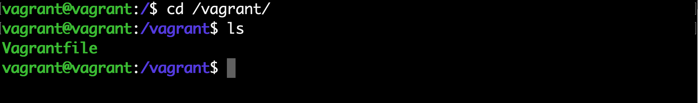
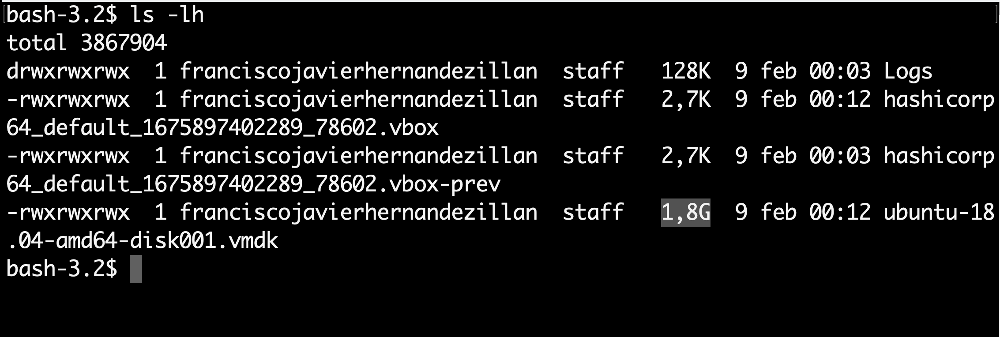

--- 
title: Configuración Vagrant 
description: Apuntes de configuración de Vagrant del módulo Sistemas Operativos en red (SOR) del docente Francisco Javier Hernández Illán. 
---

# Configuración Vagrant

La configuración de un escenario concreto se realiza de forma bastante simple mediante modificaciones en el `Vagrantfile`, que está escrito en formato Ruby.

El **Vagrantfile** es un archivo de Ruby utilizado para configurar Vagrant por proyecto. La función principal de **Vagrantfile** es describir las máquinas virtuales necesarias para un proyecto, así como la forma de configurar y aprovisionar estas máquinas.

Los scripts **Vagrantfiles** están destinados a ser comprometidos directamente bajo el control de versiones. La idea es que cuando un desarrollador sincroniza su fichero **vagrantfile**, simplemente con lanzar el comando `vagrant up` obtiene un entorno virtual totalmente aprovisionado para desarrollar ese producto.

## Vagrantfile

Para montar una máquina virtual con Vagrant tenemos que tener obligatoriamente un archivo llamado Vagrantfile. La sintaxis del script Vagrantfile es Ruby , pero el conocimiento del lenguaje de programación Ruby no es necesario para realizar modificaciones en el Vagrantfile, ya que es en su mayoría sólo se realizan asignaciones simples de variables. Este fichero define:

- El **box** que servirá de plantilla de la máquina virtual.
- Las **características** de la máquina virtual.
- Conjunto de **comandos que queremos que se ejecuten al crear la máquina**. Suelen ser los pasos de instalación de aplicaciones y copias de datos desde carpetas compartidas en la máquina host a la máquina virtual.

!!! tip "Consejo"
    Para visualizar por consola la lista de máquina virtuales en virtual box se puede utilizar el comando: `VBoxManage list vms`

!!! note "Nota"
    Realmente la configuración que se aplica es la aplicación en serie de varios `Vagranfiles`, tal como se explica en en la documentación oficial en [Load Order and Merging](https://developer.hashicorp.com/vagrant/docs/vagrantfile#load-order-and-merging), aunque lo más habitual es que se cargue el `Vagrantfile` que incluye el box y el que exista en el directorio de trabajo, siendo este último el que se modifica en la mayoría de los casos.

### Modificaciones de la máquina virtual

- Las modificaciones se configuran en el espacio de nombres `config.vm`, prefijo que antecede a los parámetros en este caso, `por ejemplo` para modificar el hostname de la máquina se utiliza:

``` bash
config.vm.hostname = "UbuntuServer22_Vagrant"
```

<figure>
  
  <figcaption>Generar hostname a la MV de Vagrant.</figcaption>
</figure>

!!! note "Nota"
    El resto de parámetros que se pueden modificar los encontramos en la documentación de [Vagrant: Machine Settings](https://developer.hashicorp.com/vagrant/docs/vagrantfile/machine_settings), dejando en este caso para secciones posteriores algunos de los aspectos que necesitan más desarrollo como la configuración de la red o la configuración integrada de la máquina virtual mediante shell scripts o mediante aplicaciones como `Ansible` o `Puppet`.

- Los parámetros relativos a las **características de hardware de la máquina virtual** dependen del proveedor en Vagrant y en el caso de VirtualBox se definen mediante una sub-sección desde donde se realizan las modificaciones apropiadas en un Vagrantfile. **Por ejemplo** para cambiar el nombre de la máquina virtual, la memoria RAM asignada y el número de núcleos virtuales.

``` bash
 config.vm.provider "virtualbox" do |vb|
     vb.name = "nombre"
     vb.memory = "512"
     vb.cpus = 2
   end
```

- Como la forma habitual de gestionar máquinas virtuales en `Vagrant` es mediante la línea de comandos y accediendo a ellas a través de ssh, no tiene mucho sentido que se arranque una interfaz gráfica, pero en algunas ocasiones es conveniente. Para activar la interfaz gráfica de usuario al levantar la máquina, se debe añadir la siguiente línea al `Vagrantfile`.

``` bash
config.vm.provider "virtualbox" do |vb|
     vb.gui = true     
   end
```

### Directorio compartido

Por defecto cuando se ejecuta una MV con Vagrant se crea una carpeta compartida entre el Anfitrión y la MV. en este caso:

<figure>
  
  <figcaption>Directorio compartido por defecto en Vagrant.</figcaption>
</figure>

<figure>
  
  <figcaption>En la MV de Vagrant se observa el Vagrantfile.</figcaption>
</figure>

!!! note "Generar archivos"
    Si se genera un archivo en esta carpeta se generaría también en el anfitrión.

!!! warning "Advertencia"
    Existen casos en los cuales la carpeta compartida no se sincroniza correctamente, para solucionarlo existen las siguientes alternativas:

- Mediante `rsync`, la cual es una aplicación libre para sistemas de tipo Unix y Microsoft Windows que ofrece transmisión eficiente de datos incrementales. Para realizar la configuración Con Vagrant haríamos:

``` bash
config.vm.synced_folder ".", "/vagrant", type: "rsync"
```

- Y lanzar en el `host` el comando:

``` bash
vagrant rsync-auto
```

!!! note "Nota"
    La sincronización se lleva a cabo desde host a guest

- Otras alternativas son `NFS` o `SMB` de forma bidireccional:

``` bash
config.vm.synced_folder ".", "/vagrant", type: "nfs"
```

!!! Warning "Advertencia"
    Se requiere un servidor NFS (o SMB) en el host => se requiere red privada

### Aprovisionamiento ligero (thin provisioning)

- Para los casos de necesidad de clonar muchas máquinas se aconseja utilizar el **Aprovisionamiento ligero (thin provisioning)**, el cual es una técnica muy utilizada en diferentes sistemas de virtualización.

- Dicha técnica consiste en crear un disco de imagen de máquina virtual que incluya sólo las modificaciones respecto a una imagen base, consiguiendo un ahorro significativo de espacio en disco a costa de una pequeña penalización en rendimiento. 

- A continuación se muestra la configuración de un Vagrantfile para que realiza el `aprovisionamiento ligero`.

1. Revisamos cuanto ocupa la MV de ejemplo de hashicorp.

<figure>
  
</figure>

2. Para hacer la creación de la máquina ligera clonada se realiza en una carpeta a parte un nuevo proyecto y añadimos las siguientes líneas al `Vagrantfile`.

``` bash
config.vm.provider "virtualbox" do |vb|
     vb.name = "ligera"
     vb.linked_clone = true
   end
```

<figure>
  
  <figcaption>Configuración de aprovisionamiento ligero.</figcaption>
</figure>

### Redirección de puertos

- Si se necesita habilitar puertos para determinados servicios a instalar en la MV, se puede realizar una redirección de puertos. 

- Por ejemplo si además de utilizar la redirección de puertos de `ssh` que utiliza Vagrant se debería añadir la siguiente línea:

``` bash
config.vm.network "forwarded_port", guest: 80, host: 8080
```

!!! tip "Comprobación"
    Para comprobarlo se instalaría un NGINX en la máquina y accederíamos al servicio por el puerto configurado.

### Añadir disco adicional

Una de las configuraciones más utilizadas en los escenarios de entornos virtualizados es la adición de discos adicionales para obtener diferentes tipos de configuraciones como puede ser la redundancia de datos mediante técnicas de `RAID`.

En este caso Vagrant no dispone de comandos ni configuraciones para realizarlo, por lo que se debe añadir la programación necesaria en el `VagrantFile` que actue directamente al Virtualbox.

!!! example "Ejemplo"
    Creación de una máquina virtual que tenga un disco adicional de 500 GiB. Para ello se puede utilizar el siguiente código:

``` bash
config.vm.provider "virtualbox" do |vb|
     file_to_disk = 'tmp/disk.vdi'
     unless File.exist?(file_to_disk)
       vb.customize ['createhd', 
                     '--filename', file_to_disk, 
                     '--size', 500 * 1024]
     end
     vb.customize ['storageattach', :id, 
                   '--storagectl', 'SATAController', 
                   '--port', 1, 
                   '--device', 0, 
                   '--type', 'hdd', 
                   '--medium', file_to_disk]
   end
```

!!! warning "Advertencia"
    - Este tipo de configuraciones en las que se pone de forma explícita las características de la máquina virtual no son ni mucho menos generales, en el caso anterior se está poniendo de forma concreta el puerto `SATA` al que conectar el disco y el nombre del controlador `SATA`, características que pueden variar de una máquina virtual a otra. 
    - Por lo tanto Es recomendable inicialmente comprobar el nombre del controlador de `SATA` que en el caso de VirtualBox se puede hacer con el siguiente comando de VBoxManage

``` bash
VBoxManage showvminfo NOMBRE_MV
```

<figure>
  
  <figcaption>Comprobación del nombre del controlador de SATA y creación del disco adicional.</figcaption>
</figure>

- Después de levantar el Vagrant o realizar un `reload`, se comprueba la configuración:

``` bash
lsblk
ls -hl tmp/
```

<figure>
  
  <figcaption>Comprobación de la creación del disco adicional.</figcaption>
</figure>

## Gestión de instantáneas

- Para generar y recuperar instantáneas en `Vagrant` se utiliza el comando `vagrant snapshot` seguido de la acción a realizar o bien guardar o recuperar.

!!! example "Ejemplo"
    Partiendo de un escenario de vagrant con una MV que tenga instalada un NGINX y un reenvío de puertos. Se genera una `snapshot` para realizar algún cambio y restaurar la captura guardada.

- Comandos:

``` bash
# se genera la captura.
vagrant snapshot save nginx-limpio

# se comprueba que se ha creado.
vagrant snapshot list

# Después de realizar algún cambio se restaura.
vagrant snapshot restore nginx-limpio
```

!!! tip "Consejo"
    Existe un método más sencillo de realizar instantáneas, es mediante el comando `vagrant snapshot push` que va almacenando instantáneas cada vez que se invoca y se recupera la más reciente con `vagrant snapshot pop`.

## Redes

- Por defecto Vagrant realiza los pasos necesarios en la máquina virtual para que sea accesible a través de una red virtual desde el equipo anfitrión y tenga acceso a Internet, es decir le configura una red.

- Esta configuración lógicamente va a variar en función del proveedor, pero en el caso de VirtualBox se trata de una red de tipo NAT con el direccionamiento inicial 10.0.2.0/24. Las opciones de redes son:

### Red privada

En algunas ocasiones aparece la necesidad de utilizar un direccionamiento IP específico en una máquina virtual o añadir una red virtual adicional, por lo que en muchos casos es adecuado añadir una red privada, tal como se explica en [Private Networks](https://developer.hashicorp.com/vagrant/docs/networking/private_network).

!!! example "Ejemplo"

``` bash
config.vm.network "private_network", ip: "192.168.55.10"
```

### Red pública

Para vagrant una red pública es una red en modo puente (**bridged network**) conectada al exterior, típicamente sería poner en la misma red la máquina anfitriona y la máquina virtual. Más detalles en [Public Networks](https://developer.hashicorp.com/vagrant/docs/networking/public_network)

!!! example "Ejemplo"

``` bash
config.vm.network  "public_network", bridge: "eth0"
```

## Multi-máquinas

- Se puede extender la configuración de un escenario virtual con vagrant a aquellos casos en los que haya más de una máquina virtual y esto se hace con estructuras como la siguiente en el Vagrantfile:

``` bash
Vagrant.configure("2") do |config|
  config.vm.define "Server" do |m1|
    m1.vm.box = "Ecodev/ubuntu-server-2204"
  end
  config.vm.define "Client" do |m2|
    m2.vm.box = "hashicorp/bionic64"
  end
end
```

- Al existir más de una máquina virtual, muchas de las instrucciones que hemos visto hasta ahora deben incluir el nombre de la máquina como parámetro, por ejemplo si hiciéramos:

``` bash
vagrant ssh Server
```

!!! Example "Ejemplo"
    Crea un escenario para una aplicación web en la que ubicamos en una máquina el servidor **Ubuntu 22** conectado a una red pública exterior y una máquina con un **cliente** en una máquina no accesible desde el exterior. Para que ambas máquinas estén interconectadas entre sí, crea la red privada `10.0.100.0/24` a la que estarán conectadas ambas máquinas.

``` bash
Vagrant.configure("2") do |config|
     config.vm.define "ServerMulti1" do |nodo1|
       nodo1.vm.box = "Ecodev/ubuntu-server-2204"
       nodo1.vm.hostname = "UbuntuServerMulti"
       nodo1.vm.network "public_network", bridge: "en0"
       nodo1.vm.network "private_network", ip: "10.0.100.101"
     end
     config.vm.define "ClientMulti1" do |nodo2|
       nodo2.vm.box = "hashicorp/bionic64"
       nodo2.vm.hostname = "ClienteMulti"
       nodo2.vm.network "private_network", ip: "10.0.100.102"
     end
   end
```

## PT51. Introducción a entornos de desarrollo mediante Vagrant

!!! info "Contribución a los CEs (Criterios de Evaluación)"
    Las actividades de esta práctica contribuyen a los criterios de evaluación del **RA1: CE1, CE2, CE6, CE8 y CE9**, del **RA4: CE2 y CE5**, y del **RA6: CE1, CE2, CE3, CE4, CE5, CE6 y CE9** de SOR.
!!! Abstract "Situación de Aprendizaje"
    Reflexionando después de los proyectos realizados en **NetOS**, te das cuenta que a la hora de realizar las pruebas de las configuraciones en laboratorio, has perdido mucho tiempo en preparar los escenarios de pruebas de las máquinas virtuales antes de desplegarlas en los clientes, por lo tanto decides probar la herramienta software **Vagrant** para desarrollar los entornos virtualizados de una forma rápida y flexible. Inicialmente realizas una "toma de contacto" con la aplicación con el objetivo de adquirir los conocimientos básicos en **Vagrant**.

!!! question "Tarea"
    Realiza los siguientes tareas introductorias a **Vagrant**.

1. Monta el escenario necesario para trabajar con `Vagrant`.

- Instala `Vagrant`.
- Realiza un primer proyecto.
- Externaliza la carpeta de boxes a un disco externo (si es posible).
- Crea y destruye varias MVs.

2. Genera un Vagrantfile multimáquina con un servidor web y un cliente que pueda acceder al servidor de forma privada. El servidor debe tener salida a Internet. Comprueba que tiene acceso al `index.html` del servidor web y modifícalo.

3. Crea un entorno de desarrollo portable con Vagrant con algunas de las boxes más utilizadas del catálogo (por ejemplo ubuntu/xenial64 o centos7):

- Prueba los distintos tipos de `synced folders`. Comprueba si, para tu plataforma, en cada uno de ellos funciona adecuadamente los enlaces simbólicos y la sincronización en uno y otro sentido:
- Shared folder de virtualbox ▹ Rsync
- NFS
- Prueba a compartir por los métodos anteriores carpetas de tu equipo en otras ubicaciones de la máquina guest.

!!! note "NOTA" 
    usa vagrant reload cada vez que cambies la configuración.

4. Crea una máquina con un NGINX y un reenvío de puertos, Genera una `Snapshot` haz algún cambio en el `index.html`. Regenera la captura y comprueba que el index.html está como de inicio.