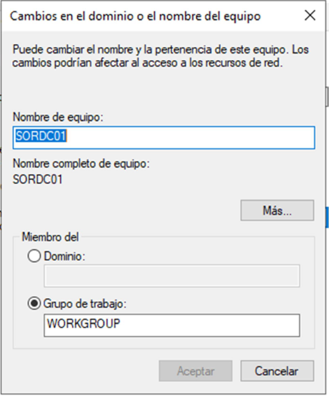

--- 
title: Introducción a Active Directory 
description: Introducción a Active Directory del módulo de Sistemas Operativos en red realizado por Francisco Javier Hernández Illán. 
---

# Directorio Activo en Windows Server

Cabe recordar que un **servicio de directorio** gestiona una base de datos organizada de modo jerárquico con el objetivo de administrar de una manera sencilla los recursos de una red, almacenando información de cada elemento de la red de manera estructurada, lo que permite facilitar el proceso de búsqueda de los recursos y de autenticación dentro de la red. 

Además, en los siguientes apartados se recuerdan los elementos de los servicios de directorios ya vistos en Samba pero relacionados con Windows Server, en concreto en el servicio de **Active directory**.

## Estructura física de Active Directory

El **Directorio Activo o Active Directory** (durante este módulo se utilizarán indistintamente ambos nombres) forma parte del [subsistema de seguridad](https://es.wikipedia.org/wiki/Servicio_de_Subsistema_de_Autoridad_de_Seguridad_Local) de Windows Server ejecutándose en modo usuario. 

<figure>
  
  <figcaption>Estructura física de AD</figcaption>
</figure>

!!! Note
    Las aplicaciones que se ejecutan en este modo no tienen acceso directo al sistema operativo ni al hardware, sino que como medida de seguridad, las peticiones realizadas a estos deben pasar previamente por un subsistema de seguridad y posteriormente por la capa de [servicios ejecutivos](https://learn.microsoft.com/es-es/windows-hardware/drivers/kernel/windows-kernel-mode-executive-support-library).

### Arquitectura del subsistema de seguridad

**Es un conjunto de componentes de seguridad** que componen el modelo de seguridad de Windows. Estos componentes garantizan que las aplicaciones no puedan acceder a los recursos sin autenticación y autorización. Los componentes del subsistema de seguridad se ejecutan en el contexto del proceso `Lsass.exe`, e incluyen lo siguiente:

- Autoridad de seguridad local.
- Servicio de inicio de sesión en red.
- Servicio de administrador de cuentas de seguridad.
- Servicio de servidor LSA (exige la aplicación de directivas de seguridad local).
- Capa de Secure Sockets (Identificadores de sesiones seguros).
- Protocolo de autenticación **Kerberos v5** y protocolo de autenticación **NTLM**.

!!! note "Nota"
    * **Kerberos** es un protocolo de autenticación de redes de ordenador creado por el **MIT** que permite a dos ordenadores en una red insegura demostrar su identidad mutuamente de manera segura.
    * **NTLM**: En una red de Windows, **NT LAN Manager** es un conjunto de protocolos de seguridad de Microsoft destinados a proporcionar autenticación, integridad y confidencialidad a los usuarios. **NTLM** es el sucesor del protocolo de autenticación en Microsoft LAN Manager, un producto anterior de Microsoft.

## Arquitectura cliente – servidor

Active Directory también esta basado en el modelo **cliente-servidor** es aquel en el que existen varios clientes, los cuales realizan peticiones a un servidor.

<figure>
  
  <figcaption>Esquema de red cliente servidor</figcaption>
</figure>

Un servidor puede ser:

- **Dedicado** : La máquina servidor sólo se dedica a tareas de servicios en la red
- **No dedicado** : Además de los servicios, la máquina se puede usar como un puesto de trabajo más.

## Objetos del Directorio Activo

El Directorio Activo **es una implementación concreta del protocolo LDAP**. Este protocolo trata los elementos de la red como
objetos. Los tipos de objetos básicos que existen en el Directorio Activo son:

- Usuarios.
- Grupos.
- Equipos.
- Dominios.
- Impresoras.
- Unidades Organizativas.

!!! tip
    Sin embargo los administradores de sistemas pueden crear nuevos tipos de objetos o añadir propiedades a alguna clase de
    los objetos modificando el esquema del Directorio Activo, para adaptar la estructura de la red a las necesidades particulares de la organización.

### Dominio

Representa un conjunto de equipos (clientes y servidores) que comparten una política de seguridad y una base de datos común. 

En concreto para el **Directorio Activo de Windows**:

* **Componente fundamental** de la estructura lógica de Active Directory. 
* Por **definición**, se trata de un conjunto de objetos de tipo equipo, usuario y otras clases de objetos que comparten una base de datos de directorio común.

Los servidores pueden ser:

- **Controladores de dominio** : Contienen las cuentas de usuario y de otros datos del **Directorio Activo**. 
    - Debe haber al menos **1 por cada dominio**.

- **Servidores miembros del dominio** : Se utilizan para almacenamiento de archivos y otros recursos compartidos en la red. No contienen información vital como cuentas de usuarios o políticas de grupos.

<figure>
  
  <figcaption>Servidores de Dominio</figcaption>
</figure>

### Diferencia entre "Grupo de Trabajo" y "Dominio"

Cabe recordar la diferencia entre la gestión de usuarios con los **Grupos de trabajo** y **Dominios**.

- **Grupo de trabajo**: es un conjunto de ordenadores comunicados entre sí, que forman parte de un mismo grupo. No obstante toda la gestión de **políticas/grupos/usuarios/servicios/…** son individuales por cada máquina.El grupo de trabajo se configuraría en cada máquina desde:

<figure>
  
  <figcaption>Configuración "Grupo de Trabajo" y "Dominio".</figcaption>
</figure>
 
- **Dominio** permite gestionar usuarios, servicios, seguridad, recursos accesibles, etc.

!!! Note
    Es decir, en un **directorio activo con dominio** se crea un usuario y desde cualquier máquina asociada al dominio se podría registrar, en el caso de un grupo de trabajo deberá estar creado el usuario manualmente en cada equipo del grupo de trabajo, y así con las políticas de grupo, etc. **Por lo tanto con el grupo de trabajo aumentaríamos la carga de gestión al enésimo usuario**.

#### Ventajas/Desventajas de un "Grupo de Trabajo" frente a un "Dominio"

- Es más **barato** (no necesita un servidor y licencias).
- La gestión es mucho más tediosa porque tienes que hacerla equipo por equipo, mientras que en un dominio solo debes configurar el servidor, por tanto es **menos escalable** (imagina tener 200 ordenadores en un grupo de trabajo).
- El grupo de trabajo es mucho más **inseguro** , puesto que es más fácil controlar políticas de seguridad a través de un servidor con políticas generalizadas para todos los equipos, ya que no todos los usuarios tienen un conocimiento suficiente de informática.
- Con el grupo de trabajo será mucho **más tedioso implementar servicios** , por ejemplo un servidor de correo.

### Unidad Organizativa

Las **unidades organizativas** nos ayudan a organizar los objetos de nuestro dominio (impresoras, usuarios, grupos, …).

* Es parecido a la estructura de directorios (carpetas) de un sistema operativo, **por ejemplo**, dentro de nuestro dominio podemos tener una unidad organizativa por cada departamento de la empresa.

En el siguiente ejemplo vemos un dominio con una unidad organizativa para usuarios de "*Contabilidad*", "*Recursos Humanos*", "*Informáticos*"y "*Marketing*".

<figure>
  
  <figcaption>Unidades Organizativas en Active Directory</figcaption>
</figure>

### Árboles:

Se da en redes muy grandes donde nos interesa segmentar en subdominios, de tal forma que el tráfico o las peticiones de los usuarios al servidor de un subdominio, no se reciban en el servidor raíz, realizando de este modo un balanceo de carga de trabajo y ahorro en el ancho de banda de la red. No obstante la gestión sigue siendo centralizada desde el servidor raíz. Similar a **DNS**.

<figure>
  
  <figcaption>Objetos en Active Directory.</figcaption>
</figure>

### Bosques

Un bosque es la unión de diferentes árboles o dominios que **confían** entre ellos, pero son dominios totalmente diferentes (USA.miempresa.com, EUROPA.miempresa.com y SPAIN.miempresa.com). 

- Si se configura **una confianza entre ellos** los usuarios de un dominio tendrán la posibilidad acceder a los recursos (o a ciertos recursos) de otro dominio que compartan el mismo bosque.

<figure>
  
  <figcaption>Ejemplo de Objetos en Active Directory.</figcaption>
</figure>

## Roles (Servicios)

Un rol de servidor es un **conjunto de servicios que permiten a un equipo realizar una función específica** para varios usuarios u otros equipos de una red. Básicamente está relacionado con el cometido de dicho servidor, un servidor puede tener múltiples roles.

Ejemplos:

- Servidor **DHCP**.
- Servidor **DNS**.
- Servidor **Active Directory**.
- Servidor de virtualización (**Hyper-V**).
- Servidor Web.
- Acceso remoto.
- Servidor de impresión.
- Servidor de correo electrónico.

A su vez, un rol puede tener diferentes funcionalidades o subroles, los cuales pueden estar activados o no. Dichos “subroles” son **servicios de rol**. 

!!! Example
    un Servidor **DNS** solo tiene una finalidad y, por lo tanto, no tienen servicios de rol disponibles. En cambio un Servicio de Archivos (para compartir ficheros) puede tener el servicio de rol para el protocolo NFS o no, es decir, puede tener habilitada la función de servidor de ficheros NFS.

!!! Note
    **Network File System, o NFS**, es un protocolo de nivel de aplicación, según el Modelo OSI. Es utilizado para sistemas de archivos distribuido en un entorno de red de computadoras de área local. Posibilita que distintos sistemas conectados a una misma red accedan a ficheros remotos como si se tratara de locales.

* Para Agregar Roles:

### Servicios de AD en Windows Server

Cuando vayamos a añadir nuestro rol de Active Directory al servidor, veremos que tenemos diferentes roles de Active Directory:

- **Active Directory Lightweight Directory Services** : Se trata de un Active Directory &quot;light&quot;, no require de un dominio para su uso, simplemente alberga opciones/características para ciertas aplicaciones que nos interese.

- **Active Directory Rights Management Services** : Nos ayuda a gestionar la protección del acceso a nuestros ficheros del directorio activo. Por ejemplo si un documento se intenta abrir desde un usuario no autorizado.

- **Servicios de certificados de Active Directory** : Simplemente gestiona la creación de certificados digitales. Es para entidades de certificación oficial (seguridad informática).

- **Servicios de dominio de Active Directory:** Este va a ser la opción que veremos en el módulo. Es el active directory relacionado con **OpenLDAP** de Linux.

- **Servicio de federación de Active Directory:** Gestiona el acceso seguro desde dentro y desde fuera de tu red (Internet) a aplicaciones gestionadas en local por el servidor de Windows Active Directory. Obviamente con las credenciales de usuarios del active directory.

## Base de datos y Autentificación

- La base de datos de los usuarios, almacenada a través de **LDAP** se almacena en los controladores de dominio. Además el fichero &quot; **ntds.dit**&quot; será el que almacene realmente dicha base de datos.
- La autenticación de los usuarios se realizará a través de **Kerberos**.