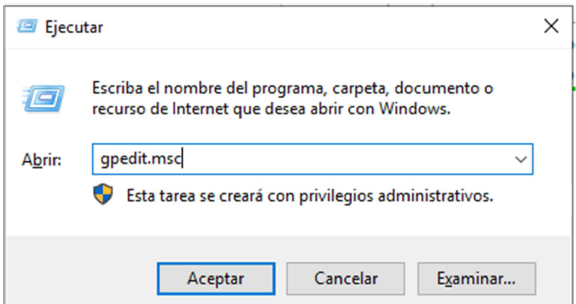
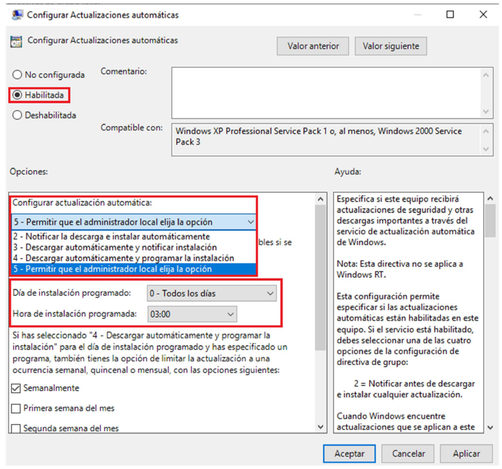
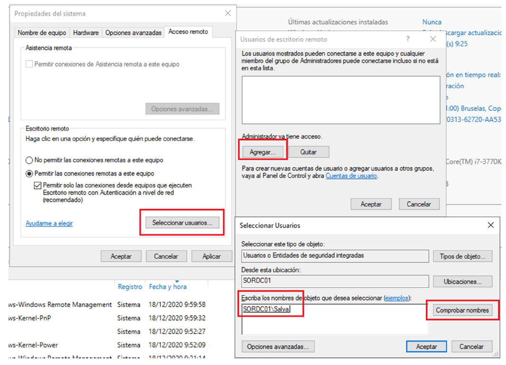
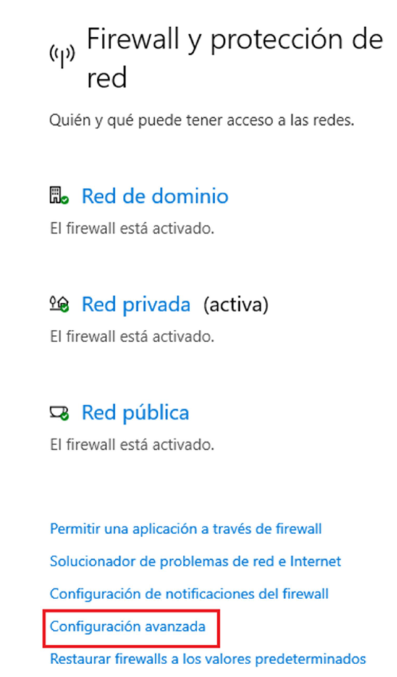
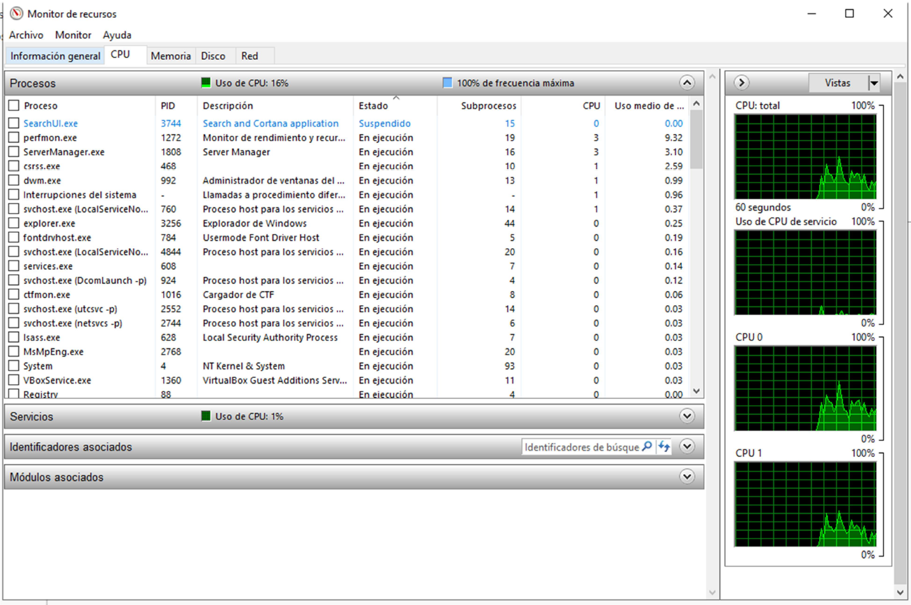
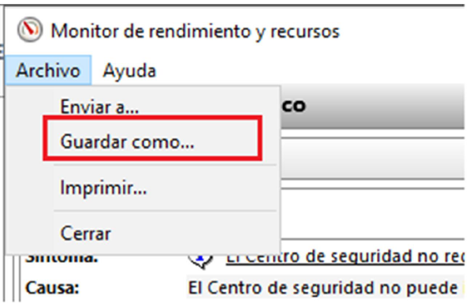

--- 
title: Configuración Windows Server 
description: Configuración de Windows Server del módulo de Sistemas Operativos en red realizado por Francisco Javier Hernández Illán. 
---

# Configuración Básica Windows Server

Cuando se configura un **Windows Server** existen una serie de recomendaciones a realizar previamente a la instalación de los diferentes roles a implementar, en este caso Active directory.

A continuación se muestran dichas recomendaciones.

## Rastreador de eventos

Un servidor, habitualmente, no debe apagarse o reiniciarse, al no ser que sea por un motivo de avería o mantenimiento. Es por ello que cada vez que necesitemos reiniciarlo/apagarlo dejemos anotado a que es debido dicha acción.

En Windows Server es recomendable usar “**alt + f4**” para apagar, ya que nos permitirá dejar una descripción de la razón por la que vamos a reiniciar/apagar el servidor. Obviamente esta descripción quedará almacenada en los logs y registros del sistema. 

<figure>
  
</figure>

## Actualizaciones

En un servidor es muy importante que se mantenga actualizado, de lo contrario tendremos fallos de seguridad. No obstante, es importante que estas actualizaciones se realicen en horario de bajo impacto, ya que:

- Pueden ocupar parte del **ancho de banda** de nuestro servidor y los clientes pueden notar por ello una bajada del rendimiento.
- Vas a tener la **CPU/RAM** ocupada en actualizar los servicios en vez de atender las peticiones de clientes.
- Es posible que tras la actualización se realice un **reinicio**, si este reinicio no lo programamos en horas de bajo impacto, por ejemplo a las 03:00 am, supondrá un corte en el servicio.

## Configurar horarios de reinicio 

* Se pueden configurar en **“Configuración de Windows Update”** y en **“Cambiar horas activas”**

<figure>
  
</figure>

En las **horas activas** elegiremos las horas en las que **NO** queremos que se reinicie el servidor, es decir, si estamos en una empresa que trabaja de 07:00 a 20:00,  éstas serán las horas activas. En caso de que sea una empresa 24/365, habría que informar de un corte de servicio o tener duplicadas las máquinas y que una soporte todo el trabajo mientras la otra se actualiza y viceversa.

<figure>
  
</figure>

## Configurar los horarios de descarga de actualizaciones

Se ejecutan las políticas de grupo del equipo local. Para que salga la ventana de **“Ejecutar”** lo más rápido es tocar la tecla de **Windows+R**.

Aunque lo veremos más adelante es importante que tengáis claro que las políticas de grupo de un dominio prevalecen o tienen prioridad sobre las políticas de grupo locales.

<figure>
  
</figure>

Dentro de las directivas de grupo vamos a ir a:

- Configuración del equipo local -> **Plantillas Administrativas** -> **Componentes de Windows** -> **Windows Update**.
- Dentro de Windows Update elegiremos -> **Configurar Actualizaciones Automáticas**.

<figure>
  
</figure>

## Cuentas locales en el servidor

En un servidor, por defecto, únicamente la cuenta administrador activa. Las cuentas por defecto o de invitado están deshabilitadas (representadas con una flecha negra apuntando hacia abajo) por seguridad.

No obstante, es posible que en nuestra empresa seamos más de un administrador del sistema y por tanto, es posible que cada administrador tenga su propia cuenta, por ejemplo para que quede registrado quien ha hecho cada acción dentro del servidor.

Para **crear cuentas locales** vamos al icono de Windows de la barra de inicio y hacemos click en el botón derecho, eligiendo **“Administración de equipos”**.

<figure>
  
</figure>

Seleccionando botón derecho se puede crear un usuario nuevo.

<figure>
  
</figure>
Una vez creado el usuario, hay dos cosas que tenemos que tener en cuenta:

- Que tenga habilitado el acceso por **escritorio remoto**. Habitualmente los servidores de Windows Server se gestionan en remoto, ya que el servidor se encontrará en el CPD y el administrador en la oficina.

<figure>
  
</figure>

- Que tenga **permisos de administrador**, ya que al servidor solo accederán habitualmente nuestros compañeros que sean también administradores del sistema.

<figure>
  
</figure>

Buscaremos el grupo **“Administradores”** y lo agregaremos al usuario.

<figure>
  
</figure>

## Administrador de servidor

En el administrador de servidor podremos administrar todo:

- Servidores remotos.
- Servicios: DNS, NTP, DHCP, …
- Notificaciones y alertas.
- Almacenamiento.
- Gestionar Copias de Seguridad.
- Monitorización del estado del servidor.
- Administración de equipos / dispositivos.

<figure>
  
</figure>

## Cambiar nombre al servidor

Es importante indicar el nombre de nuestros equipos para que sea fácil identificarlos. Debemos darles un **nombre significativo,** por ejemplo si este equipo va a ser un Controlador de Dominio y va a ser el primero, podemos ponerle “DC01…” 

!!! Tip
    Se recomienda no usar caracteres especiales en el nombre y por supuesto nada de espacios en blanco.

!!! Warning
    **Es importante cambiar el nombre antes de tener configurado el Directorio Activo, ya que si no habrá que cambiar todo lo relacionado con la resolución de nombres (DNS).**

<figure>
  
</figure>

## Escritorio Remoto

Habitualmente nuestro servidor estará en un CPD, posiblemente será un servidor virtualizado. Lo que hace esencial configurar correctamente la herramienta pertinente para su administración remota. En el caso de Windows Server, que cuenta con una buena interfaz gráfica, haremos uso de **Escritorio Remoto (RDP)**, del cual tenemos que ser consciente que es un servicio bastante atacado por ciberdelincuentes. También se puede gestionar por **consola a través de PowerShell**.

<figure>
  
</figure>

Obviamente aparte de tener habilitado el Escritorio remoto, el usuario debe tener permisos de acceso remoto al servidor.

<figure>
  
</figure>

Por defecto una misma cuenta de usuario solo puede conectarse una vez de forma simultánea.

## Configuración de Red

La configuración de red se hace igual que un Windows Cliente. 

En cuanto a la máquina virtual dependerá de nuestros recursos (memoria, CPU, discos SSD, gráfica):

- Máquina virtual para  Windows 10 y para Windows Server 2019.

## Seguridad (Firewall)

Cada vez que arrancamos un servicio (Remote Desktop Protocol, DHCP, DNS, … ) se abren una serie de puertas (puertos de red). Los ciberdelincuentes atacan estos puertos “abiertos” para intentar conseguir acceso indebido.

Por todo ello, es importante tener abiertas solo las puertas (puertos) estrictamente necesario, es decir, si nuestro servidor no va a hacer uso de un servicio DNS, no lo actives.

Además, una herramienta muy importante para controlar esto es el **“Firewall”**:

<figure>
  
</figure>

Existirán unas reglas diferentes dependiendo de la IP del equipo que realiza la petición:

- Si la IP viene de Internet (**Red Pública**).
- Si la IP viene de mi red local (**Red Privada**).
- Si la IP viene de un equipo asociado al dominio (**Red Dominio**).

En la configuración podemos decirle que bloquee el acceso a las aplicaciones dependiendo de la red  de  donde provengan, por ejemplo si en la red pública bloqueamos todas las conexiones, querrá decir que solo podremos administrar el servidor desde una red privada o red del dominio.

<figure>
  
</figure>

No obstante, quizá queramos que ciertas aplicaciones sí sean accesibles desde la red pública y otras no. En tal caso, deberemos añadir reglas por aplicaciones:

<figure>
  
</figure>

Por ejemplo indicar que solo se puede gestionar este equipo de forma remota desde una red privada.

<figure>
  
</figure>

También se pueden crear filtros avanzados:

<figure>
  
</figure>

Por ejemplo aquí vemos que el Escritorio Remoto actualmente está usando el puerto 3389 mediante UDP. Si no tiene el icono verde, es que no está habilitada la regla.

<figure>
  
</figure>

Si hacemos doble click en cualquier regla podremos manipular:

- La aplicación a la que afecta.
- Filtrar por usuarios, interfaces (alámbricas, inalámbricas, remotas), tipos de red (pública, privada, dominio) o direccionamiento IP.
- Puerto y Protocolo (TCP o UDP) usado.

Podemos crear nuestras propias reglas:

<figure>
  
</figure>

**Visor de Eventos.**

Esta herramienta nos mostrará la información del estado de las aplicaciones y servicios de nuestro servidor.

Debemos habituarnos a ver el visor de eventos de forma regular para confirmar que nuestros servicios no están fallando o a punto de fallar.  El visor de eventos  también resulta útil para sacar la información en caso de que un servicio esté fallando.

<figure>
  
</figure>

<figure>
  
  <figcaption>Visor de Eventos Windows Server.</figcaption>
</figure>

Podemos **filtrar los eventos** por tiempo (últimas 24h, 1h, 30 min, …), por aplicación que ha generado el evento, usuarios, etc…

<figure>
  
  <figcaption>Filtrar Eventos por tiempos.</figcaption>
</figure>

Una cosa importante es la política de eventos con las aplicaciones, especialmente aquellas que ofrecen un servicio y son más propicias a ser atacadas o más críticas. Se asigna una cantidad de memoria que pueden usar los registros (logs), pasado esta capacidad se debe decidir **si sobrescribir o no sobrescribir** los logs. Lo habitual sería no sobrescribir, pero debemos estar atentos a la capacidad total que van acumulando para ir eliminándolos manualmente o mediante un script cada cierto tiempo.

Con el icono **vaciar registro** podemos borrar los eventos de la aplicación seleccionada.

<figure>
  
  <figcaption>Borrar Eventos de la aplicación.</figcaption>
</figure>

En caso de tener un **error** del sistema podemos visualizarlos en la pestaña de “Sistema”, cada error registrado del sistema tiene un **identificador (ID)** que será el que usemos en caso de querer buscar información del error en Internet.

Es recomendable, mirar todos los días el registro de eventos del sistema.

Importante diferenciar entre un “Error” y un “Warning / Aviso”, el primero es que ya ha habido un problema grave que debe ser resuelto, el segundo es una alerta de algo que debería revisarse, pero que no ha ocasionado un problema crítico.

<figure>
  
  <figcaption>Comprobar errores del sistema.</figcaption>
</figure>

Al igual que con las aplicaciones podemos decidir qué hacer con los registros de eventos referidos al sistema:

<figure>
  
  <figcaption>Registros de Eventos del sistema.</figcaption>
</figure>

## Monitor de recursos

El monitor de recursos nos da información sobre la memoria libre, el rendimiento de la cpu, lecturas en disco, etc. Esto nos puede dar información si fuera necesario ampliar o mejorar algún componente hardware de nuestro servidor.

<figure>
  
</figure>

<figure>
  
</figure>

Si queremos analizar o monitorizar valores más específicos debemos ir al monitor de rendimiento y añadir a la gráfica los datos que deseamos.

<figure>
  
  <figcaption>Estadísticas de datos seleccionados.</figcaption>
</figure>

Podemos generar un resumen/**informe** de todo el sistema, referente al rendimiento de éste:

<figure>
  
</figure>

<figure>
  
  <figcaption>Generación informe I.</figcaption>
</figure>

<figure>
  
  <figcaption>Generación informe II.</figcaption>
</figure>

<figure>
  
  <figcaption>Generación informe III.</figcaption>
</figure>

**Podemos exportar a algún fichero el resumen de todo el informe del rendimiento del sistema.**

<figure>
  
  <figcaption>Generación informe IV.</figcaption>
</figure>

## NIC redundante

Una NIC (Network Interface Controller) no es más que un adaptador de red o tarjeta de red. Con una NIC redundante queremos decir que uno o más adaptadores de red trabajan como uno, pudiendo mejorar el ancho de banda total que puede cursar y dotando al sistema de una mayor disponibilidad, pues si uno de los adaptadores de red fallara, tendríamos otros y no se cortaría la conexión.

!!! Tip
    Es muy habitual en todos los servidores tener más de un adaptador de red.

* **En el siguiente vídeo puedes encontrar una ayuda para realizar un NIC redundante**

[PINCHA AQUÍ para video de Configuración NIC Redundante](https://youtu.be/nA1jYIvBFBU)

## PT61. Configuración Windows Server

!!! info "Contribución a los CEs (Criterios de Evaluación)"
    Estas actividades contribuyen a los criterios de evaluación **CE5, CE7 y CE9** del **RA1** de SOR.

!!! Abstract "Situación de Aprendizaje"
    Partiendo de la Situación de aprendizaje de [PT41](https://fjavier-hernandez.github.io/sor/04_SAMBA_DC/043_GestionRecursosSambaDC.html#pt41-gestion-de-recursos-compartidos-en-samba-dc), la empresa **Area Studio** decide hacer un cambio de infraestructura, de Ubuntu Server a **Windows Server** para facilitar su administración por los técnicos de mantenimiento propios los cuales son de nivel 1. 

!!! question "Tarea"
    **Area Studio** solicita de nuevo un proyecto a **NetOS** para instalar dicho **Windows Server** con **Active Directory**, el cual debes realizar. Inicialmente te propones pre-configurar el Windows Server con las siguientes premisas.

1. ¿Cómo harías para filtrar en el visor de eventos todos los eventos críticos de seguridad?
2. Cómo cambiarías las propiedades de un evento para que:

    1. Aumente la capacidad máxima del registro a 50MB.
    2. No sobrescribiese cuando el log alcanzará la capacidad máximo, es decir, que archive el log.
    3. Indica cual es la ruta y el nombre del log seleccionado.
    4. ¿Qué sucede si vas a dicha carpeta y abres con doble click el log seleccionado?

3. Genera un informe de tu sistema.
4. Crea un Segundo adaptador de red en tu máquina virtual de Windows Server 2019.
5. Crea un equipo de NIC y muestra el proceso mediante un vídeo o mediante capturas de pantalla.
6. Configura una IP fija en tu NIC virtual.