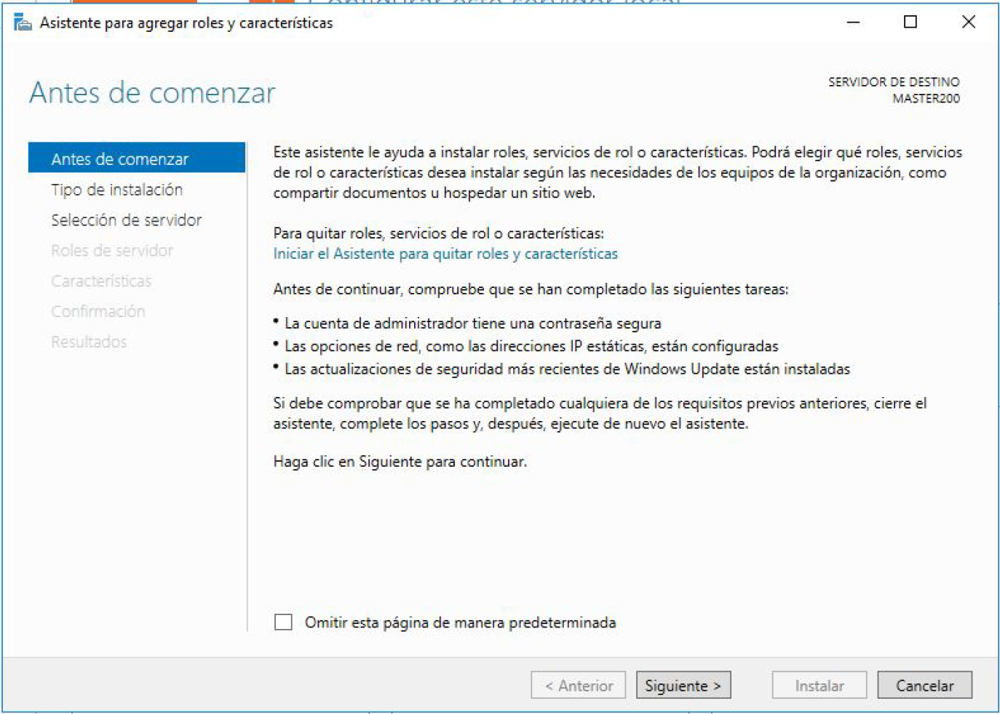
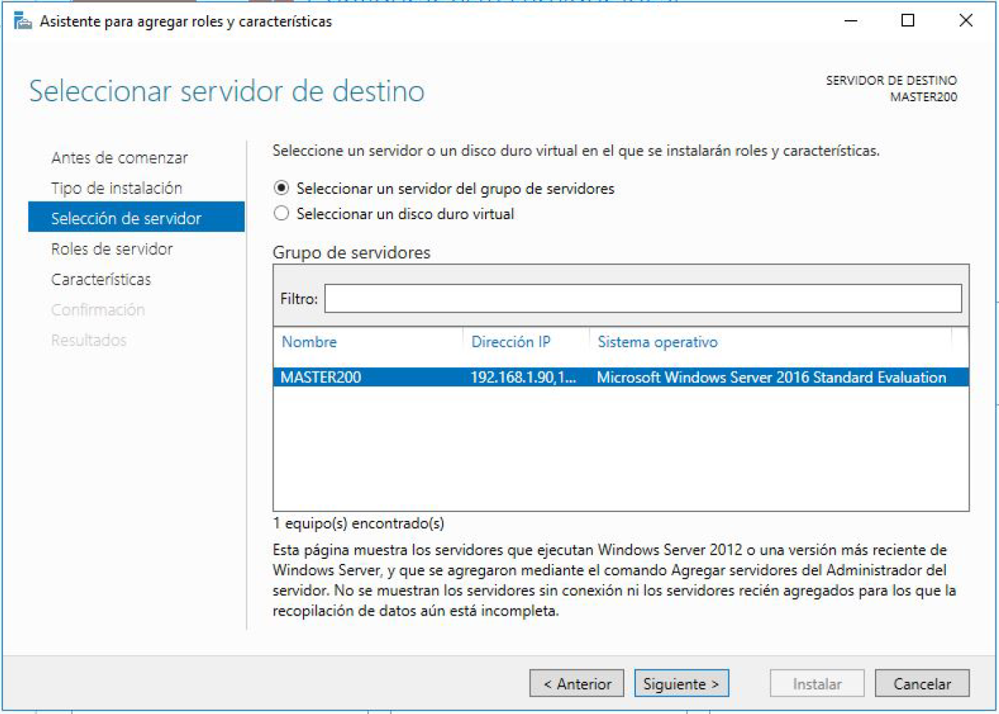
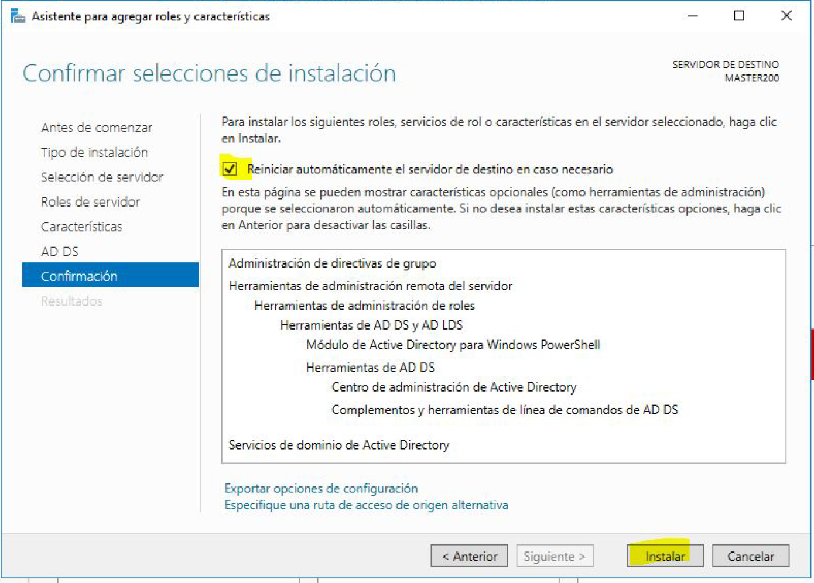
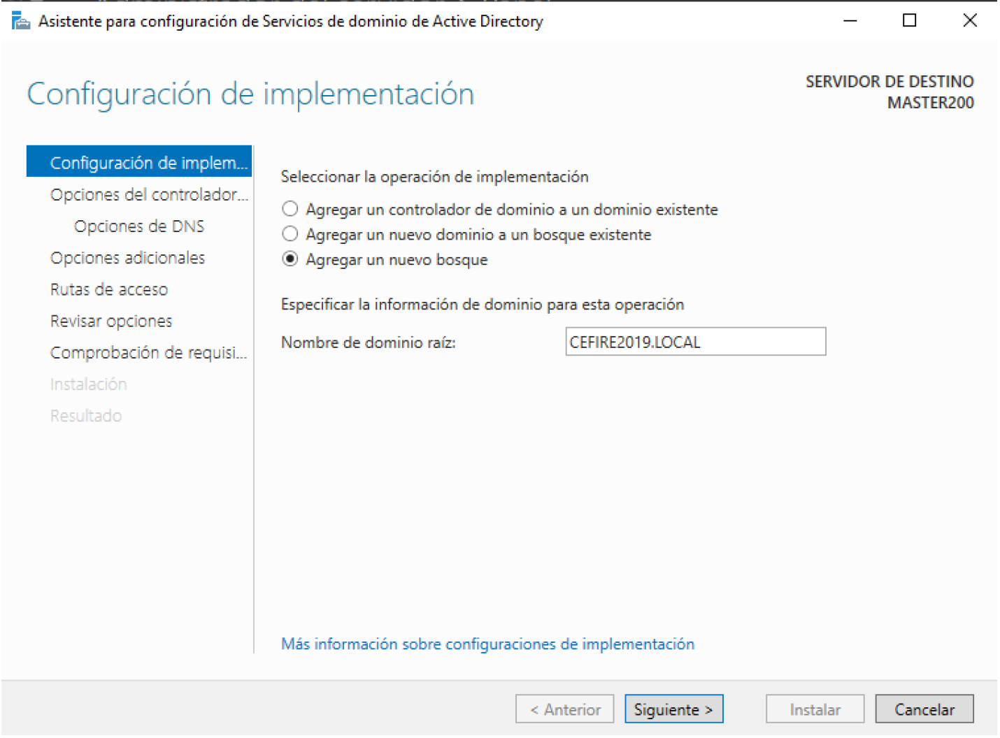
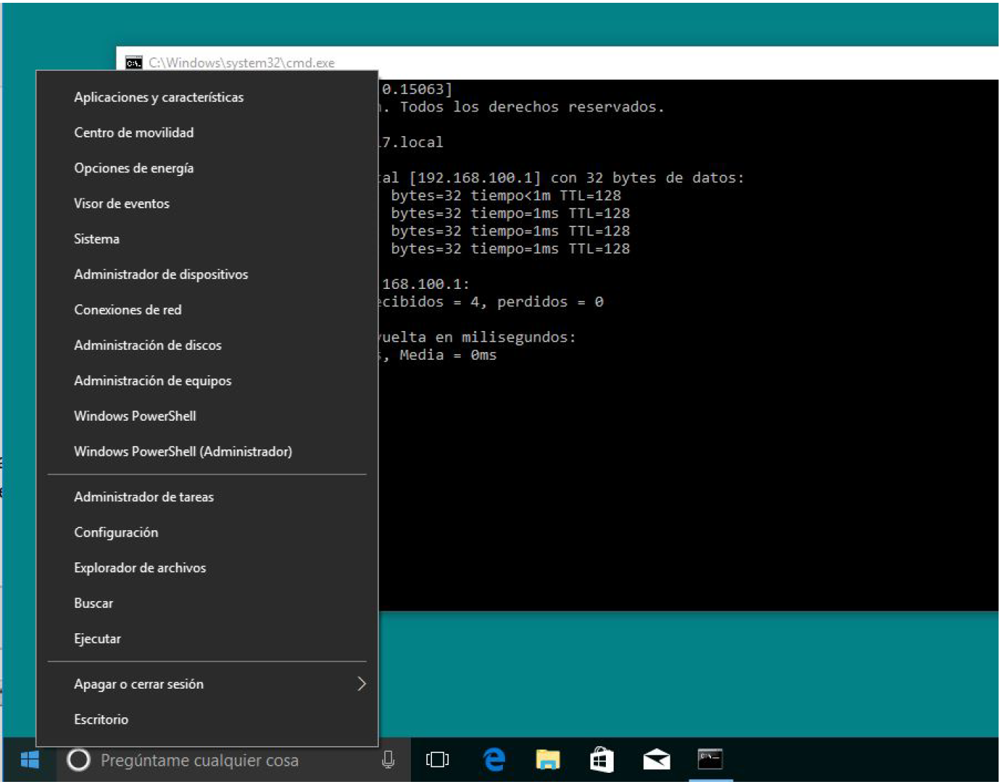
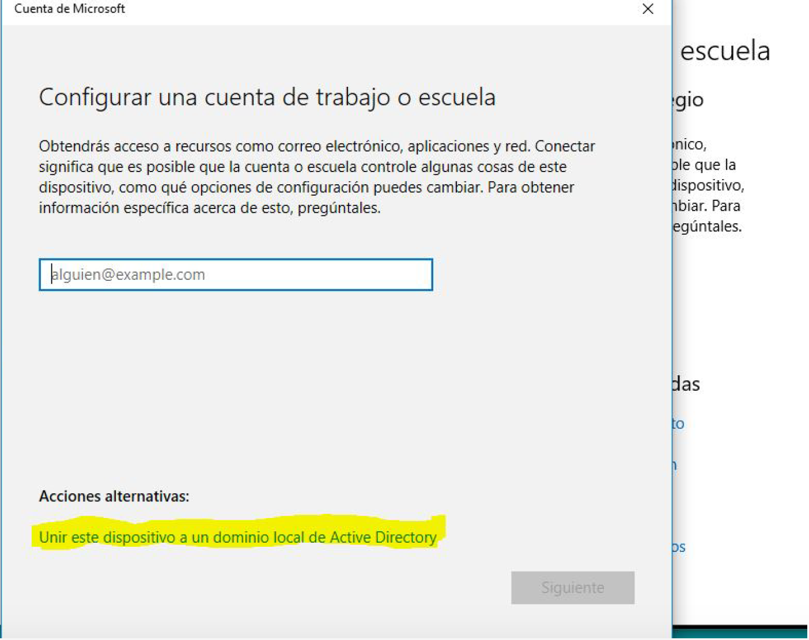
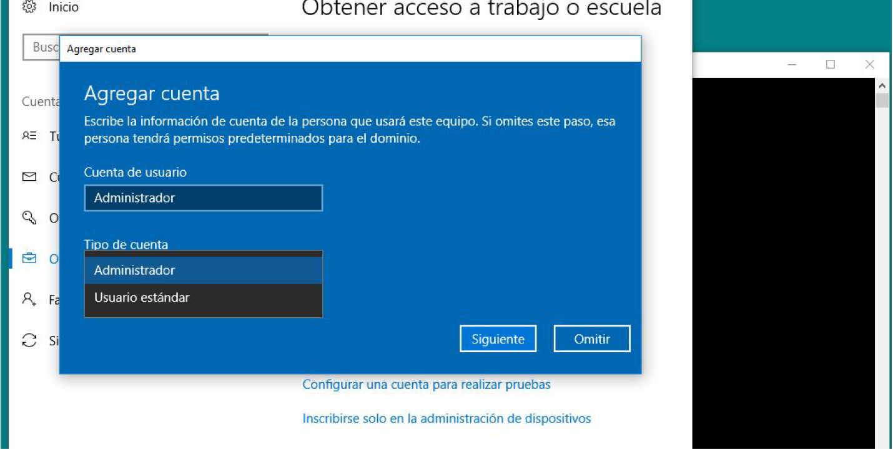

--- 
title: Instalación de Active Directory 
description: Instalación de Active Directory del módulo de Sistemas Operativos en red realizado por Francisco Javier Hernández Illán. 
---

# Instalación de Active Directory

A continuación se muestran los pasos para la instalación de **Active Directory**.

## Creación de un dominio

El primer paso para la creación del Active directory es crear un dominio; en el equipo **Controlador de Dominio**, y debe ser un equipo preparado para aguantar altas cargas de trabajo con una alta disponibilidad, y con un sistema operativo servidor instalado. 

- Para crear un dominio hay que acceder al **Administrador del Servidor** y accedemos a ->  **Agregar Roles y Características**:

<figure>
  
  <figcaption>Creación de un dominio I.</figcaption>
</figure>

- Aparece el asistente para comenzar con la creación del dominio:

<figure>
  
  <figcaption>Creación de un dominio II.</figcaption>
</figure>

- Se selecciona una **instalación basada en características y roles**.

<figure>
  
  <figcaption>Creación de un dominio III.</figcaption>
</figure>

- Una vez seleccionada la **instalación basada en roles**, se selecciona el servidor que será donde vamos a instalar nuestro **Active Directory**:

<figure>
  
  <figcaption>Creación de un dominio IV.</figcaption>
</figure>

- Se selecciona el rol **Servicios de Dominio de Active Directory**:

<figure>
  
  <figcaption>Creación de un dominio V.</figcaption>
</figure>

- Aparecerá marcado el rol tal y como muestra la siguiente figura:

<figure>
  
  <figcaption>Creación de un dominio VI.</figcaption>
</figure>

<figure>
  
  <figcaption>Creación de un dominio VII.</figcaption>
</figure>

- Se procede a realizar la instalación. Cuando se agrega un nuevo rol, podemos hacer clic en la opción de reiniciar en caso de que fuera necesario. En caso que el rol o la característica no fuera necesario un reinicio, no lo haría.

<figure>
  
  <figcaption>Creación de un dominio VIII.</figcaption>
</figure>

Un vez instalado, el asistente muestra que es necesario realizar una configuración. En este caso hay que promover el servidor a un servidor de controlador de dominio. Así que se hace clic en la opción de **promover servidor a controlador de dominio** :

<figure>
  
  <figcaption>Creación de un dominio IX.</figcaption>
</figure>

- Se ejecuta el asistente, y las primeras pantallas ofrecen información útil para la creación del dominio.

- **Se selecciona Agregar un nuevo bosque**.

!!! Note "**Nota**"
    Un conjunto de dominios agrupados lógicamente conforman un árbol de dominios y un conjunto de árboles de dominio agrupados lógicamente conforman un bosque. En este caso se especifica el dominio **sor.com** en lugar de **CEFIRE2019.LOCAL** como indica en la imagen:


<figure>
  
  <figcaption>Agregar un nuevo Bosque.</figcaption>
</figure>

- A continuación, aparece información sobre el nivel funcional del nuevo bosque. Según el nivel funcional que se establezca, se implementa un directorio activo compatible con versiones anteriores de Windows Server, pero más limitado en cuanto a funciones, o menos compatible con versiones antiguas, pero con mayores funcionalidades. 

!!! tip 
    En nuestro caso, seleccionaremos el mayor nivel funcional (**Windows Server 2016**) ya que todos los controladores del dominio tendrán instalado, al menos, **Windows Server 2016**. También se añade la contraseña para la restauración del dominio, por defecto la misma que la del administrador.

<figure>
  
  <figcaption>Creación de un dominio X.</figcaption>
</figure>

- La siguiente tarea que llevará a cabo el asistente para la creación del dominio, será preguntar por ciertas opciones adicionales del servidor, como por ejemplo la **configuración del servicio DNS**. Como en nuestro caso no se tiene DNS, dejaremos que el asistente cree una zona de DNS para que nuestro dominio pueda funcionar.

<figure>
  
  <figcaption>Creación de un dominio XI.</figcaption>
</figure>

- A continuación aparece la ubicación donde se guardará los objetos del **AD**, es decir, **la base de datos**:

<figure>
  
  <figcaption>Creación de un dominio XII.</figcaption>
</figure>

Seguidamente nos muestra las configuraciones que se van a realizar. 

!!! Note 
    Como se puede observar también se puede exportar el script para poder ejecutar los mismos comandos a través de **PowerShell**:

<figure>
  
  <figcaption>Creación de un dominio XIII.</figcaption>
</figure>

En el siguiente paso se muestra un resumen de los **Requisitos previos**:

<figure>
  
  <figcaption>Comprobación de requisitos previos.</figcaption>
</figure>

- Y finalmente se realiza la instalación. La pantalla de inicio de sesión, ahora será diferente, ya que aparece el dominio al que se va a iniciar la sesión del usuario:

!!! Note
    Nos aparecerá **SOR** en lugar de **CEFIRE2019**

<figure>
  
  <figcaption>Nueva pantalla inicio de sesión con Dominio.</figcaption>
</figure>

- Una vez instalado, podemos iniciar sesión con el Administrador del dominio. Podemos comprobar que en el panel de Administrador de Servidor aparece nuestro dominio configurado **sor.com** en lugar de **CEFIRE2019.LOCAL**

<figure>
  
  <figcaption>Comprobación Dominio en el Administrador del Servidor.</figcaption>
</figure>

<!-- # Creación de dominio en Server Core

Se podría hacer una instalación sin experiencia de escritorio del Windows Server 2019 esto es una instalación mucho más liviana que permite tener un servidor sin entorno gráfico. A esta versión se le conoce como el nombre de **Server Core**. En este punto vamos a mostrar a realizar una instalación de un dominio en una máquina Server Core.

Para hacer la instalación, debemos seleccionar la opción de instalación sin experiencia de escritorio:

<figure>
  
  <figcaption>Instalación Server Core.</figcaption>
</figure>

## PowerShell para configurar un dominio

Para configurar el dominio con PowerShell vamos a presentar unos scripts que permitirán realizar la configuración tanto de la máquina como del Active
Directory. Para entrar dentro del shell de PowerShell, teclearemos el comando **powershell** en la consola:

<figure>
  
  <figcaption>Entrar al PowerShell en el Server Core.</figcaption>
</figure>


### Configuración inicial

Primero realizaremos la configuración de la máquina, a través del siguiente script. 

`ConfiguracionInicial.ps1`
```yaml
$nombreServer="SOR"
$dirIP="192.168.5.1X"
$redInterna="Ethernet 2"
Rename-Computer -NewName $nombreServer
Get-NetAdapter –name $redInterna | Remove-NetIPAddress -Confirm:$false
Get-NetAdapter –name $redInterna | New-NetIPAddress –addressfamily IPv4 –ipaddress $dirIP –prefixlength 24 –type unicast
```

!!! Warming
    Después de la captura se debe reiniciar para aplicar los cambios.

**Donde se Puede observar:**

- El nombre de máquina en la variable `$nombreServer`
- El adaptador de la red interna en $redInterna (Ejemplo en el script) y también la dirección IP de la red interna en `$dirIP`. 
- El comando` _Rename-Computer -NewName $nombreServer` cambia el nombre del servidor. 
- Los comandos: 
    - `_Get-NetAdapter –__name $redInterna | Remove-NetIPAddress -Confirm:$false` 
    - `_Get-NetAdapter –name $redInterna | New-NetIPAddress –addressfamily IPv4 –ipaddress`
    - `$dirIP –prefixlength 24 –type unicast` 
  Nos permiten añadir la dirección IP de nuestra red interna.
- Finalmente con `_Restart-Computer -force` reiniciamos la máquina y tendremos configurado el nombre y el interfaz de la red interna.

### Instalar Controlador de dominio con powershell

Ahora vamos a promover nuestro servidor a controlador de dominio. Esto también lo vamos a realizar a través de powershell
mediante scripts. 

`creaciondominio.ps1`
``` yaml
$dominioFQDN = "SORCORE.LOCAL"
$dominioNETBIOS = "SORCORE"
$adminPass = "SOR."
Install-WindowsFeature AD-Domain-Services,DNS
Import-module addsdeployment
Install-ADDSForest -DomainName $dominioFQDN -DomainNetBiosName $dominioNETBIOS -SafeModeAdministratorPassword (ConvertTo-SecureString -string $adminPass -AsPlainText -Force) -DomainMode WinThreshold -ForestMode WinThreshold -InstallDNS -Confirm:$false
```

**Donde se Puede observar:**

- En la variable `_$dominioFQDN_` pondremos nuestro nombre de dominio 
- y en `_$dominioNETBIOS_` el nombre de dominio NETBIOS. 
- El comando `_Install-WindowsFeature AD-Domain-Services,DNS_` instala los roles de AD y también de DNS.
- El comando` _Install-ADDSForest_` realiza la configuración del dominio.

Al ejecutarlo mostraría por pantalla:

<figure>
  
  <figcaption>Creación de dominio en Server Core.</figcaption>
</figure>

Finalmente reiniciamos la máquina y ya tenemos instalado nuestro controlador de dominio en una máquina core con
powershell. Notad que el inicio de sesión ahora ya es es sor.com.
<figure>
  
  <figcaption>Nuevo Inicio Sesión en Server Core.</figcaption>
</figure>

Para comprobar que todo se ha configurado de manera correcta, podemos iniciar sesión y ejecutar el comando **sconfig**. Nos
muestra información relativa al nombre de máquina, dominio y algunas otras opciones:

<figure>
  
  <figcaption>Utilidad de inspección sconfig.</figcaption>
</figure>

### Apagado de la máquina

!!! Note
    Para poder apagar la máquina podemos hacer uso del comando `shutdown /p` o bien a través de la `opción 14` de la utilidad `sconfig`. -->

## Unir clientes al dominio

### Añadir máquinas clientes al dominio

Para incluir en el dominio los equipos que actuarán como cliente hay que configurar las propiedades de Internet de cada una
de las máquinas que vamos a unir al dominio, teniendo en cuenta que:

!!! note "**Nota**"
    - La dirección del controlador de dominio (que implementa funciones de **DNS**) en este ejemplo es la **192.168.5.1X**, en tu caso será la IP fija de la máquina que le hayas asignado. 
    - Además, en la red que se ha montado **como ejemplo** hay un elemento de interconexión con **IP 192.168.100.1** que implementa las funciones de puerta de enlace y de DNS, por ese motivo se ha incluido como puerta de enlace predeterminada y como DNS secundario, sin embargo estos dos campos no son necesarios si únicamente queremos trabajar en el interior de una única red. 
    <!-- Más adelante veremos instalación de un **servicio de DHCP** y el enrutamiento, para que nuestro servidor pueda ofrecer a los clientes de la red interna una dirección de manera dinámica. -->

A continuación, en el siguiente ejemplo, se revisa la configuración de la máquina cliente **Windows 10** que se valida en el **dominio Windows Server 2019**:

<figure>
  
  <figcaption>Configuración red cliente Windows 10.</figcaption>
</figure>

!!! warning "**Advertencia**"
    - La figura anterior es un ejemplo de configuración, habrá que adaptar la configuración al rango utilizado en las máquinas virtuales en **Red NAT**.
    - Además la máquina cliente utilizada es **Windows 11** en lugar de **windows 10**.

- Se comprueba también que desde la máquina cliente podamos hacer ping a nuestro dominio, esto es al dominio **sor.com**. Para ello abrimos una terminal en la máquina **Windows 10 (Tecla Windows + R y luego cmd)** y se comprueba que el ping al dominio funcione. 

!!! Warning
    **Es importante que este ping funcione, en caso contrario no se podrá realizar la validación en nuestro dominio**.

<figure>
  
  <figcaption>ping al dominio.</figcaption>
</figure>

- Y ahora sí, ya se puede unir nuestra máquina al dominio. Para ello, en Windows 10, se selecciona el botón de inicio y con
el botón de la derecha del ratón, se selecciona Sistema:

<figure>
  
  <figcaption>Unir cliente windows 10 a dominio I.</figcaption>
</figure>

- Se selecciona Conectar a la red del trabajo o colegio y nos aparecerá la siguiente información:

<figure>
  
  <figcaption>Unir cliente windows 10 a dominio II.</figcaption>
</figure>

- Se presiona "**clic**" en Conectar:

<figure>
  
  <figcaption>Unir cliente windows 10 a dominio III.</figcaption>
</figure>

- Se selecciona la opción de Unir este dispositivo a un dominio local de Active Directory. Aparecerá una ventana para
introducir el nombre de dominio al que se debe conectar:

<figure>
  
  <figcaption>Unir cliente windows 10 a dominio IV.</figcaption>
</figure>

En este caso, se introduce el nombre de dominio, **sor.com** en lugar de **CEFIRE2019.LOCAL**:

<figure>
  
  <figcaption>Unir cliente windows 10 a dominio V.</figcaption>
</figure>

!!! warning "**Advertencia**" 
    Para poder realizar la validación, hay que introducir la cuenta del Administrador del dominio y su contraseña, importante que recuerdes esta contraseña.

<figure>
  
  <figcaption>Unir cliente windows 10 a dominio VI.</figcaption>
</figure>

- Se selecciona que el administrador tenga los privilegios propios de administrador en la máquina cliente, para ello se selecciona **Tipo Cuenta** y se marca la opción de Administrador. Se reinicia la máquina y ya tenemos el cliente Windows 10 validado en el dominio.

<figure>
  
  <figcaption>Unir cliente windows 10 a dominio VI.</figcaption>
</figure>

- A partir de este momento, ya se puede iniciar sesión con cualquier usuario del dominio.

<figure>
  
  <figcaption>Unir cliente windows 10 a dominio VII.</figcaption>
</figure>

- También se puede ver en el servidor, desde el panel del **Administrador de Servidor** la máquina. Para ello, desde la máquina Windows Server 2019, se accede al **Administrador de Servidor --> Herramientas --> Usuarios y Equipos de Active Directory**:

<figure>
  
  <figcaption>Unir cliente windows 10 a dominio VIII.</figcaption>
</figure>

- Se selecciona el dominio **sor.com** y luego Computers. Aparecerá la máquina cliente "NombreMáquina", si se selecciona, con el botón de la derecha del ratón --> propiedades. Aquí se puede ver alguna información relativa a la máquina conectada.

<figure>
  
  <figcaption>Unir cliente windows 10 a dominio IX.</figcaption>
</figure>

<!-- ## Errores en la unión

En caso de que haya habido algún error en la unión del equipo cliente al dominio se deben comprobar algunos
aspectos:

- La configuración de la interfaz de red está en modo 'Adaptador puente', no en 'NAT'.
- El equipo cliente y el equipo servidor se hallan en la misma red.
- El nombre del dominio puede resolverse desde el equipo cliente (ping sor.com )
- La dirección del servidor **DNS** está correctamente configurada en el equipo cliente. -->

## PT62. Instalación de Active Directory

!!! info "Contribución a los CEs (Criterios de Evaluación)"
    Estas actividades contribuyen a los criterios de evaluación **CE5, CE7 y CE9** del **RA1** de SOR.

!!! Abstract "Situación de Aprendizaje"
    Partiendo de la Situación de aprendizaje de [PT61](https://fjavier-hernandez.github.io/sor/06_AD1/062_WS_Config.html#pt61-configuracion-windows-server), y después de la configuración previa del **Windows Server**. 

!!! question "Tarea"
    Se debe proceder a la instalación del **Active Directory**, realizando las siguientes premisas.

1. Instalar y promocionar un servidor a controlador de dominio, en el Windows Server.
2. Unir un equipo cliente al dominio con usuario de administrador.