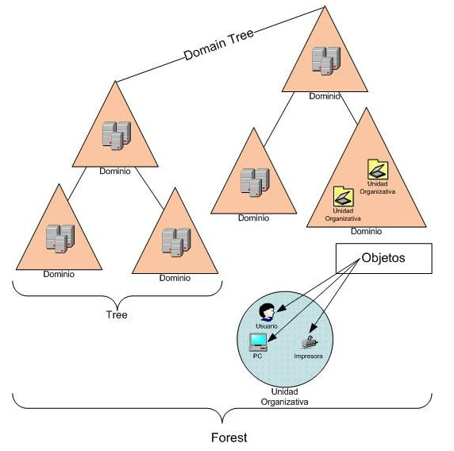

--- 
title: Administración de Dominios en Active Directory 
description: Administración de Dominios en Active Directory del módulo de Sistemas Operativos en red realizado por Francisco Javier Hernández Illán. 
---

# Administración de dominios en Active Directory

**Un dominio en Active Directory** es un conjunto de ordenadores conectados a una red los cuales cuentan con un equipo servidor para administrar las cuentas de usuario y credenciales de la red. 

## Características

Se dene tener en cuanta las siguientes características:

- Los nombres de un **dominio de Active Directory** no tienen que corresponder a un dominio de Internet registrado, pero pueden hacerlo. 
- Las estructuras de dominio se pueden configurar independientemente de las estructuras lógicas o físicas existentes de la organización. 
- Cada dominio se identifica con un nombre único basado en las convenciones de nomenclatura del Sistema de nombres de dominio (DNS). 
- Los subdominios parten de un dominio raíz. 
- El nombre completo incluye subdominios y dominio raíz.

## Estructura Lógica de Active Directory

La estructura del **Active Directory** se basa en el dominio configurado, se puede pensar en un bosque que está formado por diferentes árboles. Aquellos árboles del mismo grupo o especie forman parte de un dominio y así de vamos descendiendo hasta llegar a los objetos, que pueden ser los usuarios, periféricos u otros.

<figure>
  
  <figcaption>Estructura Lógica de <b>Active Directory</b></figcaption>
</figure>

## Prólogo prácticas

En la unidad anterior en la práctica **PT62** se instaló el Dominio y controlador en la instalación de **Active Directory**, en esta unidad se realizan configuraciones que avanzan en la gestión del dominio instalado, como la creación de usuarios y grupos, la degradación de un dominio, o eliminación de usuarios.