--- 
title: Gestión de Dominios en Active Directory
description: Gestión de Dominios en Active Directory del módulo de Sistemas Operativos en red realizado por Francisco Javier Hernández Illán. 
---

# Gestión de dominio en Active Directory

A continuación se desarrollan una serie de puntos para gestionar el dominio instalado en un **Active Directory**.

## Degradar un controlador de dominio

En este apartado lo que vamos a ver es cómo podemos **degradar un servidor que esté actuando como controlador de dominio**,
es decir, que tenga instalado un Active Directory. Para ello iremos al Panel de Administrador del Servidor y seleccionaremos
Agregar roles y características:

<figure>
  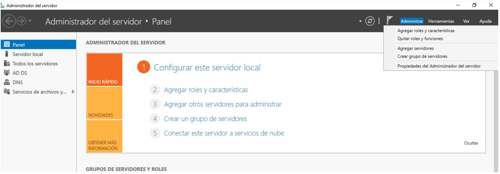
  <figcaption>Degradar un controlador de dominio I.</figcaption>
</figure>

Nos aparece el asistente para quitar roles y características, seleccionamos siguiente:

<figure>
  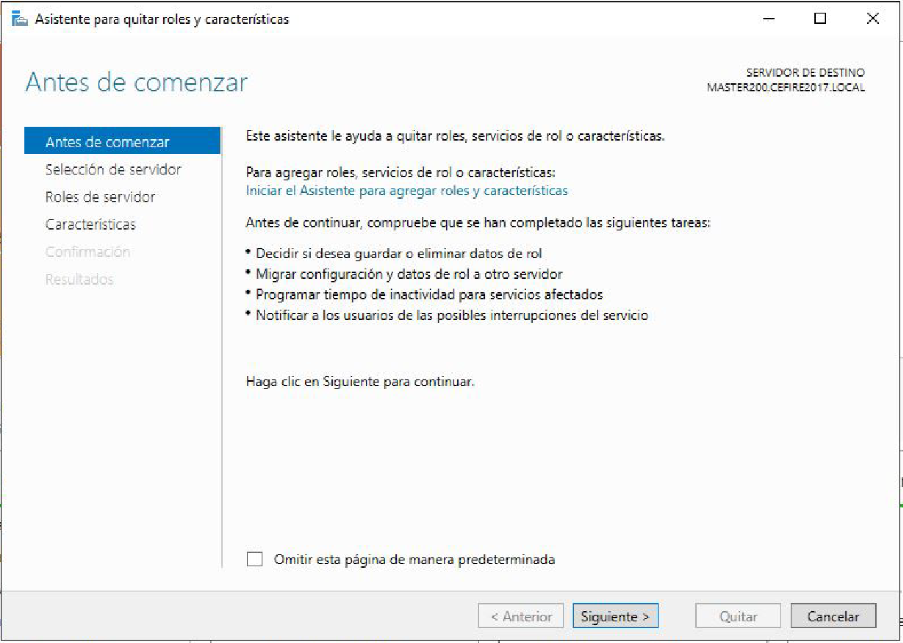
  <figcaption>Degradar un controlador de dominio II.</figcaption>
</figure>

Iniciado el asistente seleccionamos el servidor en donde vamos a quitar algún rol. En nuestro caso, eliminaremos el rol
Servicios de dominio de Active Directory:

<figure>
  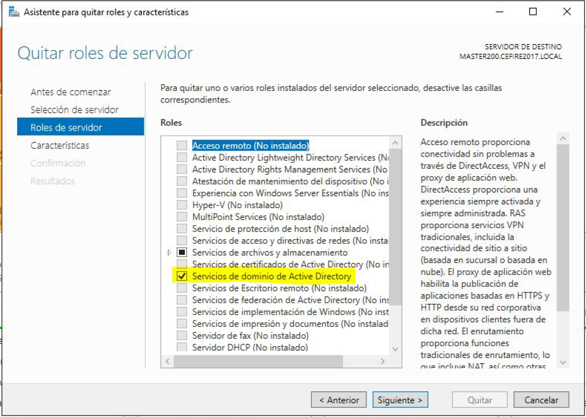
  <figcaption>Degradar un controlador de dominio III.</figcaption>
</figure>

Eliminamos las características de los servicios de Active Directory:

<figure>
  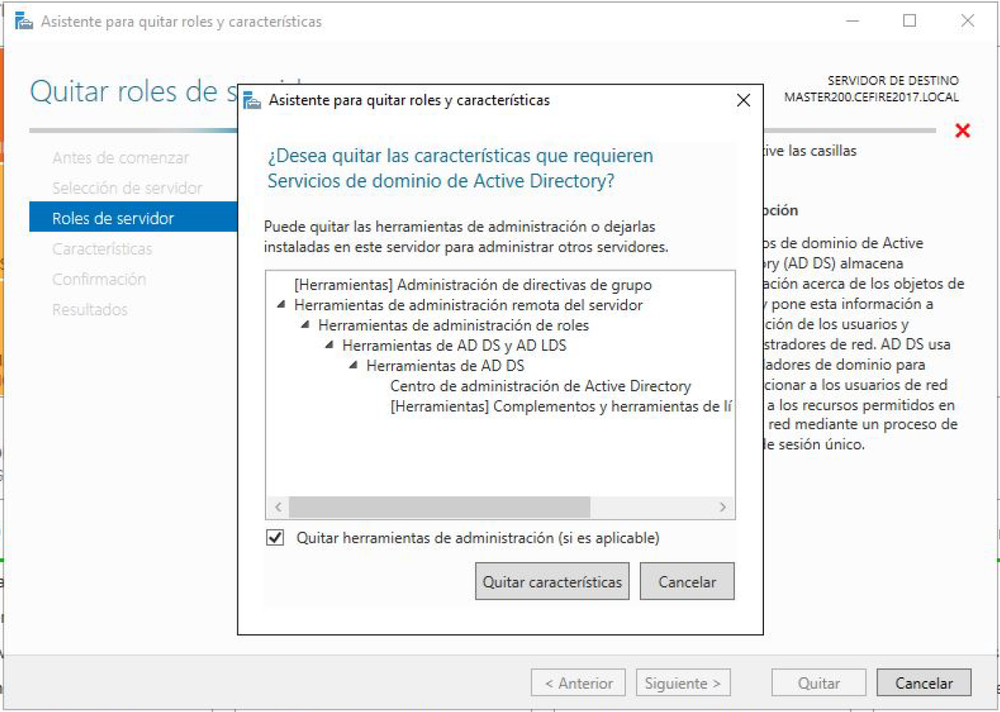
  <figcaption>Degradar un controlador de dominio IV.</figcaption>
</figure>

Para poder eliminar los servicios de Active Directory, es necesario disminuir el nivel del controlador de dominio:

<figure>
  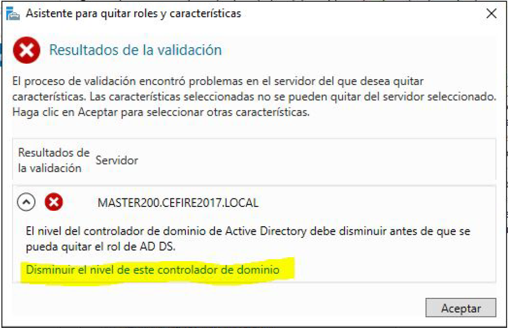
  <figcaption>Degradar un controlador de dominio V.</figcaption>
</figure>

Forzamos la eliminación del controlador de dominio:

<figure>
  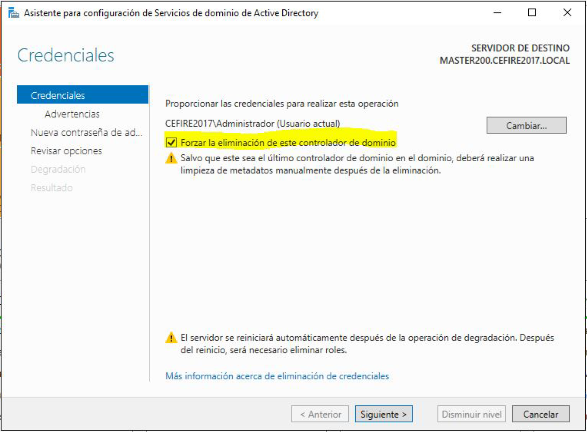
  <figcaption>Degradar un controlador de dominio VI.</figcaption>
</figure>
Introducimos la contraseña del administrador del dominio, en nuestro caso "cefire2017.":

<figure>
  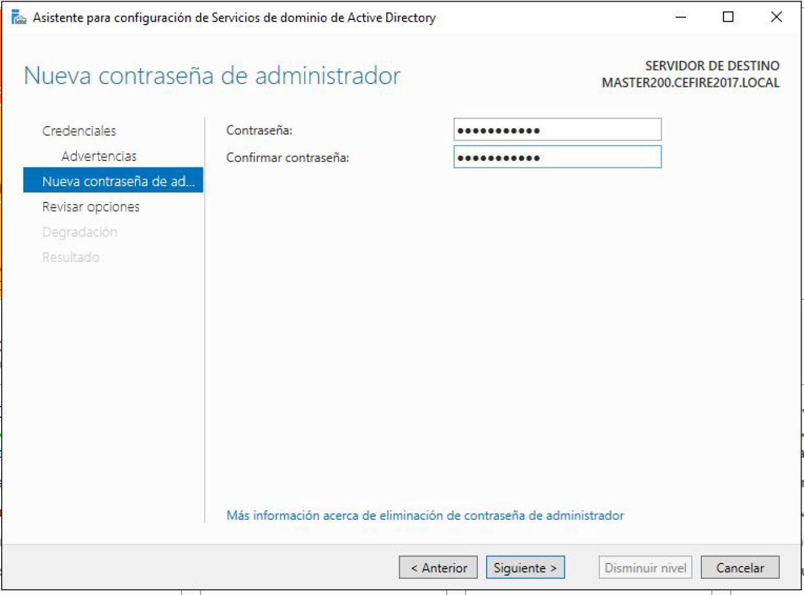
  <figcaption>Degradar un controlador de dominio VII.</figcaption>
</figure>

Y por último Disminuimos el nivel:

<figure>
  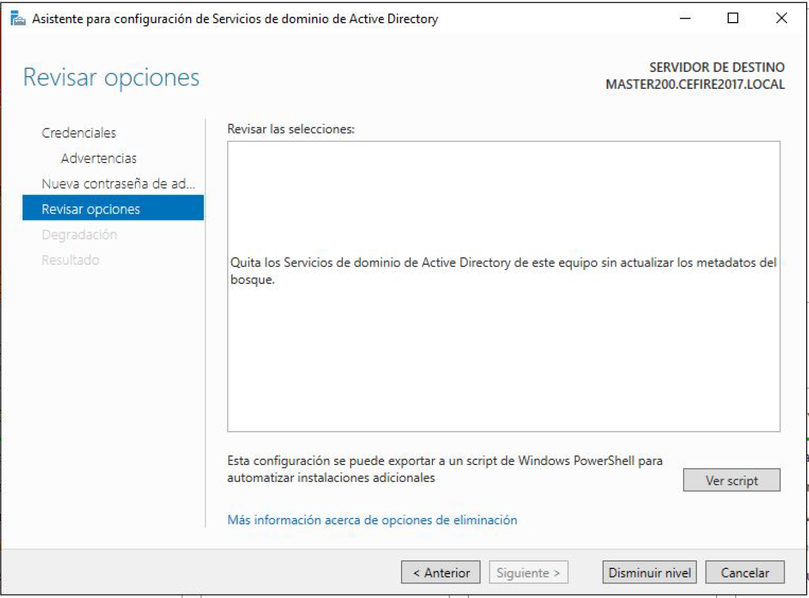
  <figcaption>Degradar un controlador de dominio VIII.</figcaption>
</figure>

## Eliminar clientes de un dominio

Habrá veces que una determinada máquina queramos sacarla de un dominio por algún motivo, para **quitar un cliente Windows
10** de un domino debemos realizar los siguientes pasos:

Accedemos a Sistema, a través del botón de **inicio de Windows** y con el ratón botón de la **derecha** --> **Sistema**.

<figure>
  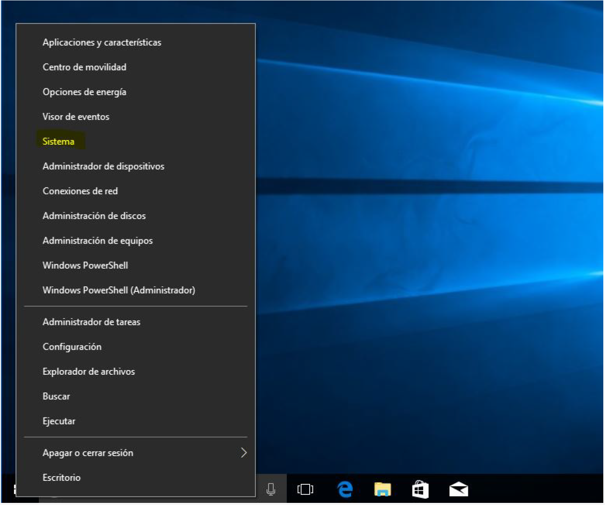
  <figcaption>Eliminar cliente windows 10 de dominio I.</figcaption>
</figure>

Dentro de **Sistema** --> Seleccionamos **Administrar o desconectar del trabajo o de la escuela**:

<figure>
  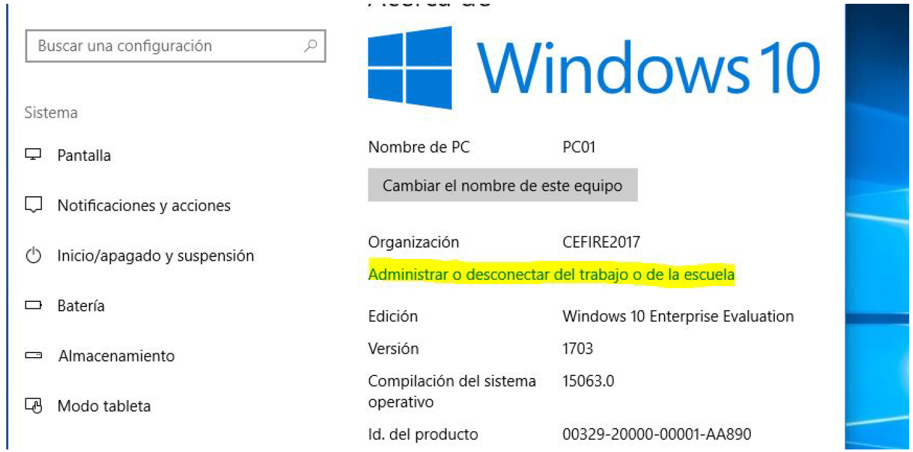
  <figcaption>Eliminar cliente windows 10 de dominio II.</figcaption>
</figure>

Seleccionamos el dominio al que está conectado, en nuestro caso a **ASO2223.LOCAL** y hacemos clic en Desconectar

<figure>
  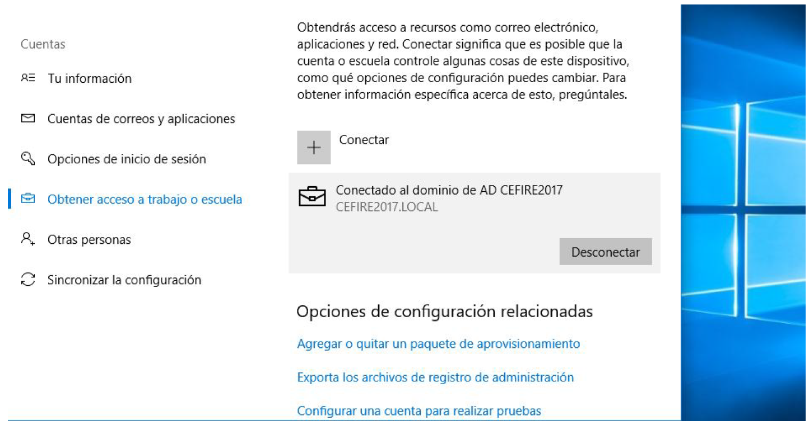
  <figcaption>Eliminar cliente windows 10 de dominio III.</figcaption>
</figure>

<figure>
  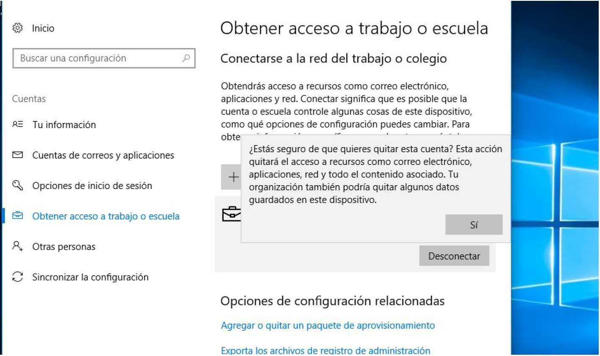
  <figcaption>Eliminar cliente windows 10 de dominio IV.</figcaption>
</figure>

Confirmamos la desconexión del dominio local

<figure>
  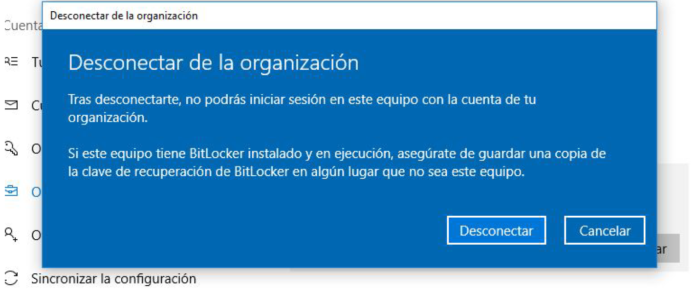
  <figcaption>Eliminar cliente windows 10 de dominio V.</figcaption>
</figure>

## PT72 Gestión de Dominios en Active Directory

!!! info "Contribución a los CEs (Criterios de Evaluación)"
    Estas actividades contribuyen a los criterios de evaluación **CE1, CE2, CE3, CE5, CE6, CE7, CE8 y CE9** del **RA3** de SOR.

!!! Abstract "Situación de Aprendizaje"
    Partiendo de la Situación de aprendizaje de [PT41](https://fjavier-hernandez.github.io/sor/04_SAMBA_DC/043_GestionRecursosSambaDC.html#pt41-gestion-de-recursos-compartidos-en-samba-dc) y [PT61](https://fjavier-hernandez.github.io/sor/06_AD1/062_WS_Config.html#pt61-configuracion-windows-server), realiza las siguientes tareas. 

!!! question "Tarea"
    Siguiendo con la configuración del **Active Directory** para **Area Studio** debes realizar los siguientes puntos:

1. Creación de los usuarios, grupos y unidades organizativas de los responsables de departamento de **Area Studio**:

| Nombre  | Apellido  | Inicio de sesión | Posición       | Contraseña |
|---------|-----------|------------------|----------------|------------|
| Eduard  | Casavella | eduard.casavella | Gerente        | casavella1 |
| Pep     | Terrón    | pep.terron       | Responsable IT | terron1    |
| Fran    | Delgado   | fran.delgado     | Administración | delgado1   |
| Marcos  | Sabates   | marcos.sabates   | Comercial      | sabates1   |
| Irene   | Masot     | irene.masot      | RR HH          | masot1     |

2. Elimina los clientes **usuario1** y **usuario2** de pruebas generados en la **PT71**.
3. Genera una instantánea del WS, y Degrada el Controlador de un dominio. Después de esta última acción prueba acceder con cualquier usuario generado para **Area Studio**. ¿Puedes acceder?¿Por qué?
