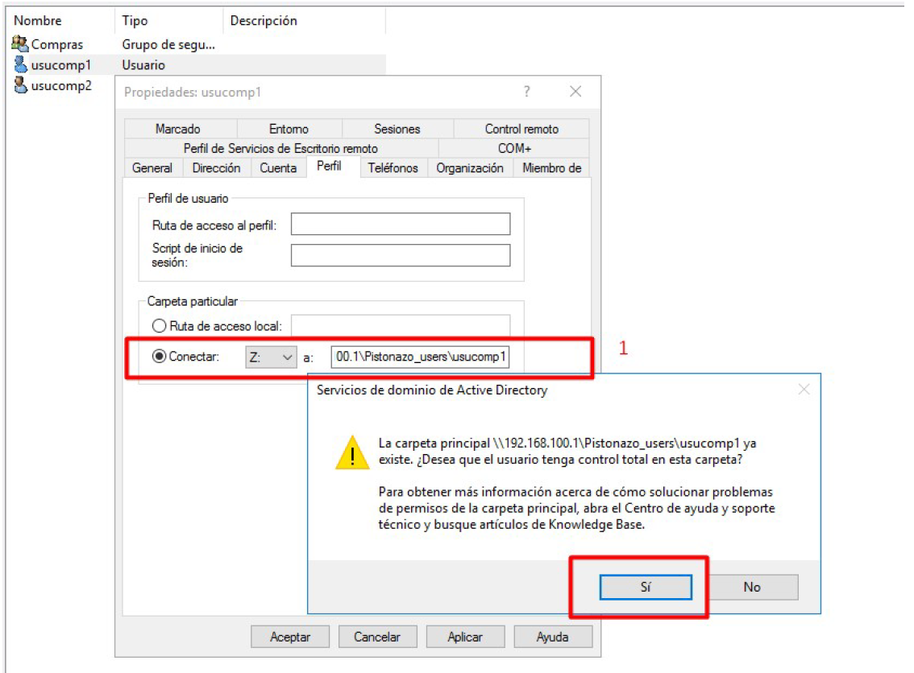
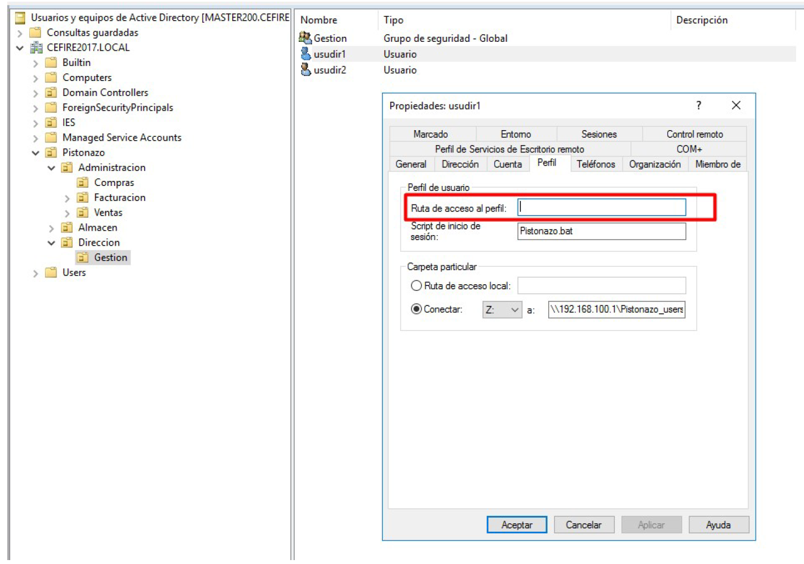

--- 
title: Gestión de recursos compartidos en Active Directory 
description: Gestión de recursos compartidos en Active Directory del módulo de Sistemas Operativos en red realizado por Francisco Javier Hernández Illán. 
---

# Compartir recursos en Active Directory

**Compartir recursos** se refiere a una carpeta o fichero, el cuál suele estar alojado en un disco duro de datos, en un NAS o en la nube. Podemos compartir recursos que se alojan en cualquier lugar de nuestra red y sirven para que varios clientes o usuarios accedan a los mismos ficheros de forma centralizada.

Entre las ventajas de compartir recursos destacan:

- No es necesario copiar el recurso localmente en los equipos, por lo tanto se consigue un ahorro de memoria determinado.
- Se pueden gestionar las políticas de seguridad de forma centralizada.

## Carpetas Personales

Una de las opciones más utilizadas que puede configurarse en la ficha '**Perfiles**' de las propiedades de la cuenta de usuario es
el establecimiento de una unidad en red personal para cada usuario a la que únicamente él tiene acceso:

<figure>
  
  <figcaption>Carpeta particular.</figcaption>
</figure>

!!! example "Ejemplo"

Para configurar la carpeta compartida, basta crear una carpeta a la que se tenga acceso desde la red. Esta carpeta la tenemos creada en el disco y dentro de esta carpeta están las carpetas de cada uno de los usuarios. Bastará asignar la ruta de esa carpeta a cada uno de los usuarios. 

A continuación se muestra un ejemplo, donde se asigna a la unidad Z: a la carpeta personal de cada uno de los usuarios de una organización llamada "*Pistonazo*":

<figure>
  
  <figcaption>Carpetas particulares.</figcaption>
</figure>

se asignan estas carpetas a cada uno de los usuarios. Para ello desde la pestaña perfil:

<figure>
  
  <figcaption>Carpetas particulares.</figcaption>
</figure>

**La carpeta del usuario debe ser una carpeta compartida con permisos de escritura**. En este caso se utilizan las carpetas creadas en la sección de Permisos NTFS. En concreto se crea una carpeta en `C:\Pistonazo_Users`, esta carpeta tiene permisos de acceso el grupo Pistonazo y los Administradores. Por tanto, el recurso
`\\192.168.100.1\Pistonazo_users\%username%` será la carpeta de cada uno de los usuarios.

!!! tip "**Importante**"
    La variable `%username%` sustituye el valor por el identificador de usuario.

## Perfiles

Los perfiles son una serie de ficheros de **configuración del entorno de trabajo**, que se aplican a todos los equipos de la red desde donde pueda iniciar sesión el usuario. Por lo tanto , los perfiles son aquellos aspectos de configuración del equipo y del entorno de trabajo propios del usuario, los cuales son exportables a otras máquinas de manera transparente al mismo. En otras palabras, mediante los perfiles se consigue que el usuario independientemente del equipo en el que inicie la sesión disponga de un entorno de trabajo similar. 

Existen tres tipos de perfiles:

1. **Perfiles locales** : se almacenan en el equipo, y configuran el entorno de trabajo de cada usuario.
2. **Perfiles móviles** : el usuario configura el entorno de trabajo a su gusto en un equipo, y al iniciar sesión en cualquier otra estación de trabajo, la configuración se importa y aplica a ese nuevo equipo.
3. **Perfiles obligatorios** : un usuario con permisos de administración define la configuración del entorno de trabajo, la cual se aplica a los usuarios del dominio. Estos pueden modificarla durante la sesión, pero al iniciar otra sesión, se vuelve a cargar la configuración del perfil obligatorio. En lugar de trabajar con perfiles obligatorios, se recomienda configurar entornos de trabajo definidos para los miembros de una unidad organizativa de una manera más cómoda y potente.

### Perfiles móviles

Los ficheros de configuración de los perfiles deben almacenarse en una ubicación accesible por los equipos clientes, **como por ejemplo el controlador de dominio**. Concretamente, los perfiles se almacenan  en una carpeta de perfil. Esta carpeta de perfil la se crea dentro de las carpetas particulares de los usuarios. 

!!! example "Ejemplo"

Por ejemplo, a continuación se muestra la configuración para los usuarios del departamento **Gestión tengan un perfil móvil** , de la organización "*Pistonazo*":

<figure>
  
  <figcaption>Perfil móvil para usuarios de departamento Gestión</figcaption>
</figure>

Estos usuarios cuando inicien sesión en alguna de las máquinas cliente del dominio, recuperan todo su perfil de la carpeta personal del usuario. 

Para ello, vamos se modifica el siguiente campo de la pestaña perfil:

<figure>
  
  <figcaption>Perfil móvil usuario usudir1</figcaption>
</figure>

Y se establece la ruta de acceso al perfil. En este caso, se establece la ruta de acceso al perfil móvil, dentro de la carpeta personal del usuario. Por tanto, se seleccionan los dos usuarios con el botón de la derecha del ratón:

<figure>
  
  <figcaption>Perfil móvil usuarios gestion</figcaption>
</figure>

Y para la ruta del perfil móvil se establece la siguiente dirección: `\\192.168.100.1\Pistonazo_users$\%username%\perfil`

De esta forma cuando algún usuario de Gestión inicie sesión, se creará en la carpeta personal su perfil. Así independientemente del equipo donde se conecte, siempre tendrá la información:

<figure>
  
  <figcaption>Creación de carpeta de perfil móvil</figcaption>
</figure>

!!! Warning
    - **Carga en red Perfil Móvil** : Hay que tener en cuenta de que cuando un usuario con perfil móvil inicia la sesión, la información del servidor se copia al cliente. Cuando cierra la sesión se realiza la operación inversa. Un alto número de usuario con perfil móvil puede sobrecargar la red demasiado. Por tanto, hay que saber exactamente en qué usuarios se deben aplicar esta característica.