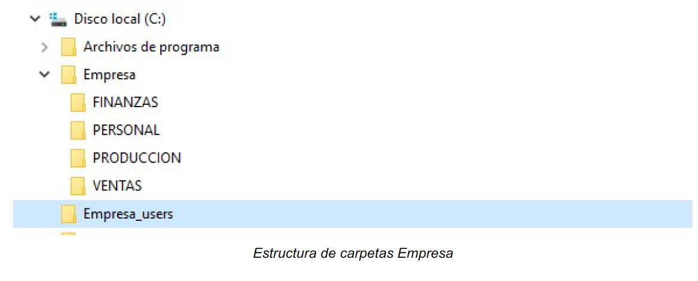
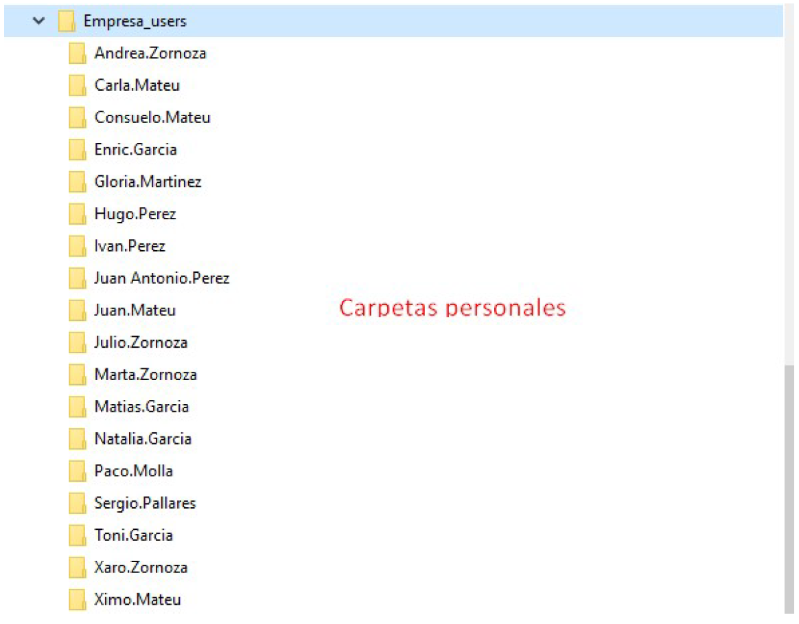
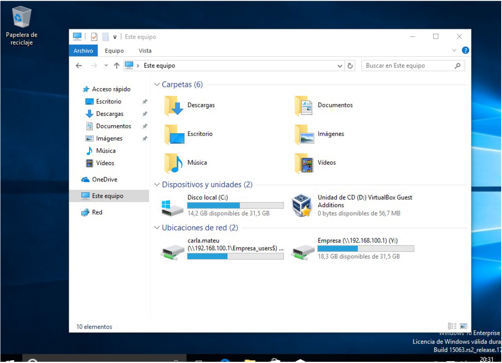

--- 
title: Estructura de empresa en Active Directory 
description: Estructura en Active Directory del módulo de Sistemas Operativos en red realizado por Francisco Javier Hernández Illán. 
---

# Estructura de empresa en Active Directory

En esta sección se detalla el enunciado de la práctica a a realizar en esta unidad.

## PT81. Estructura de empresa en AD con recursos compartidos

Partiendo de la [Situación de aprendizaje](https://fjavier-hernandez.github.io/sor/SituacionAprendizaje.html) la empresa **SOR Systems** solicita un servicio de directorio en Active directory que gestione los recursos compartidos de sus empleados y dispositivos. La empresa esta compuesta por cuatro departamentos **Finanzas, Personal, Producción, y ventas**, y con 2 empleados por departamento.

A partir de estos datos se deben realizar los siguientes apartados de configuración de la estructura de la empresa **SOR Systems**

### PT81_1 Creación de usuarios y grupos

!!! info "Contribución a los CEs (Criterios de Evaluación)"
    Estas actividades contribuyen a los criterios de evaluación **CE1, CE3, y CE7** del **RA2** de SOR.

!!! question "Tarea"
    Debes realizar un informe con una captura de la realización del siguiente punto:

1. Crea los usuarios y grupos ficticios para la organización de **SOR Systems**, siguiendo la unidad anterior, en concreto la sección [7.2. Administración de Usuarios y Grupos](https://fjavier-hernandez.github.io/sor/07_DOMINIO_AD/072_GestionDominioI.html). 

!!! note "**Nota**"
    Utiliza datos inventados para la información personal. Puedes usar esta web para obtener datos personales ficticios: [GeneraData](https://www.generatedata.com).

### PT81_2 Gestión de recursos en AD

!!! info "Contribución a los CEs (Criterios de Evaluación)"
    Estas actividades contribuyen a los criterios de evaluación **CE2, CE3, CE5 y CE6** del **RA4**de SOR.

!!! question "Tarea"
    Debes realizar un informe con una captura de la realización de los siguientes puntos:

1. Crear la estructura de carpetas en disco y definir los siguientes permisos:

A la carpeta principal Empresa, sólo podrán acceder los miembros del grupo Empresa. En esta carpeta solo tendrán acceso de lectura. Cada departamento podrá entrar en su carpeta con permisos de control total y no podrá acceder al resto de departamentos de la empresa.

<figure>
  
  <figcaption>Estructura de carpetas Empresa</figcaption>
</figure>

2. Crear también la estructura para almacenar las carpetas particulares de los usuarios. Por ejemplo en `C:\Empresa_users`

<figure>
  
  <figcaption>Carpeta de usuarios</figcaption>
</figure>

3. Cuando un usuario inicie sesión, conectará de manera automática la carpeta personal en la unidad X: y la carpeta de
empresas en la unidad Y:

<figure>
  
  <figcaption>Inicio sesión usuario Empresa</figcaption>
</figure>

Además se debe modificar las directivas necesarias para conseguir:

4. Los usuarios deben cambiar la contraseña cada 90 días y guardar el historial de 5 contraseñas. Para facilitar la gestión
no será necesaria tener una restricción en cuánto a la complejidad de la contraseña y el número mínimo de caracteres
será de 4.
5. Para evitar posibles robos de contraseña y ataques mal intencionados, cuando un usuario intenta 4 veces introducir de
manera incorrecta su contraseña, la cuenta se bloqueará hasta que se reestablezca el contador de inicios de sesión erróneos a los 10minutos.

Haced una captura de pantalla de las directivas de contraseña y de inicios de sesión.