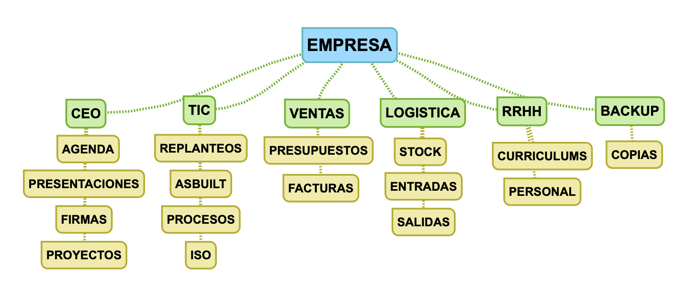

--- 
title: Proyecto Final SOR
description: Proyecto Final de Módulo de Sistemas Operativos en red realizado por Francisco Javier Hernández Illán.
---

# Proyecto Final de Módulo (PFM)

!!! info "Contribución a los CEs (Criterios de Evaluación)"
    Estas actividades contribuyen a los siguientes resultados de aprendizaje **RA1**, **RA2**, **RA3**, **RA4**, **RA5** **RA6** y **RA7** de SOR.

!!! Info "Situación de Aprendizaje"
    Partiendo de la [Situación de aprendizaje](https://fjavier-hernandez.github.io/sor/SituacionAprendizaje.html), Se te ha encargado realizar la implantación de un Servicio de Directorio a elegir entre **Active directory** y **Samba DC**. 

!!! Abstract "Premisas"
    - **Proyecto Creación de Servicio de Directorio**. El proyecto se realizará individual o por grupos de dos personas como máximo con el principal objetivo de emular la configuración de instalación de un **Active Directory** o de **Samba DC** en una empresa ficticia que se deberá detallar (por parte del alumnado). 
    - Una vez instalado se crearán usuarios, grupos y dominios, comprobando el acceso de los usuarios al servicio de directorio según las directivas de seguridad que se deben definir (por parte del alumnado) durante el proyecto.
    - Además se generaran recursos compartidos, a los que se configuraran el acceso apropiado según las directivas de seguridad definidas, comprobando dicho acceso.

!!! warning "**¡¡Cuidado!!**"
    - Los puntos a realizar en el proyecto pueden aumentar hasta que se imparta todo el temario.
    - El proyecto se presentará al profesor/a responsable del módulo en una cita concertada en la semana de exámenes de la evaluación, previa consulta y muestra de la situación del proyecto en la semana de preparación de los exámenes.

!!! question "Tarea"
    A continuación se muestra una guía de pasos para iniciar el proyecto.

## PFM11 Inicio del proyecto

Se debe presentar un un **pdf** con las siguientes premisas:

- Nombre del componente o de los componentes del grupo (máximo 2).
- Definición de la Organización:
    - Nombre.
    - Dominio.
    - Unidades Organizativas, (mínimo 4).
    - Usuarios y grupos (diferentes niveles, administradores, usuarios de OUs). Se deberá generar información inventada para los usuarios. Para generar datos inventados [PINCHA AQUÍ](https://www.generatedata.com).
    - Definición de directorios de cada OU.
    - Realizar un mapa conceptual de la organización. Ejemplo:

<figure>
  
  <figcaption>Ejemplo de Directorios de Organización.</figcaption>
</figure>

!!! note "NOTA"
    En el caso de ser realizado el proyecto por un grupo la nota será la misma para los componentes del grupo.

## PFM12 Desarrollo del proyecto

Se debe realizar una memoria y presentación del desarrollo del proyecto donde se cumplan las siguientes premisas.

- La memoria debe contener, portada, índice, desarrollo de los apartados, numeración de figuras, y bibliografía.
- La presentación debe estar orientada a la defensa del proyecto el día del examen, con una duración máxima de 10 minutos (**Importante**).
- El desarrollo del proyecto debe centrase en la implementación de un servicio de directorio en linux o Windows, explicando con argumentos la elección de la distribución y desplegando el escenario necesario en virtualbox.
- En el servicio de directorio se deben crear los usuarios, grupos, departamentos, y recursos compartidos definidos en el PFM11.

## PFM13 Defensa del proyecto

Se debe defender el proyecto según la memoria y presentación entregada, el día del examen, con duración de **10 minutos**.

