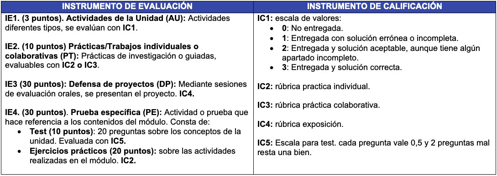

--- 
title: Evaluación
description: Evaluación de Sistemas Operativos en red de Francisco Javier Hernández Illán. Descrición de los procedimientos de evaluación. 
---

# Evaluación

La evaluación es un proceso **continuo y formativo** basado en la calificación de competencias a través de los **resultados de aprendizaje**. En el caso de SOR se realiza la media de las calificaciones de cada **RA**.

!!! warning "IMPORTANTE"
    - Por lo tanto **LA CALIFICACIÓN FINAL DEL MÓDULO** se obtendrá de la **media ponderada de las calificaciones de cada RA**.

## Procedimientos de Evaluación

- **La calificación de cada RA se obtendrá de la media ponderada de las actividades formativas trabajadas**. Para ello se utilizan los siguientes procedimientos de evaluación:

<table class="tg">
<thead>
  <tr>
    <th class="tg-ht60">INSTRUMENTO DE EVALUACIÓN</th>
    <th class="tg-ht60">INSTRUMENTO DE CALIFICACIÓN</th>
  </tr>
</thead>
<tbody>
  <tr>
    <td class="tg-1wig"><b>IE1. (3 puntos). Actividades de la Unidad (AU):</b> Actividades diferentes tipos, se evalúan con IC1.    </td>
    <td class="tg-1wig"><b>IC1: escala de valores:</b>  <b>0: </b>No entregada; <b>1:</b> Entregada con solución errónea o incompleta;  <b>2:</b> Entregada y solución aceptable, aunque tiene algún apartado incompleto;  <b>3:</b> Entregada y solución correcta.</td>
  </tr>
  <tr>
    <td class="tg-1wig"><b>IE2. (10 puntos) Prácticas/Trabajos (PT):</b> Prácticas de investigación o guiadas, evaluables con IC2 o IC3.  </td>
    <td class="tg-1wig"><b>IC2: rúbrica practica individual.</b>    <b>IC3: rúbrica práctica colaborativa.</b>  </td>
  </tr>
  <tr>
    <td class="tg-1wig"><b>IE3 (30 puntos): Defensa de proyectos (DP):</b>  Mediante sesiones de evaluación orales, se presentan el proyecto. IC4.  </td>
    <td class="tg-1wig"><b>IC4: rúbrica exposición.</b>    </td>
  </tr>
  <tr>
    <td class="tg-1wig"><b>IE4. (30 puntos). Prueba específica (PE):</b> Actividad o prueba que hace referencia a los contenidos del módulo. Consta de: Test (10 puntos): 20 preguntas sobre los conceptos de la unidad. Evaluada con IC5. Ejercicios prácticos (20 puntos): sobre las actividades realizadas en el módulo. IC2.</td>
    <td class="tg-1wig"><b>IC5:</b> Escala para test. cada pregunta vale 0,5 y 2 preguntas mal resta una bien.</td>
  </tr>
</tbody>
</table>

<!-- <figure>
  
  <figcaption>Procedimientos de Evaluación</figcaption>
</figure> -->

## Evaluaciones Trimestrales 

* **Primer trimestre**: la calificación se obtiene de la media ponderada simple de las actividades formativas evaluables trabajadas durante el primer trimestre, por lo tanto **NO HABRÁ EXAMEN**.

* **Segundo trimestre**: media ponderada simple de todas las actividades formativas, incluyendo la presentación individual del **"Proyecto de Módulo"** que se realizará en lugar del examen de la 2ª evaluación.

## Evaluaciones Ordinaria y Extraordinaria 

En el caso de no superar algún resultado de aprendizaje durante la evaluación continua:

!!! warning "IMPORTANTE"
    - En primera instancia se recupera el **RA** en el examen de convocatoria final **Ordinaria**.
    - En segunda instancia si todavía no se ha superado el RA en la Ordinaria se debe aprobar en examen final de la convocatoria **Extraordinaria**.
