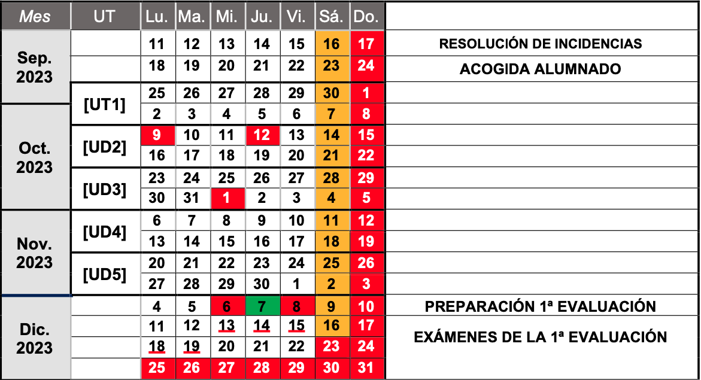

--- 
title: Programación de Aula 
description: Programación de Aula de Sistemas Operativos en red de Francisco Javier Hernández Illán. Muestra de las sesiones y planificación de la programación de aula de sistemas operativos en red (SOR). 
---

# Programación de Aula

Las **unidades de trabajo (UT)** se han temporalizado siguiendo la distribución en quincenas para las **UTs** indicada en la [ORDEN 30/2002, de 12 de mayo](https://dogv.gva.es/datos/2022/05/18/pdf/2022_4219.pdf), con el resultado a nivel de centro publicado en el [calendario escolar 2023/2024](https://portal.edu.gva.es/03013224/wp-content/uploads/sites/231/2023/09/Calendario-semipresencial-2324.pdf).

Teniendo en cuenta esta temporalización inicial se han planificado las siguientes sesiones para el módulo de SOR:

<!-- Por lo tanto la temporalización de las **UTs de SOR** se organiza de la siguiente forma:

### Calendario y Planificación inicial

- Calendario:

<figure>
  
  <figcaption>Temporalización UTs 1º Trimestre.</figcaption>
</figure>

- Planificación general inicial: 

1. **[Introducción SOR. Docker. NextCloud.](https://fjavier-hernandez.github.io/sor/01_INTRO_SOR/001_IntroSOR.html) (16 horas, del 25/09/23 al 06/10/23)**
    * Introducción a los sistemas operativos en red.
    * Virtualización.
    * Contenedores. Docker
    * NextCloud.
2. **[Introducción Samba.](https://fjavier-hernandez.github.io/sor/02_INTRO_SAMBA/021_IntroSamba.html) (16 horas, del 10/10/23 al 20/10/23)**
    * Instalación Samba.
    * Fichero configuración, Creación directorio compartido.
    * Docker Compose Samba.
3. **[Gestión Usuarios y grupos Samba](https://fjavier-hernandez.github.io/sor/03_USERS_SAMBA/031_SambaSecUsers.html). (16 horas, del 23/10/23 al 3/11/23)**
    * Perfiles de usuario y grupos.
    * Integración de permisos.
4. **[Gestión de recursos compartidos en Samba.](https://fjavier-hernandez.github.io/sor/04_SAMBA_DC/041_Introduccion_SambaDC.html) (16 horas, del 7/11/23 al 18/11/23)**
    * Creación de de recursos compartidos.
    * Monitorización de incidencias. 
5. **Entornos de desarrollo virtualizados. Vagrant. (16 horas, del 21/11/23 al 2/12/23)**
    * Escenarios heterogéneos, Protocolos para redes heterogéneas, servicios de recursos compartidos.
    * creación de entornos de desarrollo virtualizados mediante Vagrant.   -->

## Planificación de Sesiones

<table class="tg">
<thead>
  <tr>
    <th class="tg-3nxc">Sesión</th>
    <th class="tg-3nxc">Tipo</th>
    <th class="tg-3nxc">Fechas</th>
    <th class="tg-3nxc">Descripción</th>
    <th class="tg-3nxc">Actividades/Recursos</th>
  </tr>
</thead>
<tbody>
  <tr>
    <th class="tg-vov5" colspan="5">PRIMERA EVALUACIÓN</th>
  </tr>
  <tr>
    <td class="tg-0pky">1</td>
    <td class="tg-fymr">Teórica: Explicativa.  </td>
    <td class="tg-mxcs"><b>25/09/23(Mañana)</b>   <b>28/09/23(Tarde)</b></td>
    <td class="tg-0pky">Presentación del módulo e introducción a los sistemas operativos en red  destacando herramientas de virtualización innovadoras como Docker.</td>
    <td class="tg-fymr"><a href="https://fjavier-hernandez.github.io/sor/01_INTRO_SOR/001_IntroSOR.html">1.1.Introducción SOR.</a> <a href="https://fjavier-hernandez.github.io/sor/01_INTRO_SOR/002_Virtualización.html">1.2.Virtualización.</a> <a href="https://fjavier-hernandez.github.io/sor/01_INTRO_SOR/003_Docker.html">1.3.Docker.</a> <a href="https://fjavier-hernandez.github.io/sor/01_INTRO_SOR/004_PracticaNextCloud.html">1.4.NextCloud.</a> - Vídeo: explicación módulo.</td>
  </tr>
  <tr>
    <td class="tg-0pky">2</td>
    <td class="tg-fymr">Práctica: Resolución actividades  y dudas.</td>
    <td class="tg-mxcs"><b>02/10/23(Mañana)</b>   <b>05/10/23(Tarde)</b></td>
    <td class="tg-0pky">Realización guiada de la práctica de NextCloud.  Se comenta el vídeo-guía de la práctica para dar la facilidad al alumnado </td>
    <td class="tg-fymr"><a href="https://fjavier-hernandez.github.io/sor/01_INTRO_SOR/004_PracticaNextCloud.html#pt11-instalacion-y-configuracion-de-nextcloud-mediante-docker">PT11. NextCloud mediante Docker</a> <a href="https://fjavier-hernandez.github.io/sor/01_INTRO_SOR/005_RefuerzoAmpliacion.html#pt12-instalacion-y-configuracion-de-owncloud-mediante-docker">PT12. (Refuerzo) OwnCloud mediante Docker.</a> <a href="https://fjavier-hernandez.github.io/sor/01_INTRO_SOR/005_RefuerzoAmpliacion.html#pt13-instalacion-aplicaciones-cloud">PT13. (Ampliación) Instalación aplicaciones Cloud.</a> Test/cuestionario Docker en Aules.</td>
  </tr>
  <tr>
    <td class="tg-0pky">3</td>
    <td class="tg-fymr">Teórica: Explicativa.  </td>
    <td class="tg-mxcs"><b>16/10/23(Mañana)</b>   <b>19/10/23(Tarde)</b></td>
    <td class="tg-0pky">Introducción al servicio Samba para compartir carpetas  y explicación de Docker Compose.</td>
    <td class="tg-fymr"><a href="https://fjavier-hernandez.github.io/sor/02_INTRO_SAMBA/021_IntroSamba.html">2.1.Introducción Samba.</a> <a href="https://fjavier-hernandez.github.io/sor/02_INTRO_SAMBA/022_InstalacionSamba.html">2.2.Instalación y configuración inicial.</a> <a href="https://fjavier-hernandez.github.io/sor/02_INTRO_SAMBA/023_DockerComposeSamba.html">2.3.Docker Compose Samba.</a></td>
  </tr>
  <tr>
    <td class="tg-0pky">4</td>
    <td class="tg-fymr">Práctica: Resolución actividades  y dudas.</td>
    <td class="tg-mxcs"><b>23/10/23(Mañana)</b>   <b>26/10/23(Tarde)</b></td>
    <td class="tg-0pky">Revisión del vídeo-guía de la práctica de instalación de Samba.  Realización de muestras de accesos permitidos y denegados a las carpetas según se indica en la práctica. Realización y revisión del vídeo de Docker compose Samba.</td>
    <td class="tg-fymr"><a href="https://fjavier-hernandez.github.io/sor/02_INTRO_SAMBA/022_InstalacionSamba.html#pt21-practica-instalacion-y-configuracion-inicial-de-samba">PT21. Práctica Instalación y configuración inicial de Samba</a> <a href="https://fjavier-hernandez.github.io/sor/02_INTRO_SAMBA/023_DockerComposeSamba.html#pt22-samba-mediante-docker-compose">PT22. Samba mediante Docker compose.</a> <a href="https://fjavier-hernandez.github.io/sor/02_INTRO_SAMBA/024_RefuerzoAmpliacion.html#pt23-generar-carpeta-compartida-con-acceso-total">PT23. (Refuerzo) Generar carpeta compartida con acceso total.</a> <a href="https://fjavier-hernandez.github.io/sor/02_INTRO_SAMBA/024_RefuerzoAmpliacion.html#pt24-instalacion-aplicaciones-cloud">PT24. (Ampliación) Generar carpeta con permisos desde Docker Compose Samba.</a> - Vídeo: Instalación Samba y permisos. - Vídeo: Docker Compose Samba</td>
  </tr>
  <tr>
    <td class="tg-0pky">5</td>
    <td class="tg-fymr">Teórica y Práctica</td>
    <td class="tg-mxcs"><b>31/10/23(Mañana)</b> </td>
    <td class="tg-0pky">Explicación de la creación de usuarios, grupos y secciones en Samba. Realización guiada de la práctica de NextCloud. Se comenta el vídeo-guía de la práctica para dar la facilidad al alumnado</td>
    <td class="tg-fymr"><a href="https://fjavier-hernandez.github.io/sor/03_USERS_SAMBA/031_SambaSecUsers.html">3.1.Introducción Secciones y usuarios Samba.</a> - Vídeo: usuarios y grupos. <a href="https://fjavier-hernandez.github.io/sor/03_USERS_SAMBA/032_CreacionUsersSamba.html#pt31-creacion-de-usuarios-y-grupos">PT31.Creación de usuarios y grupos en Samba.</a> <a href="https://fjavier-hernandez.github.io/sor/03_USERS_SAMBA/033_GestionUsersSamba.html#pt32-gestion-de-secciones-y-usuarios-en-samba">PT32.Gestión usuarios y secciones Samba.</a> <a href="https://fjavier-hernandez.github.io/sor/03_USERS_SAMBA/034_RefuerzoAmpliacion.html#pt33-configuracion-usuarios-y-grupos">PT33.(Refuerzo) Configuración Usuarios y grupos.</a> <a href="https://fjavier-hernandez.github.io/sor/03_USERS_SAMBA/034_RefuerzoAmpliacion.html#pt_34-creacion-usuarios-shellscripting">PT34. (Ampliación) Creación usuarios Shellscripting.</a> - Vídeo: secciones.</td>
  </tr>
  <tr>
    <td class="tg-vov5" colspan="5">    Permiso Paternidad del 02/11/23 hasta 04/12/23</b>    </td>
  </tr>
  <tr>
    <td class="tg-0pky">6</td>
    <td class="tg-fymr">Teórica: Explicativa.  </td>
    <td class="tg-mxcs"><b>11/12/23(Mañana)</b>   <b>14/12/23(Tarde)</b></td>
    <td class="tg-0pky">Presentación de Servicios de directorio y de sus elementos principales. Explicación de Samba Domain Controller y Práctica Guiada.  </td>
    <td class="tg-fymr"><a href="https://fjavier-hernandez.github.io/sor/04_SAMBA_DC/041_Introduccion_SambaDC.html">4.1.Introducción Samba DC.</a> <a href="https://fjavier-hernandez.github.io/sor/04_SAMBA_DC/042_InstallConfigSambaDC.html">4.2.Instalación y configuración de Samba DC.</a></td>
  </tr>
  <tr>
    <td class="tg-0pky">7</td>
    <td class="tg-fymr">Práctica: Resolución actividades y dudas.</td>
    <td class="tg-mxcs"><b>18/12/23(Mañana)</b>   <b>21/10/23(Tarde)</b></td>
    <td class="tg-0pky">Realización guiada de la práctica de Samba Domain Controller.   </td>
    <td class="tg-fymr"><a href="https://fjavier-hernandez.github.io/sor/04_SAMBA_DC/043_GestionRecursosSambaDC.html#pt41-gestion-de-recursos-compartidos-en-samba-dc">PT41. Gestión de recursos compartidos en Samba DC</a> <a href="https://fjavier-hernandez.github.io/sor/04_SAMBA_DC/044_RefuerzoAmpliacion.html#pt42-samba-dc-directorios">PT42. (Refuerzo) Samba DC directorios</a> <a href="https://fjavier-hernandez.github.io/sor/04_SAMBA_DC/044_RefuerzoAmpliacion.html#pt43-samba-dc-con-docker-compose">PT43. (Ampliación) Samba DC con Docker Compose</a> </td>
  </tr>
  <tr>
    <th class="tg-vov5" colspan="5">SEGUNDA EVALUACIÓN</th>
  </tr>
  <tr>
    <td class="tg-0pky">8</td>
    <td class="tg-fymr">Teórica:  Explicativa.  </td>
    <td class="tg-mxcs"><b>08/01/24(Mañana)</b>   <b>11/01/24(Tarde)</b></td>
    <td class="tg-0pky">Introducción a Windows server y su configuración básica. Introducción e instalación de Active Directory</td>
    <td class="tg-fymr"><a href="https://fjavier-hernandez.github.io/sor/06_AD1/061_AD_Intro.html">6.1.Introducción Active Directory.</a> <a href="https://fjavier-hernandez.github.io/sor/06_AD1/062_WS_Config.html">6.2.Configuración Windows Server.</a> <a href="https://fjavier-hernandez.github.io/sor/06_AD1/063_AD_Install.html">6.3.Instalación de Active Directory.</a></a> <a href="https://www.youtube.com/watch?v=nA1jYIvBFBU">Vídeo: explicación configuración WS.</a></td>
  </tr>
  <tr>
    <td class="tg-0pky">9</td>
    <td class="tg-fymr">Práctica: Resolución actividades  y dudas.</td>
    <td class="tg-mxcs"><b>15/01/24(Mañana)</b>   <b>18/01/24(Tarde)</b></td>
    <td class="tg-0pky">Realización guiada de la Instalación de Active Directory.</td>
    <td class="tg-fymr"><a href="https://fjavier-hernandez.github.io/sor/06_AD1/062_WS_Config.html#pt61-configuracion-windows-server">PT61. Configuración Windows Server</a> <a href="https://fjavier-hernandez.github.io/sor/06_AD1/063_AD_Install.html#pt62-instalacion-de-active-directory">PT62. Instalación programada de Active Directory.</a> - Vídeo: Realización guiada de PT62</td>
  </tr>
  <tr>
    <td class="tg-0pky">10</td>
    <td class="tg-fymr">Teórica:  Explicativa.  </td>
    <td class="tg-mxcs"><b>22/01/24(Mañana)</b>   <b>25/01/24(Tarde)</b></td>
    <td class="tg-0pky">Administración de dominios en Active Directory. creación de usuarios y grupos, la degradación de un dominio, y eliminación de usuarios.</td>
    <td class="tg-fymr"><a href="https://fjavier-hernandez.github.io/sor/07_DOMINIO_AD/071_DominioAD.html">7.1.Administración de dominios en Active Directory.</a> <a href="https://fjavier-hernandez.github.io/sor/07_DOMINIO_AD/072_GestionDominioI.html">7.2.Administración de Usuarios y Grupos.</a> <a href="https://fjavier-hernandez.github.io/sor/07_DOMINIO_AD/073_GestionDominioII.html">7.3.Gestión de dominio en Active Directory.</a></a></td>
  </tr>
  <tr>
    <td class="tg-0pky">11</td>
    <td class="tg-fymr">Práctica: Resolución actividades  y dudas.</td>
    <td class="tg-mxcs"><b>29/01/24(Mañana)</b>   <b>01/02/24(Tarde)</b></td>
    <td class="tg-0pky">Realización guiada de la gestión de dominios en Active Directory.</td>
    <td class="tg-fymr"><a href="https://fjavier-hernandez.github.io/sor/07_DOMINIO_AD/072_GestionDominioI.html#pt71-administracion-de-usuarios-y-grupos">PT71.Administración de usuarios y grupos</a> <a href="https://fjavier-hernandez.github.io/sor/07_DOMINIO_AD/073_GestionDominioII.html#pt72-gestion-de-dominios-en-active-directory">PT72. Gestión de Dominios en Active Directory.</a> - Vídeos: de creación y gestión de usuarios, grupos y Unidades organizativas. </td>
  </tr>
</tbody>
</table>

