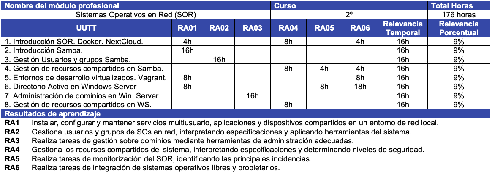

--- 
title: Sistemas Operativos en red
description: Apuntes de Sistemas Operativos en red de Francisco Javier Hernández Illán. Explicación inicial del módulo Sistemas Operativos en Red en el IES Severo Ochoa d'Elx. Aclaración sobre las competencias, resultados de aprendizaje, temporalización de las unidades de trabajo, explicación de la evaluación del curso, por último se muestra la programación de aula del ciclo de Sistemas Operativos de Red. 
---

# Sistemas Operativos en Red

Estos apuntes desarrollan los materiales didácticos del módulo de **Sistemas Operativos en Red (SOR)**, el cual se imparte en el [IES Severo Ochoa](https://portal.edu.gva.es/03013224/). Dicho módulo se realiza durante el segundo curso del ciclo formativo de grado medio de **Sistemas Microinformáticos en Red (SMR)**, cuyas enseñanzas mínimas se definen en el [RD 1691/2007](https://www.boe.es/buscar/doc.php?id=BOE-A-2008-819) y se concretan en el currículo de la [ORDEN de 29 de julio de 2009](https://dogv.gva.es/datos/2009/09/03/pdf/2009_9808.pdf).

Cabe destacar las siguientes características del módulo SOR:

- En la modalidad presencial La duración del módulo es de **176 horas lectivas**, a razón de **8 horas semanales**. 
- En el caso de semipresencial se realizaran **4 horas tutorías colectivas y 4 horas de tutorías telemáticas** semanalmente, de las cuales las tutorías colectivas se imparten **2 horas por la mañana** y **2 horas por la tarde**.

## ¿Qué voy a aprender?

El aprendizaje en **Formación Profesional (FP)** se basa en las **competencias profesionales, personales y sociales (CPPS)**, las cuales se definen en el **artículo 5** del citado Real Decreto (**RD 1691/2007**). Estas competencias se traducen en el conjunto de conocimientos y destrezas que permiten dar respuesta a los requerimientos del sector productivo en el que se trabaja.

El módulo de SOR contribuyen a las siguientes **Competencias Profesionales**:

* Instalar, configurar y mantener **servicios multiusuario, aplicaciones y dispositivos compartidos en un entorno de red local**, atendiendo a las necesidades y requerimientos especificados.
* Instalar y configurar **recursos compartidos (acceso a directorios, impresión, accesos remotos, entre otros)** en condiciones de calidad.
* **Administrar usuarios de acuerdo a las especificaciones de explotación** para garantizar los accesos y la disponibilidad de los recursos del sistema.
* Gestionar los **recursos de diferentes sistemas operativos** (programando y verificando su cumplimiento).
* Aplicar los **protocolos y normas de seguridad**, calidad de los servicios instalados.
* Mantener un **espíritu constante de innovación** y actualización en el ámbito del sector informático.

## Resultados de aprendizaje
Un **Resultado de Aprendizaje (RA)**: *"es una declaración de lo que el estudiante se espera que conozca, comprenda y sea capaz de hacer al finalizar un periodo de aprendizaje"*.

Es importante conocer los **RAs** ya que la evaluación de la formación profesional se basa en la valoración dichos resultados de aprendizaje. Los Resultados de Aprendizaje de **SOR** son:

1. **Instala sistemas operativos en red** describiendo sus características e interpretando la documentación técnica.
2. **Gestiona usuarios y grupos** de sistemas operativos en red, interpretando especificaciones y aplicando herramientas del sistema.
3. **Realiza tareas de gestión sobre dominios** identificando necesidades y aplicando herramientas de administración de dominios.
4. **Gestiona los recursos compartidos del sistema**, interpretando especificaciones y determinando niveles de seguridad.
5. **Realiza tareas de monitorización** y uso del sistema operativo en red, describiendo las herramientas utilizadas e identificando las principales incidencias.
6. **Realiza tareas de integración de sistemas operativos libres y propietarios**, describiendo las ventajas de compartir recursos e instalando software específico.

## Mapa General de la Programación Didáctica

A modo de resumen de la **Programación didáctica (PD)** de SOR, se muestra la secuenciación de las **Unidades de trabajo** planificadas y los **Resultados de aprendizaje (RAs)** tratados en cada una de dichas unidades.

<table class="tg">
<thead>
  <tr>
    <th class="tg-6xje" colspan="4">Nombre del módulo profesional</th>
    <th class="tg-6xje" colspan="4">Curso</th>
    <th class="tg-6xje">Horas</th>
  </tr>
</thead>
<tbody>
  <tr>
    <td class="tg-baqh" colspan="4">Sistemas Operativos en Red (SOR)</td>
    <td class="tg-baqh" colspan="4">2º</td>
    <td class="tg-baqh">176 horas</td>
  </tr>
  <tr>
    <td class="tg-ht60">UUTT</td>
    <td class="tg-ht60">RA01</td>
    <td class="tg-ht60">RA02</td>
    <td class="tg-ht60">RA03</td>
    <td class="tg-ht60">RA04</td>
    <td class="tg-ht60">RA05</td>
    <td class="tg-ht60">RA06</td>
    <td class="tg-ht60">Duración</td>
    <td class="tg-ht60">Porcentaje</td>
  </tr>
  <tr>
    <td class="tg-0lax">1. Introducción SOR. Docker. NextCloud. </td>
    <td class="tg-baqh">4h</td>
    <td class="tg-baqh"> </td>
    <td class="tg-baqh"> </td>
    <td class="tg-baqh">8h</td>
    <td class="tg-baqh"> </td>
    <td class="tg-baqh">4h</td>
    <td class="tg-baqh">16h</td>
    <td class="tg-baqh">9%</td>
  </tr>
  <tr>
    <td class="tg-0lax">2. Introducción Samba.</td>
    <td class="tg-baqh">16h</td>
    <td class="tg-baqh"> </td>
    <td class="tg-baqh"> </td>
    <td class="tg-baqh"> </td>
    <td class="tg-baqh"> </td>
    <td class="tg-baqh"> </td>
    <td class="tg-baqh">16h</td>
    <td class="tg-baqh">9%</td>
  </tr>
  <tr>
    <td class="tg-0lax">3. Gestión Usuarios y grupos Samba.</td>
    <td class="tg-baqh"> </td>
    <td class="tg-baqh">16h</td>
    <td class="tg-baqh"> </td>
    <td class="tg-baqh"> </td>
    <td class="tg-baqh"> </td>
    <td class="tg-baqh"> </td>
    <td class="tg-baqh">16h</td>
    <td class="tg-baqh">9%</td>
  </tr>
  <tr>
    <td class="tg-0lax">4. Gestión de recursos Samba DC.</td>
    <td class="tg-baqh"> </td>
    <td class="tg-baqh"> </td>
    <td class="tg-baqh"> </td>
    <td class="tg-baqh">8h</td>
    <td class="tg-baqh">4h</td>
    <td class="tg-baqh">4h</td>
    <td class="tg-baqh">16h</td>
    <td class="tg-baqh">9%</td>
  </tr>
  <tr>
    <td class="tg-0lax">5. Entornos de desarrollo virtualizados.</td>
    <td class="tg-baqh">8h</td>
    <td class="tg-baqh"> </td>
    <td class="tg-baqh"> </td>
    <td class="tg-baqh"> </td>
    <td class="tg-baqh"> </td>
    <td class="tg-baqh">8h</td>
    <td class="tg-baqh">16h</td>
    <td class="tg-baqh">9%</td>
  </tr>
  <tr>
    <td class="tg-0lax">6. Directorio Activo en Windows Server</td>
    <td class="tg-baqh">8h</td>
    <td class="tg-baqh"> </td>
    <td class="tg-baqh"> </td>
    <td class="tg-baqh"> </td>
    <td class="tg-baqh">8h</td>
    <td class="tg-baqh">18h</td>
    <td class="tg-baqh">16h</td>
    <td class="tg-baqh">9%</td>
  </tr>
  <tr>
    <td class="tg-0lax">7. Administración de dominios en WS.</td>
    <td class="tg-baqh"> </td>
    <td class="tg-baqh"> </td>
    <td class="tg-baqh">16h</td>
    <td class="tg-baqh"> </td>
    <td class="tg-baqh"> </td>
    <td class="tg-baqh"> </td>
    <td class="tg-baqh">16h</td>
    <td class="tg-baqh">9%</td>
  </tr>
  <tr>
    <td class="tg-0lax">8. Gestión de recursos compartidos en WS.</td>
    <td class="tg-baqh"> </td>
    <td class="tg-baqh"> </td>
    <td class="tg-baqh"> </td>
    <td class="tg-baqh">8h</td>
    <td class="tg-baqh"> </td>
    <td class="tg-baqh"> </td>
    <td class="tg-baqh">16h</td>
    <td class="tg-baqh">9%</td>
  </tr>
</tbody>
</table>

<!-- <figure>
  
  <figcaption>Mapa general de la programación didáctica.</figcaption>
</figure> -->

<!-- ## Bloques 

Los contenidos de SOR se pueden agrupar en los siguientes **bloques**:

* Instalación de sistemas operativos en red.
* Gestión de usuarios y grupos.
* Gestión de dominios.
* Gestión de los recursos compartidos en red.
* Monitorización y uso del sistema operativo en red.
* Integración de sistemas operativos en red libres y propietarios -->

<!-- !!! note "NOTA"
    **Estos RAs serán calificados a lo largo de la evaluación continua y se deben aprobar cada uno de ellos para aprobar el módulo.** -->
